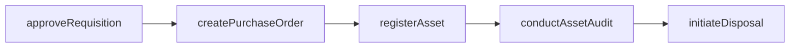
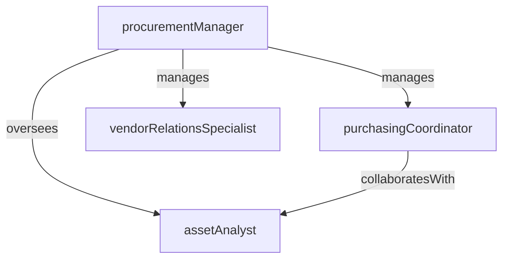

# Procurement & Asset Management

> Business-as-Code definition for the Procurement & Asset Management department. Models responsibilities, actions, events, and searches.

## Overview

Capital asset tracking, disposal, and lifecycle management

## Responsibilities

| Responsibility | Description |
|---------------|-------------|
| trackAssetLifecycle | Maintain a complete inventory of capital assets from acquisition through disposal |
| manageProcurement | Source, evaluate, and onboard vendors for goods and services |
| planAssetDisposal | Coordinate the retirement, sale, or recycling of end-of-life assets |
| enforceAssetPolicies | Define and enforce tagging, depreciation, and audit policies for all tracked assets |
| optimizeSpend | Analyze procurement data to identify cost savings and consolidation opportunities |

## Roles

| Role | Description |
|------|-------------|
| procurementManager | Leads strategic sourcing, vendor negotiations, and purchasing policies |
| assetAnalyst | Tracks asset inventory, depreciation schedules, and lifecycle status |
| purchasingCoordinator | Processes purchase requisitions, issues POs, and manages order fulfillment |
| vendorRelationsSpecialist | Manages vendor performance reviews, scorecards, and contract compliance |

## Entities

| Entity | Description |
|--------|-------------|
| Asset | A tracked capital item such as equipment, furniture, or IT hardware |
| PurchaseOrder | A formal request to a vendor for the delivery of goods or services |
| Vendor | A supplier or service provider registered in the procurement system |
| AssetDisposal | A record of an asset being retired, sold, donated, or recycled |
| ProcurementContract | A negotiated agreement governing terms with a supplier |

## Actions

| Action | Description |
|--------|-------------|
| createPurchaseOrder | Issue a new purchase order to an approved vendor |
| registerAsset | Tag and record a newly received asset in the inventory system |
| conductAssetAudit | Perform a physical or system-based verification of asset inventory |
| evaluateVendor | Score a vendor on delivery, quality, pricing, and compliance |
| initiateDisposal | Begin the process to retire or dispose of an end-of-life asset |
| approveRequisition | Review and authorize a purchase requisition from a business unit |

## Events

| Event | Description |
|-------|-------------|
| purchaseOrderIssued | A new purchase order was created and sent to the vendor |
| assetRegistered | A new capital asset was tagged and added to the inventory |
| assetDisposed | An asset was retired, sold, or recycled and removed from active inventory |
| vendorOnboarded | A new vendor completed qualification and was added to the approved list |
| auditCompleted | A scheduled asset audit was finished with findings documented |
| contractAwarded | A procurement contract was finalized and signed with a vendor |

## Searches

| Search | Description |
|--------|-------------|
| findAssetsByStatus | List assets filtered by status such as active, in-repair, or pending disposal |
| listOpenPurchaseOrders | Retrieve purchase orders awaiting delivery or approval |
| searchVendors | Look up vendors by category, rating, or contract status |
| getDepreciationSchedule | Retrieve depreciation data for assets by class or business unit |
| findAssetsForDisposal | Identify assets that have reached end-of-life or are flagged for retirement |

## Workflow



## Actor Relationships



## Related Processes

| Process | APQC ID | Relationship |
|---------|---------|-------------|
| Plan and Acquire Assets | 10.1 | Core process for asset tracking and lifecycle management |
| Maintain Productive Assets | 10.3 | Governs capital expenditure approvals and depreciation policies |
| Dispose of Assets | 10.4 | Covers asset disposal and end-of-life management |

## Related Departments

| Department | Relationship |
|-----------|-------------|
| Facilities Management | Coordinates on building equipment and maintenance asset needs |
| Accounts Payable | Partners on vendor payment processing and invoice reconciliation |
| Financial Planning & Analysis | Collaborates on capital budgeting and depreciation forecasting |

## Usage

```typescript
import { db } from '@headlessly/db'

const dept = await db.departments.get('procurementAssetManagement')
const assets = await db.departments.search('findAssetsByStatus', { status: 'active' })
const openPOs = await db.departments.search('listOpenPurchaseOrders', { vendor: 'acme-corp' })
```
