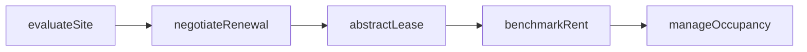
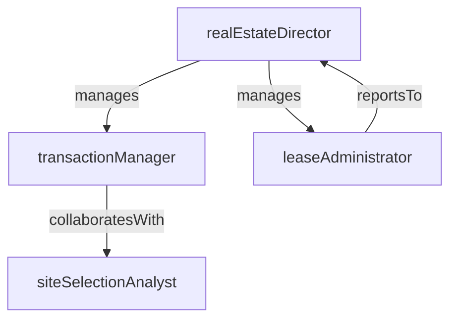

# Real Estate

> Business-as-Code definition for the Real Estate department. Models responsibilities, actions, events, and searches.

## Overview

Lease management, site selection, and property portfolio management

## Responsibilities

| Responsibility | Description |
|---------------|-------------|
| manageLeasePortfolio | Administer all active leases including renewals, terminations, and rent escalations |
| evaluateSiteSelection | Assess potential locations against business requirements, cost, and market conditions |
| optimizePropertyPortfolio | Continuously review the real estate footprint for consolidation or expansion opportunities |
| negotiateLeaseTerms | Lead commercial negotiations with landlords, brokers, and property managers |

## Roles

| Role | Description |
|------|-------------|
| realEstateDirector | Sets portfolio strategy and oversees all real estate transactions |
| leaseAdministrator | Manages lease documentation, critical dates, and payment schedules |
| siteSelectionAnalyst | Researches and evaluates potential new locations using market and demographic data |
| transactionManager | Executes property acquisitions, dispositions, and lease negotiations |

## Entities

| Entity | Description |
|--------|-------------|
| Lease | A contractual agreement for the use of a property with defined terms and obligations |
| Property | A physical location within the corporate portfolio, owned or leased |
| SiteEvaluation | An assessment of a prospective location against selection criteria |
| LeaseAbstract | A summarized extract of key lease terms, dates, and financial obligations |

## Actions

| Action | Description |
|--------|-------------|
| abstractLease | Extract and summarize critical terms from a signed lease document |
| evaluateSite | Score a prospective location against strategic criteria |
| negotiateRenewal | Initiate renewal discussions and negotiate updated lease terms |
| approveSublease | Review and authorize subletting of unused space to a third party |
| terminateLease | Execute early termination provisions and manage exit obligations |
| benchmarkRent | Compare current lease rates against market comparables |
| manageOccupancy | Monitor and optimize space utilization and occupancy levels across the property portfolio |

## Events

| Event | Description |
|-------|-------------|
| leaseExecuted | A new lease agreement was fully signed and recorded |
| leaseRenewed | An existing lease was extended under renegotiated terms |
| leaseTerminated | A lease was ended and exit obligations were settled |
| siteApproved | A prospective location passed evaluation and was approved for occupancy |
| rentEscalationTriggered | A scheduled rent increase took effect per lease terms |
| subleaseApproved | Authorization was granted to sublet a portion of leased space |

## Searches

| Search | Description |
|--------|-------------|
| findExpiringLeases | List leases approaching their expiration or renewal deadline |
| getPortfolioCosts | Retrieve total occupancy costs aggregated by region, building, or business unit |
| searchProperties | Look up properties by location, size, lease type, or status |
| listSiteEvaluations | Find in-progress or completed site assessments for new locations |

## Workflow



## Actor Relationships



## Related Processes

| Process | APQC ID | Relationship |
|---------|---------|-------------|
| Manage Physical Assets | 10.1 | Governs the lifecycle of owned and leased properties |
| Manage Capital Assets | 10.2 | Covers capital expenditure decisions for property investments |

## Related Departments

| Department | Relationship |
|-----------|-------------|
| Facilities Management | Coordinates on space requirements and building operations |
| Corporate Legal | Partners on lease review, negotiation, and contract execution |
| Financial Planning & Analysis | Collaborates on occupancy cost modeling and capital budgeting |

## Usage

```typescript
import { db } from '@headlessly/db'

const dept = await db.departments.get('realEstate')
const expiring = await db.departments.search('findExpiringLeases', { withinMonths: 6 })
const costs = await db.departments.search('getPortfolioCosts', { region: 'north-america' })
```
