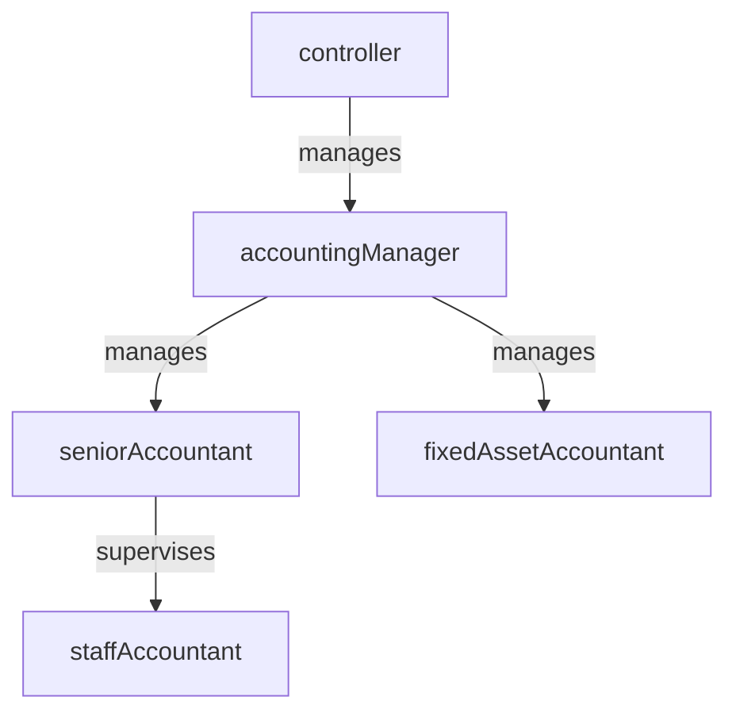

# Accounting

> Business-as-Code definition for the Accounting department. Models responsibilities, actions, events, and searches.

## Overview

General ledger, financial reporting, month-end close, and audit coordination

## Responsibilities

| Responsibility | Description |
|---------------|-------------|
| manageGeneralLedger | Maintain the chart of accounts and post journal entries to the general ledger |
| executeMonthEndClose | Coordinate the period-end close process including accruals, reconciliations, and adjustments |
| prepareFinancialStatements | Produce balance sheet, income statement, and cash flow statements |
| manageFixedAssets | Track asset additions, disposals, depreciation, and impairment |
| coordinateExternalAudit | Prepare schedules, provide evidence, and address findings from external auditors |

## Roles

| Role | Description |
|------|-------------|
| staffAccountant | Prepares journal entries, reconciliations, and supporting schedules |
| seniorAccountant | Reviews complex transactions and supervises period-end close tasks |
| accountingManager | Manages day-to-day accounting operations and team workload |
| controller | Oversees financial reporting, policies, and internal controls |
| fixedAssetAccountant | Manages capitalization, depreciation schedules, and asset registers |

## Entities

| Entity | Description |
|--------|-------------|
| JournalEntry | A debit-credit transaction posted to the general ledger |
| GeneralLedgerAccount | An account in the chart of accounts used for financial classification |
| Reconciliation | A comparison of sub-ledger or bank balances to the general ledger |
| FinancialStatement | A formal report such as balance sheet, income statement, or cash flow statement |
| FixedAsset | A capitalized long-lived asset tracked for depreciation and reporting |

## Actions

| Action | Description |
|--------|-------------|
| postJournalEntry | Record a debit-credit transaction in the general ledger |
| reconcileAccount | Compare sub-ledger or external balances to the GL and resolve differences |
| closeAccountingPeriod | Execute the month-end or quarter-end close checklist |
| generateFinancialReport | Produce financial statements from the general ledger |
| calculateDepreciation | Compute periodic depreciation expense for fixed assets |
| prepareAuditSchedule | Compile supporting documentation for external audit requests |

## Events

| Event | Description |
|-------|-------------|
| journalEntryPosted | Debit-credit transaction recorded in the general ledger |
| accountReconciled | Sub-ledger or bank balance verified against the general ledger |
| accountingPeriodClosed | Month-end or quarter-end close process completed |
| financialReportGenerated | Financial statements produced and ready for review |
| depreciationCalculated | Periodic depreciation expense computed and posted |
| auditSchedulePrepared | Supporting schedules compiled for external audit review |

## Searches

| Search | Description |
|--------|-------------|
| findUnreconciledAccounts | List general ledger accounts with pending reconciliations |
| getTrialBalance | Retrieve the trial balance for a given period |
| listJournalEntriesByPeriod | Query journal entries posted within a date range |
| getFixedAssetRegister | Retrieve the asset register with depreciation schedules |
| searchAuditFindings | Find open audit findings by severity and remediation status |

## Workflow


## Actor Relationships



## Related Processes

| Process | APQC ID | Relationship |
|---------|---------|-------------|
| Perform General Accounting and Reporting | 9.3 | Core process for GL management, close, and financial reporting |
| Manage Fixed-Asset Project Accounting | 9.4 | Governs capital project accounting and fixed asset lifecycle |
| Perform Revenue Accounting | 9.2 | Partners on revenue recognition and receivable postings |

## Related Departments

| Department | Relationship |
|-----------|-------------|
| Financial Planning & Analysis | Consumes financial actuals for variance analysis and forecasting |
| Accounts Payable | Posts AP sub-ledger entries that roll into the general ledger |
| Internal Audit | Provides controls evidence and responds to audit findings |

## Usage

```typescript
import { db } from '@headlessly/db'

const acct = await db.departments.get('accounting')
const unreconciled = await db.departments.search('findUnreconciledAccounts', { period: '2025-Q4' })
const trialBalance = await db.departments.search('getTrialBalance', { period: '2025-12' })
```
