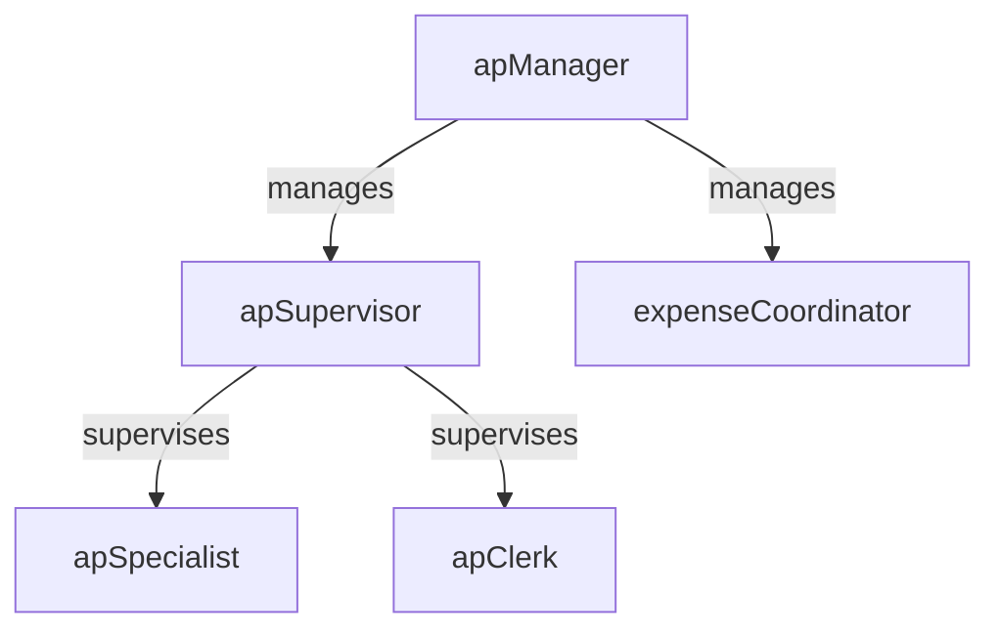

# Accounts Payable

> Business-as-Code definition for the Accounts Payable department. Models responsibilities, actions, events, and searches.

## Overview

Invoice processing, vendor payments, and expense management

## Responsibilities

| Responsibility | Description |
|---------------|-------------|
| processVendorInvoices | Receive, validate, and code vendor invoices for approval and payment |
| executePaymentRuns | Schedule and execute payment batches via check, ACH, or wire transfer |
| manageExpenseReports | Review and reimburse employee expense reports per corporate policy |
| maintainVendorMasterData | Onboard new vendors, validate tax information, and maintain payment terms |
| reconcileApSubledger | Ensure accounts payable sub-ledger balances agree with the general ledger |

## Roles

| Role | Description |
|------|-------------|
| apClerk | Enters invoices, matches to purchase orders, and resolves coding discrepancies |
| apSpecialist | Processes complex invoices, manages vendor inquiries, and handles exceptions |
| expenseCoordinator | Reviews employee expense reports and enforces corporate travel and expense policies |
| apSupervisor | Oversees daily processing volumes, aging reports, and team workload |
| apManager | Manages payment strategy, vendor relationships, and process improvement initiatives |

## Entities

| Entity | Description |
|--------|-------------|
| Invoice | A vendor billing document requiring validation, approval, and payment |
| PurchaseOrder | A procurement document authorizing the purchase of goods or services |
| PaymentBatch | A group of approved invoices scheduled for payment in a single run |
| ExpenseReport | An employee submission of business expenses for reimbursement |
| VendorRecord | Master data for a supplier including tax ID, payment terms, and bank details |

## Actions

| Action | Description |
|--------|-------------|
| receiveInvoice | Log an incoming vendor invoice and begin the processing workflow |
| matchInvoiceToPo | Validate invoice line items against the corresponding purchase order |
| approveInvoice | Route the invoice for managerial approval based on delegation of authority |
| executePayment | Process an approved payment batch and transmit funds to vendors |
| submitExpenseReport | Receive an employee expense report for review and reimbursement |
| onboardVendor | Register a new vendor with validated tax and banking information |

## Events

| Event | Description |
|-------|-------------|
| invoiceReceived | Vendor invoice logged and entered into the AP system |
| invoiceMatchedToPo | Invoice validated against purchase order and receiving documents |
| invoiceApproved | Invoice approved for payment per delegation of authority |
| paymentExecuted | Payment batch processed and funds transmitted to vendors |
| expenseReportSubmitted | Employee expense report received for review |
| vendorOnboarded | New vendor registered with validated master data |

## Searches

| Search | Description |
|--------|-------------|
| findInvoicesByStatus | List invoices filtered by processing status such as pending, approved, or paid |
| getAgingReport | Retrieve the AP aging summary grouped by vendor and due date bucket |
| listPendingPayments | Query approved invoices awaiting the next payment run |
| searchVendorsByTerm | Find vendor records by name, tax ID, or payment terms |
| getExpenseReportsByEmployee | Retrieve submitted expense reports for a specific employee |

## Workflow


## Actor Relationships



## Related Processes

| Process | APQC ID | Relationship |
|---------|---------|-------------|
| Process Accounts Payable | 9.6.1 | Core process for invoice receipt, validation, approval, and payment |
| Process Expense Reimbursements | 9.6.2 | Governs employee expense report review and reimbursement |
| Manage Policies and Procedures | 9.3.1 | Defines accounting policies that govern AP processing and approvals |

## Related Departments

| Department | Relationship |
|-----------|-------------|
| Accounting | Posts AP sub-ledger entries to the general ledger during period close |
| Treasury | Coordinates payment timing, bank account funding, and wire transfers |
| Internal Audit | Reviews AP controls, duplicate payment detection, and vendor master integrity |

## Usage

```typescript
import { db } from '@headlessly/db'

const ap = await db.departments.get('accountsPayable')
const aging = await db.departments.search('getAgingReport', { asOfDate: '2025-12-31' })
const pending = await db.departments.search('listPendingPayments', { minAmount: 10000 })
```
