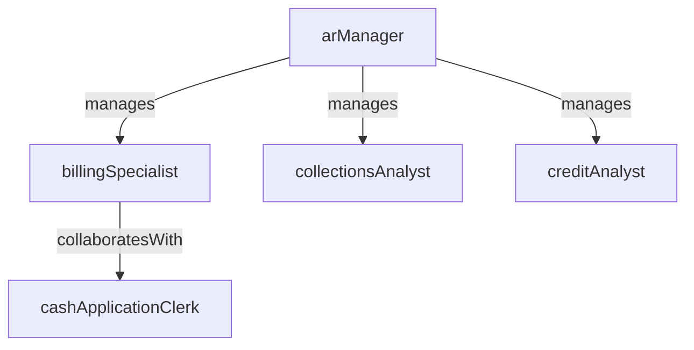

# Accounts Receivable

> Business-as-Code definition for the Accounts Receivable department. Models responsibilities, actions, events, and searches.

## Overview

Billing, collections, credit management, and cash application

## Responsibilities

| Responsibility | Description |
|---------------|-------------|
| manageCustomerBilling | Generate, transmit, and track customer invoices and billing statements |
| applyCustomerPayments | Match incoming payments to open invoices and post cash receipts |
| manageCollections | Monitor delinquent accounts, contact customers, and escalate overdue balances |
| administerCreditPolicy | Evaluate customer creditworthiness, set credit limits, and manage credit holds |
| reconcileArSubledger | Ensure accounts receivable sub-ledger balances agree with the general ledger |

## Roles

| Role | Description |
|------|-------------|
| billingSpecialist | Generates invoices, resolves billing discrepancies, and manages billing cycles |
| cashApplicationClerk | Matches incoming payments to open invoices and posts cash receipts |
| collectionsAnalyst | Contacts delinquent customers, negotiates payment plans, and escalates aged balances |
| creditAnalyst | Evaluates new and existing customer credit applications and recommends limits |
| arManager | Oversees billing, collections, credit policy, and team performance metrics |

## Entities

| Entity | Description |
|--------|-------------|
| CustomerInvoice | A billing document sent to a customer for goods or services delivered |
| CashReceipt | An incoming customer payment applied against one or more open invoices |
| CreditApplication | A request to establish or modify credit terms for a customer |
| CollectionCase | A record tracking delinquent balance pursuit and communication history |
| AgingReport | A summary of outstanding receivables grouped by age bucket |

## Actions

| Action | Description |
|--------|-------------|
| generateInvoice | Create and transmit a customer invoice for delivered goods or services |
| applyCashReceipt | Match an incoming payment to open invoices and post the cash receipt |
| initiateCollection | Open a collection case and contact a customer about an overdue balance |
| evaluateCreditApplication | Assess a customer's creditworthiness and recommend a credit limit |
| writeOffBalance | Record an uncollectible balance as bad debt expense |
| resolveDisputedInvoice | Investigate and settle a customer dispute over invoice amounts or terms |

## Events

| Event | Description |
|-------|-------------|
| invoiceGenerated | Customer invoice created and transmitted |
| cashReceiptApplied | Incoming payment matched to invoices and posted |
| collectionInitiated | Collection case opened for a delinquent customer balance |
| creditApplicationEvaluated | Customer credit assessment completed with limit recommendation |
| balanceWrittenOff | Uncollectible balance recorded as bad debt expense |
| disputedInvoiceResolved | Customer billing dispute investigated and settled |

## Searches

| Search | Description |
|--------|-------------|
| getArAgingReport | Retrieve outstanding receivables grouped by age bucket and customer |
| findOverdueInvoices | List invoices past their due date filtered by amount or customer |
| getCashApplicationStatus | Check unapplied or partially applied cash receipts |
| listOpenCollectionCases | Query active collection cases by age, amount, or assigned analyst |
| searchCustomerCreditLimits | Find customers by credit limit, utilization, or risk score |

## Workflow


## Actor Relationships



## Related Processes

| Process | APQC ID | Relationship |
|---------|---------|-------------|
| Perform Revenue Accounting | 9.2 | Core process for customer billing, cash application, and receivable management |
| Process Customer Credit | 9.2.1 | Governs credit evaluation, scoring, and limit administration |
| Manage and Process Collections | 9.2.4 | Drives delinquent account management and recovery activities |

## Related Departments

| Department | Relationship |
|-----------|-------------|
| Accounting | Posts AR sub-ledger entries to the general ledger during period close |
| Treasury | Coordinates incoming cash deposits and bank reconciliations |
| Financial Planning & Analysis | Consumes receivable aging data for cash flow forecasting |

## Usage

```typescript
import { db } from '@headlessly/db'

const ar = await db.departments.get('accountsReceivable')
const aging = await db.departments.search('getArAgingReport', { asOfDate: '2025-12-31' })
const overdue = await db.departments.search('findOverdueInvoices', { minAmount: 5000 })
```
