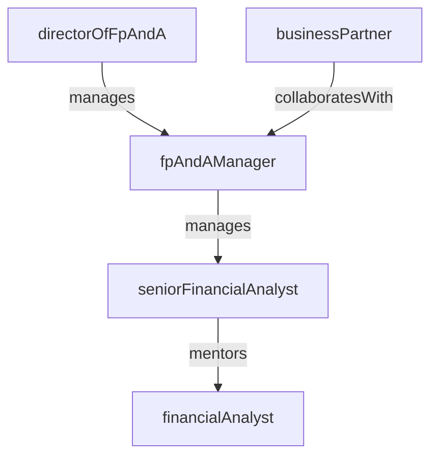

# Financial Planning & Analysis

> Business-as-Code definition for the Financial Planning & Analysis department. Models responsibilities, actions, events, and searches.

## Overview

Budgeting, forecasting, variance analysis, and financial modeling

## Responsibilities

| Responsibility | Description |
|---------------|-------------|
| developAnnualBudget | Lead the annual budgeting cycle across all business units and cost centers |
| prepareFinancialForecasts | Produce rolling forecasts that project revenue, expenses, and cash flow |
| performVarianceAnalysis | Analyze actual-versus-budget and actual-versus-forecast variances and explain drivers |
| buildFinancialModels | Create scenario models for strategic initiatives, pricing, and capital investments |
| deliverManagementReporting | Produce executive dashboards, board decks, and business unit performance reports |

## Roles

| Role | Description |
|------|-------------|
| financialAnalyst | Builds models, analyzes variances, and prepares management reports |
| seniorFinancialAnalyst | Leads complex analyses and partners with business unit leaders on planning |
| fpAndAManager | Manages the planning calendar, team workload, and stakeholder deliverables |
| directorOfFpAndA | Sets strategic planning priorities and presents to executive leadership |
| businessPartner | Embedded finance resource supporting a specific business unit or function |

## Entities

| Entity | Description |
|--------|-------------|
| Budget | An approved annual plan of revenue and expense targets by cost center |
| Forecast | A periodic forward-looking projection of financial performance |
| VarianceReport | An analysis comparing actuals to budget or forecast with driver explanations |
| FinancialModel | A spreadsheet or system model used for scenario analysis and decision support |
| ManagementReport | An executive-facing summary of financial performance and key metrics |

## Actions

| Action | Description |
|--------|-------------|
| prepareBudget | Collect inputs and build the annual budget across business units |
| updateForecast | Refresh the rolling forecast with latest actuals and assumptions |
| analyzeVariance | Compare actuals to plan and identify root causes of deviations |
| modelScenario | Build what-if scenarios for strategic decisions and investment cases |
| publishManagementReport | Distribute executive dashboards and performance summaries |
| presentToLeadership | Deliver financial insights and recommendations to the executive team |

## Events

| Event | Description |
|-------|-------------|
| budgetPrepared | Annual budget finalized and approved by leadership |
| forecastUpdated | Rolling forecast refreshed with latest data and assumptions |
| varianceAnalyzed | Actual-to-plan variance analysis completed with explanations |
| scenarioModeled | What-if scenario analysis completed with recommendations |
| managementReportPublished | Executive performance report distributed to stakeholders |
| leadershipPresented | Financial review presented to executive team or board |

## Searches

| Search | Description |
|--------|-------------|
| getBudgetByDepartment | Retrieve approved budget figures for a specific department or cost center |
| findVariancesByThreshold | List line items where actual-to-budget variance exceeds a given percentage |
| getForecastAccuracy | Measure forecast accuracy by comparing prior forecasts to actuals |
| listOpenBudgetRequests | Query budget amendment or reallocation requests pending approval |

## Workflow


## Actor Relationships



## Related Processes

| Process | APQC ID | Relationship |
|---------|---------|-------------|
| Perform Planning, Budgeting, and Forecasting | 9.1.1 | Core process for budget development, forecasting, and variance analysis |
| Evaluate and Manage Financial Performance | 9.1.4 | Drives profitability analysis and performance measurement |
| Perform Cost Accounting and Control | 9.1.2 | Supplies cost data for variance analysis and product costing |

## Related Departments

| Department | Relationship |
|-----------|-------------|
| Accounting | Provides actual financial data used in variance analysis and forecasting |
| Treasury | Collaborates on cash flow forecasting and liquidity projections |
| Data Engineering | Supplies curated datasets and automated reporting pipelines |

## Usage

```typescript
import { db } from '@headlessly/db'

const fpa = await db.departments.get('financialPlanningAnalysis')
const variances = await db.departments.search('findVariancesByThreshold', { threshold: 10 })
const budget = await db.departments.search('getBudgetByDepartment', { department: 'engineering' })
```
