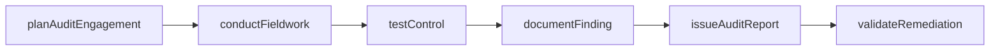
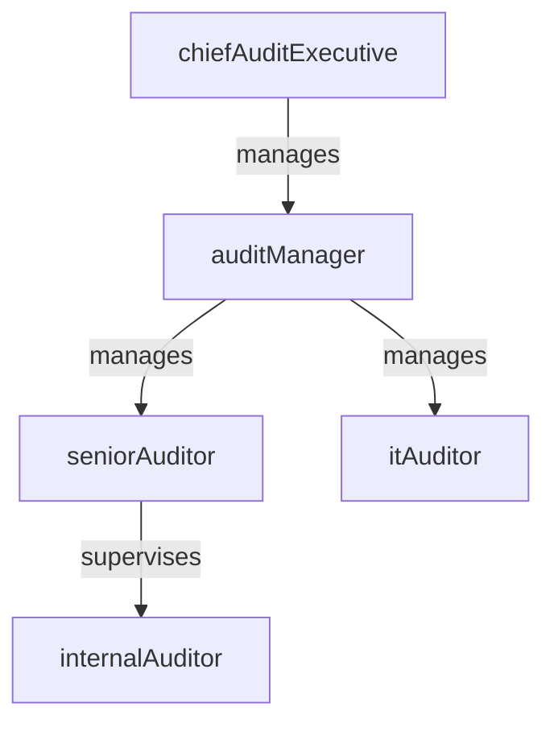

# Internal Audit

> Business-as-Code definition for the Internal Audit department. Models responsibilities, actions, events, and searches.

## Overview

Financial controls, process audits, and compliance verification

## Responsibilities

| Responsibility | Description |
|---------------|-------------|
| developAuditPlan | Create the annual risk-based audit plan and prioritize engagements |
| executeAuditEngagements | Conduct fieldwork including walkthroughs, testing, and evidence collection |
| evaluateInternalControls | Assess the design and operating effectiveness of financial and operational controls |
| reportAuditFindings | Document findings, assess risk severity, and present results to management and the audit committee |
| monitorRemediationActions | Track management's corrective actions and validate remediation of audit findings |

## Roles

| Role | Description |
|------|-------------|
| internalAuditor | Performs fieldwork, tests controls, and documents audit workpapers |
| seniorAuditor | Leads audit engagements, supervises junior staff, and drafts findings |
| auditManager | Plans engagements, manages team assignments, and reviews audit reports |
| itAuditor | Evaluates technology controls, system access, and data integrity |
| chiefAuditExecutive | Sets audit strategy, presents to the audit committee, and maintains independence |

## Entities

| Entity | Description |
|--------|-------------|
| AuditEngagement | A planned audit project covering a specific process, control, or business area |
| AuditFinding | A documented control deficiency, process gap, or compliance issue |
| AuditWorkpaper | Supporting documentation, evidence, and test results for an engagement |
| RemediationAction | A corrective action plan assigned to management to address an audit finding |
| RiskAssessment | An evaluation of organizational risks used to prioritize audit coverage |

## Actions

| Action | Description |
|--------|-------------|
| planAuditEngagement | Define scope, objectives, and timeline for an audit project |
| conductFieldwork | Execute walkthroughs, sample testing, and evidence collection |
| testControl | Evaluate whether a specific internal control is designed and operating effectively |
| documentFinding | Record a control deficiency with risk rating, root cause, and recommendation |
| issueAuditReport | Finalize and distribute the audit report to management and the audit committee |
| validateRemediation | Verify that management has implemented corrective actions for prior findings |

## Events

| Event | Description |
|-------|-------------|
| auditEngagementPlanned | Engagement scope and timeline defined and approved |
| fieldworkConducted | Walkthroughs and control testing completed for an engagement |
| controlTested | Specific internal control evaluated with documented results |
| findingDocumented | Control deficiency recorded with risk rating and recommendation |
| auditReportIssued | Final audit report distributed to management and audit committee |
| remediationValidated | Management's corrective action verified as effectively implemented |

## Searches

| Search | Description |
|--------|-------------|
| listOpenFindings | Retrieve unresolved audit findings by severity and age |
| getAuditPlanProgress | Check completion status of the annual audit plan |
| findOverdueRemediations | List corrective actions past their target completion date |
| searchEngagementsByArea | Query audit engagements by business area, process, or risk domain |
| getRiskAssessmentSummary | Retrieve the enterprise risk assessment with audit coverage mapping |

## Workflow



## Actor Relationships



## Related Processes

| Process | APQC ID | Relationship |
|---------|---------|-------------|
| Manage Internal Controls | 9.8 | Core process for evaluating and testing financial and operational controls |
| Perform General Accounting and Reporting | 9.3 | Provides controls assurance over financial close and reporting processes |
| Manage Policies and Procedures | 9.3.1 | Validates adherence to accounting policies and approval frameworks |

## Related Departments

| Department | Relationship |
|-----------|-------------|
| Accounting | Primary audit target for financial close controls and GL accuracy |
| Cybersecurity | Partners on IT audit engagements and security control evaluations |
| Accounts Payable | Reviews AP controls for duplicate payments, segregation of duties, and vendor fraud |

## Usage

```typescript
import { db } from '@headlessly/db'

const audit = await db.departments.get('internalAudit')
const findings = await db.departments.search('listOpenFindings', { severity: 'high' })
const overdue = await db.departments.search('findOverdueRemediations', { daysOverdue: 30 })
```
