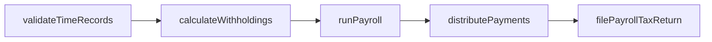
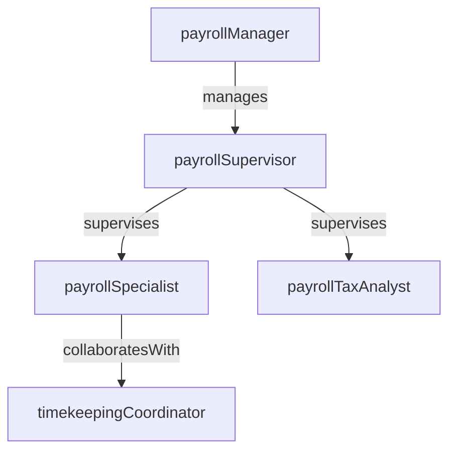

# Payroll

> Business-as-Code definition for the Payroll department. Models responsibilities, actions, events, and searches.

## Overview

Payroll processing, tax withholding, and compensation disbursement

## Responsibilities

| Responsibility | Description |
|---------------|-------------|
| processPayrollCycles | Calculate gross pay, deductions, and net pay for each payroll cycle |
| managePayrollTaxes | Compute, withhold, and remit federal, state, and local payroll taxes |
| administerDeductions | Maintain and process employee benefit deductions, garnishments, and retirement contributions |
| distributeCompensation | Execute direct deposits, issue checks, and manage payment exceptions |
| fileRegulatoryReports | Prepare and submit W-2s, quarterly tax filings, and other statutory payroll reports |

## Roles

| Role | Description |
|------|-------------|
| payrollSpecialist | Processes payroll transactions, validates time data, and resolves pay discrepancies |
| payrollTaxAnalyst | Calculates tax withholdings, files quarterly returns, and manages jurisdiction registrations |
| payrollSupervisor | Oversees processing schedules, audits payroll runs, and manages exception handling |
| payrollManager | Manages payroll operations, vendor relationships, and compliance reporting |
| timekeepingCoordinator | Validates employee time records, leave balances, and overtime calculations |

## Entities

| Entity | Description |
|--------|-------------|
| PayrollRun | A scheduled processing cycle that calculates and distributes employee compensation |
| EmployeePayRecord | An individual employee's gross pay, deductions, taxes, and net pay for a period |
| TaxFiling | A federal, state, or local payroll tax return or remittance |
| Deduction | A withholding from gross pay for benefits, taxes, garnishments, or retirement |
| TimeRecord | An employee's reported hours worked, leave taken, and overtime for a pay period |

## Actions

| Action | Description |
|--------|-------------|
| runPayroll | Execute the payroll calculation cycle for all eligible employees |
| validateTimeRecords | Verify employee time entries against schedules and leave balances |
| calculateWithholdings | Compute federal, state, and local tax withholdings for each employee |
| distributePayments | Execute direct deposits and issue checks to employees |
| filePayrollTaxReturn | Submit periodic payroll tax returns and remittances to authorities |
| processPayrollAdjustment | Apply corrections for overpayments, underpayments, or retroactive changes |

## Events

| Event | Description |
|-------|-------------|
| payrollRunCompleted | Payroll cycle calculated and ready for payment distribution |
| timeRecordsValidated | Employee time entries verified and approved for processing |
| withholdingsCalculated | Tax withholdings computed for all employees in the pay period |
| paymentsDistributed | Direct deposits executed and checks issued to employees |
| payrollTaxReturnFiled | Quarterly or annual payroll tax filing submitted to authorities |
| payrollAdjustmentProcessed | Pay correction applied and reflected in employee records |

## Searches

| Search | Description |
|--------|-------------|
| getPayrollRunSummary | Retrieve gross pay, deductions, taxes, and net pay totals for a payroll cycle |
| findPayDiscrepancies | List employees with flagged pay variances or exception conditions |
| getUpcomingTaxDeadlines | Query payroll tax filing and remittance deadlines within a window |
| listDeductionsByEmployee | Retrieve active deductions for a specific employee |
| searchOvertimeByDepartment | Find overtime hours and costs grouped by department for a pay period |

## Workflow



## Actor Relationships



## Related Processes

| Process | APQC ID | Relationship |
|---------|---------|-------------|
| Process Payroll | 9.5 | Core process for payroll calculation, distribution, and reporting |
| Report Time | 9.5.1 | Governs time collection, validation, and leave tracking |
| Manage and Process Payroll Taxes | 9.5.3 | Drives tax calculation, withholding, and regulatory filing |

## Related Departments

| Department | Relationship |
|-----------|-------------|
| Accounting | Posts payroll journal entries to the general ledger |
| Tax | Coordinates on payroll tax compliance and annual reporting |
| Treasury | Funds payroll bank accounts and coordinates payment execution |

## Usage

```typescript
import { db } from '@headlessly/db'

const pay = await db.departments.get('payroll')
const summary = await db.departments.search('getPayrollRunSummary', { period: '2025-12-15' })
const overtime = await db.departments.search('searchOvertimeByDepartment', { period: '2025-12' })
```
