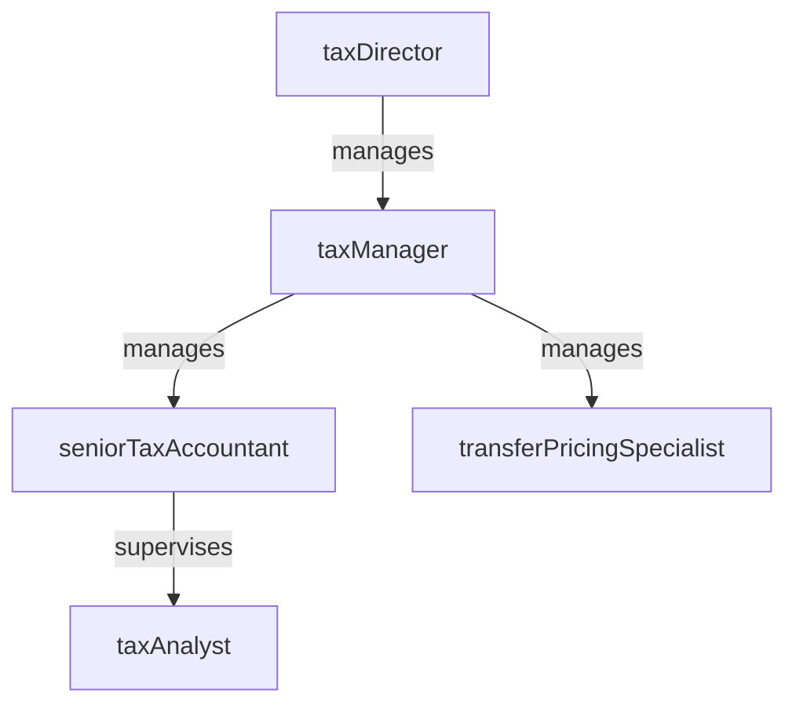

# Tax

> Business-as-Code definition for the Tax department. Models responsibilities, actions, events, and searches.

## Overview

Tax planning, compliance, filing, and transfer pricing

## Responsibilities

| Responsibility | Description |
|---------------|-------------|
| developTaxStrategy | Create and maintain federal, state, and international tax planning strategies to optimize the effective tax rate |
| manageComplianceFilings | Prepare and submit all required tax returns, extensions, and regulatory filings on schedule |
| calculateTaxProvisions | Compute quarterly and annual income tax provisions including deferred tax assets and liabilities |
| administerTransferPricing | Establish, document, and defend intercompany transfer pricing policies |
| respondToTaxAuthorities | Manage audits, inquiries, and correspondence with federal, state, and foreign tax authorities |

## Roles

| Role | Description |
|------|-------------|
| taxAnalyst | Prepares tax workpapers, computations, and supporting schedules |
| seniorTaxAccountant | Reviews tax provisions, prepares complex returns, and researches technical positions |
| taxManager | Manages compliance calendar, team assignments, and tax authority relationships |
| transferPricingSpecialist | Develops intercompany pricing studies, benchmarks, and documentation |
| taxDirector | Sets enterprise tax strategy, oversees planning initiatives, and advises executive leadership |

## Entities

| Entity | Description |
|--------|-------------|
| TaxReturn | A federal, state, or international filing submitted to a tax authority |
| TaxProvision | A quarterly or annual calculation of current and deferred income tax expense |
| TransferPricingStudy | Documentation supporting intercompany pricing between related entities |
| TaxNotice | An inquiry, assessment, or correspondence received from a tax authority |
| TaxCalendar | A schedule of all filing deadlines, extension dates, and estimated payment dates |

## Actions

| Action | Description |
|--------|-------------|
| prepareTaxReturn | Compile data, compute liabilities, and draft a tax return for filing |
| calculateProvision | Compute current and deferred tax expense for quarterly or annual close |
| fileReturn | Submit a finalized tax return to the appropriate authority |
| researchTaxPosition | Analyze technical tax law and regulations to support a filing position |
| conductTransferPricingAnalysis | Perform benchmarking and economic analysis for intercompany transactions |
| respondToNotice | Draft and submit a response to a tax authority inquiry or assessment |

## Events

| Event | Description |
|-------|-------------|
| taxReturnPrepared | Tax return drafted and ready for review |
| provisionCalculated | Income tax provision computed and recorded for the period |
| returnFiled | Tax return submitted to the tax authority |
| taxPositionResearched | Technical tax research completed with documented conclusion |
| transferPricingAnalyzed | Intercompany pricing study completed and documented |
| noticeResponded | Response to tax authority inquiry submitted |

## Searches

| Search | Description |
|--------|-------------|
| getUpcomingDeadlines | List tax filing and payment deadlines within a specified window |
| findOpenNotices | Retrieve unresolved tax authority inquiries and assessments |
| getEffectiveTaxRate | Calculate the blended effective tax rate for a given period |
| listTransferPricingStudies | Query transfer pricing documentation by entity or jurisdiction |
| searchTaxPositions | Find documented tax positions by topic or risk classification |

## Workflow


## Actor Relationships



## Related Processes

| Process | APQC ID | Relationship |
|---------|---------|-------------|
| Manage Taxes | 9.9 | Core process for tax planning, compliance, and filing |
| Process Taxes | 9.9.2 | Governs return preparation, provision calculation, and authority management |
| Develop Tax Strategy and Plan | 9.9.1 | Drives enterprise tax optimization and planning initiatives |

## Related Departments

| Department | Relationship |
|-----------|-------------|
| Accounting | Supplies general ledger data and coordinates on tax provision entries |
| Treasury | Partners on estimated tax payments and international cash repatriation |
| Financial Planning & Analysis | Collaborates on effective tax rate forecasting and scenario modeling |

## Usage

```typescript
import { db } from '@headlessly/db'

const tax = await db.departments.get('tax')
const deadlines = await db.departments.search('getUpcomingDeadlines', { withinDays: 60 })
const notices = await db.departments.search('findOpenNotices', { jurisdiction: 'federal' })
```
