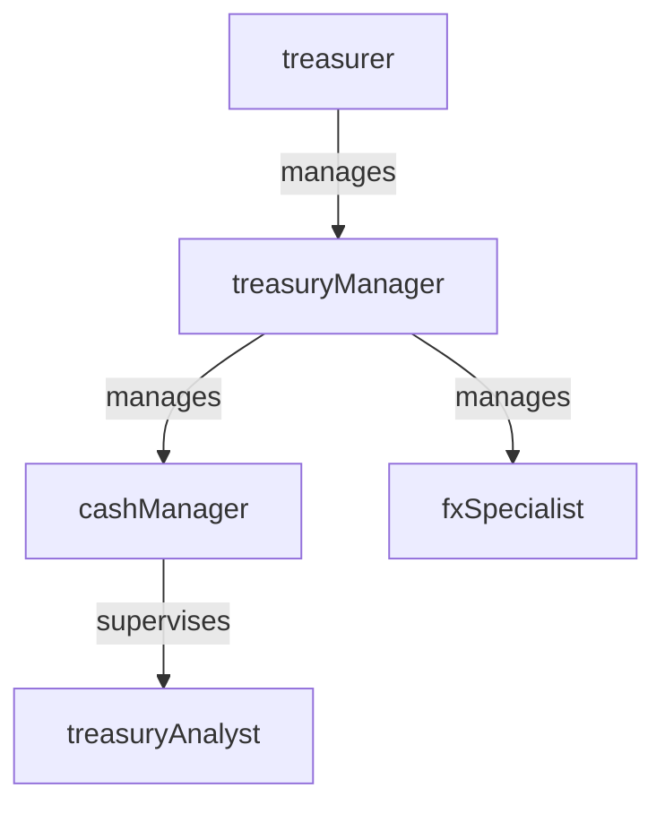

# Treasury

> Business-as-Code definition for the Treasury department. Models responsibilities, actions, events, and searches.

## Overview

Cash management, banking relationships, investments, and liquidity management

## Responsibilities

| Responsibility | Description |
|---------------|-------------|
| manageCashPositions | Monitor and reconcile daily cash balances across all bank accounts |
| forecastCashFlows | Develop short-term and long-term cash flow projections to ensure adequate liquidity |
| manageBankRelationships | Negotiate banking terms, maintain account structures, and oversee fee analysis |
| administerDebtAndInvestments | Manage borrowing facilities, investment portfolios, and interest rate exposure |
| mitigateForeignExchangeRisk | Monitor currency exposures and execute hedging strategies |

## Roles

| Role | Description |
|------|-------------|
| treasuryAnalyst | Monitors daily cash positions, processes wire transfers, and reconciles bank statements |
| cashManager | Oversees daily liquidity management, cash pooling, and intercompany funding |
| treasuryManager | Manages banking relationships, debt facilities, and investment activities |
| treasurer | Sets treasury strategy, risk appetite, and capital structure decisions |
| fxSpecialist | Manages foreign exchange exposure analysis and hedging execution |

## Entities

| Entity | Description |
|--------|-------------|
| BankAccount | A deposit, investment, or credit facility account held at a financial institution |
| CashForecast | A projection of expected cash inflows and outflows over a planning horizon |
| WireTransfer | An electronic funds transfer between bank accounts |
| DebtFacility | A credit line, term loan, or bond issuance used for organizational financing |
| HedgePosition | A derivative contract used to mitigate interest rate or foreign exchange risk |

## Actions

| Action | Description |
|--------|-------------|
| reconcileCashPosition | Compare expected and actual balances across bank accounts |
| executeWireTransfer | Initiate and approve an electronic funds transfer |
| updateCashForecast | Refresh the cash flow projection with latest receivables and payables data |
| drawOnCreditFacility | Borrow funds from an existing revolving credit line |
| executeFxHedge | Enter into a forward or option contract to mitigate currency exposure |
| analyzeBankFees | Review and negotiate banking fees and service charges |

## Events

| Event | Description |
|-------|-------------|
| cashPositionReconciled | Daily cash balances verified across all bank accounts |
| wireTransferExecuted | Electronic funds transfer completed and confirmed |
| cashForecastUpdated | Cash flow projection refreshed with current data |
| creditFacilityDrawn | Funds borrowed from revolving credit facility |
| fxHedgeExecuted | Foreign exchange hedging contract entered into |
| bankFeesAnalyzed | Banking fee review completed with savings recommendations |

## Searches

| Search | Description |
|--------|-------------|
| getCashPositionSummary | Retrieve consolidated cash balances across all bank accounts |
| findMaturingInvestments | List investments approaching maturity within a specified window |
| getFxExposureByEntity | Query foreign exchange exposure by subsidiary or currency |
| listPendingWireTransfers | Retrieve wire transfers awaiting approval or confirmation |
| getDebtCovenantStatus | Check compliance with financial covenants on debt facilities |

## Workflow


## Actor Relationships



## Related Processes

| Process | APQC ID | Relationship |
|---------|---------|-------------|
| Manage Treasury Operations | 9.7 | Core process for cash management, banking, and investment operations |
| Manage International Funds/Consolidation | 9.10 | Governs cross-border cash movement and currency consolidation |
| Monitor and Execute Risk and Hedging Transactions | 9.7.6 | Drives foreign exchange and interest rate risk management |

## Related Departments

| Department | Relationship |
|-----------|-------------|
| Accounting | Partners on bank reconciliations and cash-related journal entries |
| Financial Planning & Analysis | Collaborates on cash flow forecasting and liquidity projections |
| Accounts Payable | Coordinates payment timing and wire transfer execution |

## Usage

```typescript
import { db } from '@headlessly/db'

const treas = await db.departments.get('treasury')
const cashPosition = await db.departments.search('getCashPositionSummary', { date: '2025-12-31' })
const maturing = await db.departments.search('findMaturingInvestments', { withinDays: 30 })
```
