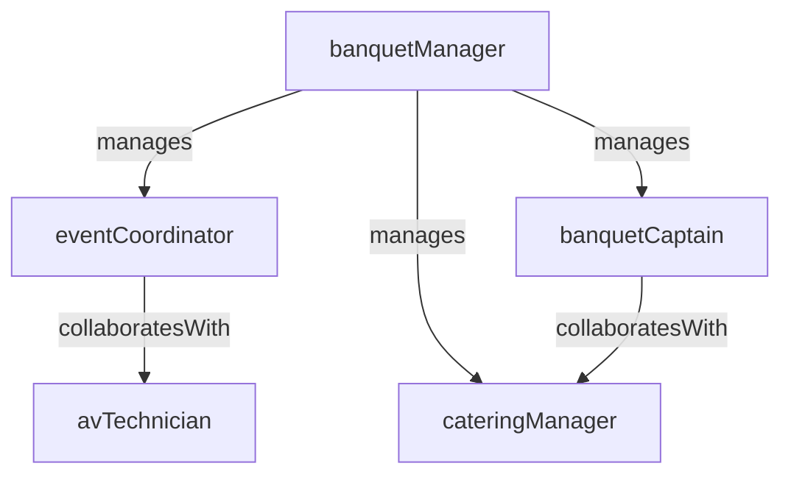

# Banquets and Events

> Business-as-Code definition for the Banquets and Events department. Models responsibilities, actions, events, and searches.

## Overview

Banquets and Events plans and executes meetings, conferences, weddings, and social events, managing space allocation, catering, audiovisual setup, and day-of coordination. The department converts event bookings into seamless, profitable guest experiences.

## Responsibilities

| Responsibility | Description |
|---------------|-------------|
| planEventLogistics | Coordinate space setup, floor plans, catering menus, and audiovisual requirements |
| manageFunctionSpace | Schedule and allocate meeting rooms, ballrooms, and outdoor venues |
| executeEventService | Deliver food, beverage, and service during events per the banquet event order |
| coordinateAvSetup | Arrange audiovisual equipment, staging, and technical support for events |
| manageBanquetRevenue | Track event revenue, service charges, and cost against budget for each booking |

## Roles

| Role | Description |
|------|-------------|
| banquetManager | Oversees all event execution, banquet staffing, and service quality |
| eventCoordinator | Plans event details with clients and produces banquet event orders |
| banquetCaptain | Leads service staff during event execution and manages floor operations |
| avTechnician | Sets up and operates audiovisual equipment for meetings and events |
| cateringManager | Manages catering menus, food production coordination, and event food service |

## Entities

| Entity | Description |
|--------|-------------|
| BanquetEventOrder | Detailed specification document for an event including menu, setup, timeline, and AV needs |
| FunctionSpace | Bookable meeting room, ballroom, or outdoor venue with capacity and configuration data |
| EventBooking | Confirmed reservation of function space and services for a specific date and client |
| CateringMenu | Pre-designed or custom menu package offered for event food and beverage service |
| EventInvoice | Itemized billing document for an event covering space rental, catering, AV, and service charges |

## Actions

| Action | Description |
|--------|-------------|
| createBanquetEventOrder | Draft the detailed event specification document with client requirements |
| bookFunctionSpace | Reserve a meeting room or ballroom for a specific date, time, and configuration |
| setupEventRoom | Configure the function space with tables, chairs, linens, and decor per the event order |
| executeEventService | Deliver food, beverage, and service during the event per the banquet event order |
| coordinateAvRequirements | Arrange and test audiovisual equipment for the event |
| generateEventInvoice | Produce the final itemized invoice for the event after completion |

## Events

| Event | Description |
|-------|-------------|
| banquetEventOrderFinalized | The event specification document was approved by the client and distributed to operations |
| functionSpaceBooked | A meeting room or ballroom was reserved for an event |
| eventRoomSetupCompleted | The function space was configured and ready for the event |
| eventServiceExecuted | Food, beverage, and service were delivered during the event |
| avSetupCompleted | Audiovisual equipment was installed and tested for the event |
| eventInvoiceGenerated | The final event invoice was produced and sent to the client |
| eventFeedbackReceived | Post-event satisfaction feedback was collected from the client |

## Searches

| Search | Description |
|--------|-------------|
| findAvailableFunctionSpace | Search open function spaces by date, capacity, and configuration type |
| getUpcomingEvents | List events scheduled within a date range with status and assigned coordinator |
| searchEventsByClient | Find past and upcoming event bookings for a specific client or organization |
| getEventRevenueReport | Summarize event revenue, cost, and margin by period or event type |
| findEventsNeedingBeo | List confirmed events that do not yet have a finalized banquet event order |

## Workflow


## Actor Relationships



## Related Processes

| Process | APQC ID | Relationship |
|---------|---------|-------------|
| Deliver Products and Services | 4.4 | Event execution is a core service delivery function in hospitality |
| Manage Customer Service | 5.1 | Event planning and day-of coordination are high-touch guest service activities |
| Market and Sell Products and Services | 3.5 | Event sales and catering proposals are key revenue-generating activities |

## Related Departments

| Department | Relationship |
|-----------|-------------|
| Food and Beverage | Provides kitchen resources and catering menus for event food service |
| Reservations | Coordinates group room blocks associated with event bookings |
| Enterprise Sales | Generates event leads and negotiates group booking contracts |
| Front Desk | Manages group check-in and VIP arrivals connected to events |

## Usage

```typescript
import { db } from '@headlessly/db'

const dept = await db.departments.get('banquetsAndEvents')
const spaces = await db.departments.search('findAvailableFunctionSpace', { date: '2025-06-15', capacity: 200 })
const upcoming = await db.departments.search('getUpcomingEvents', { startDate: '2025-06-01', endDate: '2025-06-30' })
```
