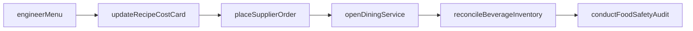
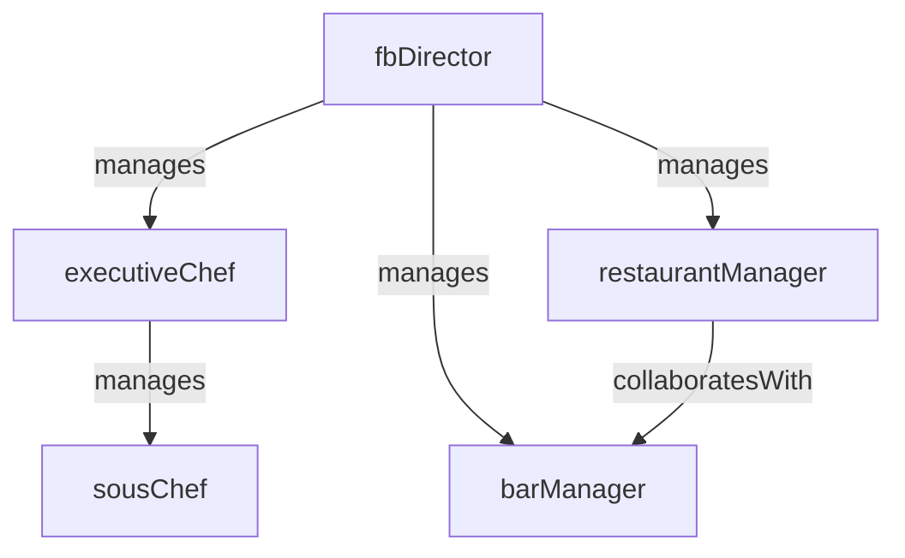

# Food and Beverage

> Business-as-Code definition for the Food and Beverage department. Models responsibilities, actions, events, and searches.

## Overview

Food and Beverage manages kitchen operations, menu planning, food safety compliance, beverage programs, and dining room service across restaurants, bars, room service, and catering outlets. The department balances guest satisfaction, cost control, and health code adherence.

## Responsibilities

| Responsibility | Description |
|---------------|-------------|
| manageMenuEngineering | Design, cost, and optimize menus to maximize guest satisfaction and contribution margin |
| overseeKitchenOperations | Coordinate food production, mise en place, and plating across all kitchen stations |
| ensureFoodSafetyCompliance | Enforce HACCP protocols, temperature logging, and health department standards |
| manageBeverageProgram | Curate wine, spirits, and beverage offerings including inventory and pour cost control |
| controlFoodAndBeverageCost | Track food cost percentage, waste, and purchasing against budget targets |

## Roles

| Role | Description |
|------|-------------|
| fbDirector | Oversees all food and beverage outlets, budgets, and guest experience standards |
| executiveChef | Leads culinary operations, menu development, and kitchen staff management |
| restaurantManager | Manages front-of-house dining operations, service standards, and floor scheduling |
| barManager | Oversees bar operations, cocktail programs, and beverage inventory control |
| sousChef | Supervises daily kitchen production and assists the executive chef with menu execution |

## Entities

| Entity | Description |
|--------|-------------|
| MenuItem | Individual dish or beverage with recipe, cost, pricing, and dietary attributes |
| MenuEngineeringReport | Analysis of menu item popularity and profitability used to optimize the menu mix |
| FoodCostReport | Periodic summary of actual versus budgeted food cost by outlet or category |
| PurchaseOrder | Order placed with a food or beverage supplier for ingredients and supplies |
| HealthInspectionRecord | Documentation of a health department or internal food safety inspection |
| RecipeCostCard | Detailed ingredient breakdown and cost calculation for a specific menu item |

## Actions

| Action | Description |
|--------|-------------|
| engineerMenu | Analyze item profitability and popularity to redesign the menu mix |
| placeSupplierOrder | Submit a purchase order for food, beverage, or supply items |
| conductFoodSafetyAudit | Perform an internal HACCP compliance check across kitchen and storage areas |
| updateRecipeCostCard | Recalculate ingredient costs and portion sizes for a menu item |
| reconcileBeverageInventory | Count and reconcile bar inventory against sales and pour records |
| openDiningService | Set up and begin service for a meal period in a restaurant or outlet |

## Events

| Event | Description |
|-------|-------------|
| menuPublished | A new or revised menu was finalized and deployed to an outlet |
| supplierOrderReceived | A food or beverage delivery was received and inspected |
| foodSafetyAuditCompleted | An internal or external food safety inspection was completed and documented |
| recipeCostCardUpdated | A menu item's cost card was recalculated reflecting current ingredient prices |
| beverageInventoryReconciled | Bar inventory was counted and variances against sales were recorded |
| diningServiceOpened | A meal period was opened for guest service in a restaurant outlet |
| foodCostVarianceFlagged | Actual food cost exceeded the budgeted threshold for an outlet or period |

## Searches

| Search | Description |
|--------|-------------|
| getMenuItemProfitability | Retrieve contribution margin and popularity ranking for menu items |
| findFoodCostVariances | List outlets or categories where actual food cost exceeds budget |
| searchExpiringInventory | Find perishable inventory approaching or past expiration dates |
| getBeveragePourCost | Calculate pour cost percentages by category, brand, or outlet |
| getHealthInspectionHistory | Retrieve past health inspection scores and outstanding violations |
| findTopSellingItems | List highest-volume menu items by outlet and time period |

## Workflow



## Actor Relationships



## Related Processes

| Process | APQC ID | Relationship |
|---------|---------|-------------|
| Manage Customer Service | 5.1 | Dining service is a primary guest experience touchpoint |
| Manage Health, Safety, and Environment | 5.5 | Food safety, HACCP compliance, and health inspections are core safety obligations |
| Deliver Products and Services | 4.4 | Food and beverage production and service is a core hospitality delivery function |

## Related Departments

| Department | Relationship |
|-----------|-------------|
| Banquets and Events | Provides catering menus and kitchen resources for event food service |
| Housekeeping | Coordinates room service tray retrieval and minibar restocking |
| Procurement | Sources food, beverage, and supply vendors and negotiates contracts |
| Front Desk | Handles guest dining charges posted to room folios |

## Usage

```typescript
import { db } from '@headlessly/db'

const dept = await db.departments.get('foodAndBeverage')
const profitability = await db.departments.search('getMenuItemProfitability', { outlet: 'mainRestaurant' })
const variances = await db.departments.search('findFoodCostVariances', { period: '2025-03' })
```
