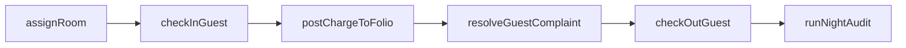
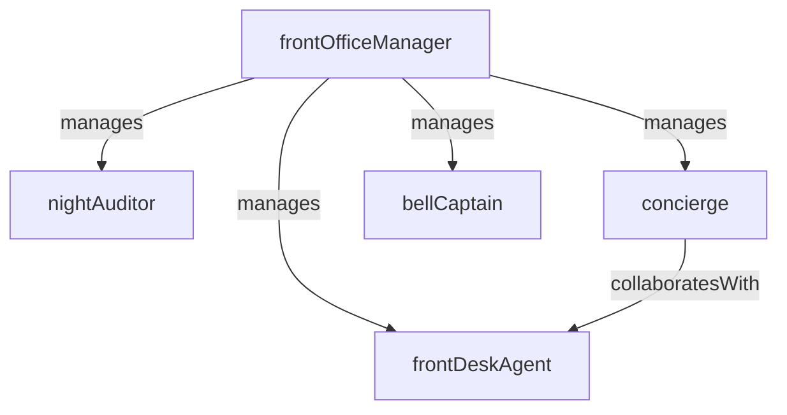

# Front Desk

> Business-as-Code definition for the Front Desk department. Models responsibilities, actions, events, and searches.

## Overview

The Front Desk manages guest check-in and check-out, room assignments, concierge services, guest relations, and night audit operations. It is the primary point of contact for guests throughout their stay and the hub connecting all hotel departments.

## Responsibilities

| Responsibility | Description |
|---------------|-------------|
| processCheckInCheckOut | Register arriving guests, assign rooms, and settle departing guest folios |
| manageRoomAssignments | Allocate rooms based on guest preferences, availability, and upgrade eligibility |
| handleGuestRelations | Resolve complaints, fulfill special requests, and recover service failures |
| conductNightAudit | Reconcile daily transactions, post room and tax charges, and close the business day |
| provideConciergeServices | Arrange transportation, dining reservations, tours, and local recommendations |

## Roles

| Role | Description |
|------|-------------|
| frontOfficeManager | Oversees front desk operations, staffing, and guest satisfaction metrics |
| frontDeskAgent | Processes guest check-in, check-out, and handles in-stay requests |
| nightAuditor | Reconciles daily revenue, posts charges, and produces end-of-day reports |
| concierge | Provides personalized guest services including reservations, directions, and arrangements |
| bellCaptain | Manages bell staff for luggage handling, room escorts, and valet coordination |

## Entities

| Entity | Description |
|--------|-------------|
| GuestFolio | Financial account for a guest stay containing charges, payments, and adjustments |
| RoomAssignment | Mapping of a guest reservation to a specific room number |
| GuestProfile | Record of guest preferences, loyalty status, stay history, and special requests |
| NightAuditReport | End-of-day reconciliation summarizing revenue, occupancy, and rate statistics |
| ServiceRequest | Guest request for maintenance, amenities, or concierge assistance |

## Actions

| Action | Description |
|--------|-------------|
| checkInGuest | Register an arriving guest, verify identity, assign room, and issue key |
| checkOutGuest | Settle the guest folio, process payment, and release the room |
| assignRoom | Allocate a specific room to a reservation based on type, preferences, and availability |
| postChargeToFolio | Add a room charge, incidental, or adjustment to a guest's folio |
| resolveGuestComplaint | Document, investigate, and resolve a guest service issue or complaint |
| runNightAudit | Execute end-of-day reconciliation, post room and tax charges, and generate reports |

## Events

| Event | Description |
|-------|-------------|
| guestCheckedIn | A guest was registered, assigned a room, and issued a key |
| guestCheckedOut | A guest's folio was settled and the room released for turnover |
| roomAssigned | A specific room was allocated to a guest reservation |
| guestComplaintResolved | A guest service issue was documented, addressed, and closed |
| nightAuditCompleted | The daily reconciliation was finished and end-of-day reports generated |
| folioChargePosted | A charge or adjustment was posted to a guest's folio |
| vipGuestArrivalFlagged | A VIP or loyalty-tier guest arrival was flagged for enhanced service preparation |

## Searches

| Search | Description |
|--------|-------------|
| findArrivalsToday | List all reservations with check-in dates for today |
| getDeparturesToday | List all guests scheduled for check-out today |
| searchGuestByName | Look up a guest profile or active folio by name or confirmation number |
| getOccupancySnapshot | Retrieve current rooms occupied, available, out-of-order, and due-out counts |
| findOpenGuestComplaints | List unresolved guest complaints or service recovery cases |
| getRevenueByOutlet | Retrieve revenue posted to guest folios by department or outlet |

## Workflow



## Actor Relationships



## Related Processes

| Process | APQC ID | Relationship |
|---------|---------|-------------|
| Manage Customer Service | 5.1 | The front desk is the primary guest service and complaint resolution channel |
| Deliver Products and Services | 4.4 | Check-in and room assignment is the core service delivery moment for lodging |
| Perform Revenue Accounting | 5.2 | Night audit and folio management feed into revenue accounting and reporting |

## Related Departments

| Department | Relationship |
|-----------|-------------|
| Housekeeping | Receives room availability updates and communicates guest room readiness |
| Reservations | Provides reservation data that drives room assignments and arrival preparation |
| Revenue Management | Supplies rate and upgrade strategies that front desk agents execute at check-in |
| Food and Beverage | Posts dining charges to guest folios and coordinates room service requests |

## Usage

```typescript
import { db } from '@headlessly/db'

const dept = await db.departments.get('frontDesk')
const arrivals = await db.departments.search('findArrivalsToday', { property: 'main' })
const occupancy = await db.departments.search('getOccupancySnapshot', { property: 'main' })
```
