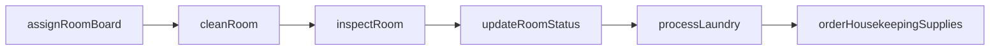
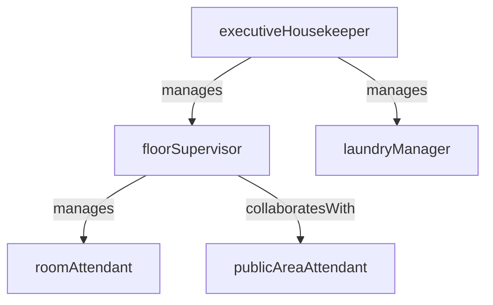

# Housekeeping

> Business-as-Code definition for the Housekeeping department. Models responsibilities, actions, events, and searches.

## Overview

Housekeeping manages room cleaning, laundry operations, public area maintenance, and housekeeping supply inventory to maintain property cleanliness and guest comfort standards. The department coordinates room turnover with the front desk to maximize available inventory.

## Responsibilities

| Responsibility | Description |
|---------------|-------------|
| manageRoomTurnover | Clean, inspect, and release guest rooms on the daily turnover schedule |
| overseelaundryOperations | Manage on-property or outsourced laundry for linens, towels, and guest garments |
| maintainPublicAreas | Keep lobbies, corridors, restrooms, and common areas clean and presentable |
| controlHousekeepingInventory | Track and reorder cleaning supplies, linens, amenities, and guest room consumables |
| enforceCleanlinessStandards | Define and audit room cleanliness, deep-cleaning schedules, and brand standards |

## Roles

| Role | Description |
|------|-------------|
| executiveHousekeeper | Oversees all housekeeping operations, staffing, and quality standards |
| floorSupervisor | Manages room attendants on assigned floors and inspects completed rooms |
| roomAttendant | Cleans and prepares guest rooms to brand standards |
| laundryManager | Operates the laundry facility and manages linen par levels |
| publicAreaAttendant | Maintains cleanliness of lobbies, corridors, and other common areas |

## Entities

| Entity | Description |
|--------|-------------|
| RoomStatus | Current condition of a guest room: dirty, in-progress, inspected, or available |
| TurnoverSchedule | Daily assignment of rooms to attendants with priority and sequence |
| LinenParLevel | Target inventory quantity for each linen type by property or floor |
| InspectionChecklist | Standardized quality checklist used to inspect cleaned guest rooms |
| HousekeepingSupplyOrder | Purchase order for cleaning chemicals, amenities, and consumable supplies |

## Actions

| Action | Description |
|--------|-------------|
| assignRoomBoard | Distribute room cleaning assignments to attendants based on occupancy and priorities |
| cleanRoom | Perform full or stayover cleaning of a guest room per brand standards |
| inspectRoom | Verify room cleanliness against the inspection checklist and release for sale |
| processLaundry | Wash, dry, fold, and distribute linens and guest garments |
| orderHousekeepingSupplies | Place orders for cleaning chemicals, amenities, and linen replacements |
| updateRoomStatus | Change a room's status in the property management system after cleaning or inspection |

## Events

| Event | Description |
|-------|-------------|
| roomBoardAssigned | Daily room assignments were distributed to housekeeping staff |
| roomCleaned | A guest room was cleaned and is awaiting inspection |
| roomInspected | A cleaned room passed inspection and was released as available |
| roomInspectionFailed | A room did not meet standards and was returned for re-cleaning |
| laundryProcessed | A batch of linens or guest garments completed the laundry cycle |
| housekeepingSuppliesOrdered | A replenishment order was placed for cleaning supplies or amenities |

## Searches

| Search | Description |
|--------|-------------|
| findDirtyRooms | List rooms in dirty status that need cleaning, sorted by priority |
| getRoomTurnoverProgress | Check how many rooms are cleaned, inspected, and available versus the day's target |
| searchLinenParLevels | Find linen types that are below par level and need replenishment |
| getAttendantProductivity | Retrieve rooms cleaned, inspection pass rate, and hours by attendant |
| findRoomsAwaitingInspection | List rooms that have been cleaned but not yet inspected |

## Workflow



## Actor Relationships



## Related Processes

| Process | APQC ID | Relationship |
|---------|---------|-------------|
| Deliver Products and Services | 4.4 | Room readiness is the core product delivery function for lodging operations |
| Manage Customer Service | 5.1 | Room cleanliness is one of the highest-impact guest satisfaction drivers |
| Manage Health, Safety, and Environment | 5.5 | Chemical handling, infection control, and laundry hygiene are safety-critical |

## Related Departments

| Department | Relationship |
|-----------|-------------|
| Front Desk | Receives room availability updates and communicates early check-in or late checkout requests |
| Reservations | Provides occupancy forecasts that drive housekeeping staffing and supply planning |
| Food and Beverage | Coordinates room service tray pickup and minibar restocking schedules |
| Facilities Management | Submits and receives work orders for in-room repairs discovered during cleaning |

## Usage

```typescript
import { db } from '@headlessly/db'

const dept = await db.departments.get('housekeeping')
const dirty = await db.departments.search('findDirtyRooms', { floor: 12, priority: 'vip' })
const progress = await db.departments.search('getRoomTurnoverProgress', { date: 'today' })
```
