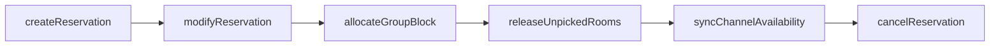
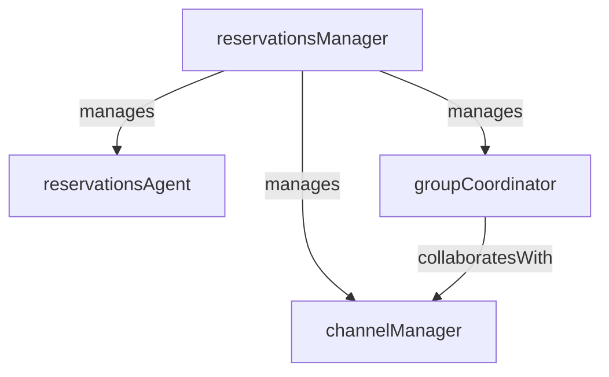

# Reservations

> Business-as-Code definition for the Reservations department. Models responsibilities, actions, events, and searches.

## Overview

Reservations manages room inventory across all booking channels, processes individual and group bookings, and forecasts availability to maximize occupancy and revenue. The department serves as the gateway between demand generation and property operations.

## Responsibilities

| Responsibility | Description |
|---------------|-------------|
| manageRoomInventory | Control room type availability, allotments, and sell-through across all channels |
| processBookings | Create, modify, and cancel reservations from direct, OTA, and group channels |
| manageGroupBlocks | Allocate, track, and release room blocks for group and corporate bookings |
| forecastAvailability | Project future occupancy based on pace, historical patterns, and booking trends |
| manageChannelDistribution | Maintain rate and availability connectivity with OTAs, GDS, and brand channels |

## Roles

| Role | Description |
|------|-------------|
| reservationsManager | Oversees booking operations, inventory control, and channel management |
| reservationsAgent | Processes inbound reservation requests via phone, email, and digital channels |
| groupCoordinator | Manages group room blocks, rooming lists, and cutoff date tracking |
| channelManager | Maintains rate parity and availability across OTA, GDS, and direct booking channels |

## Entities

| Entity | Description |
|--------|-------------|
| Reservation | A confirmed booking for a guest stay with dates, room type, and rate details |
| RoomBlock | An allocated inventory of rooms held for a group, event, or corporate account |
| AvailabilityForecast | Projected room availability and occupancy by date and room type |
| BookingChannel | Distribution source through which reservations are received (OTA, GDS, direct) |
| RateCode | Pricing rule associating a rate amount with a room type, channel, and date range |

## Actions

| Action | Description |
|--------|-------------|
| createReservation | Book a new guest stay with dates, room type, rate, and guest details |
| modifyReservation | Update an existing reservation's dates, room type, rate, or guest information |
| cancelReservation | Cancel a reservation and apply the appropriate cancellation policy |
| allocateGroupBlock | Reserve a block of rooms for a group booking with a cutoff date |
| releaseUnpickedRooms | Return unbooked rooms from an expired group block to general inventory |
| syncChannelAvailability | Push updated room availability and rates to connected distribution channels |

## Events

| Event | Description |
|-------|-------------|
| reservationCreated | A new reservation was confirmed in the property management system |
| reservationModified | An existing reservation's details were changed |
| reservationCancelled | A reservation was cancelled and the room returned to available inventory |
| groupBlockAllocated | A room block was created and reserved for a group booking |
| unpickedRoomsReleased | Unused rooms from an expired group block were returned to general availability |
| channelAvailabilitySynced | Room availability and rates were pushed to distribution channels |
| overbookingAlertRaised | Projected arrivals exceeded available room count for a future date |

## Searches

| Search | Description |
|--------|-------------|
| findAvailableRooms | Search room availability by date range, room type, and rate code |
| getBookingPace | Compare reservation pickup against the same period last year by arrival date |
| searchGroupBlocks | List active group blocks with pickup counts, cutoff dates, and remaining rooms |
| getChannelProductionReport | Retrieve reservation volume and revenue by booking channel |
| findCancellations | List reservations cancelled within a date range with cancellation reasons |
| getOccupancyForecast | Project occupancy percentage by date based on current bookings and historical trends |

## Workflow



## Actor Relationships



## Related Processes

| Process | APQC ID | Relationship |
|---------|---------|-------------|
| Deliver Products and Services | 4.4 | Reservations converts demand into confirmed bookings that operations must fulfill |
| Manage Customer Service | 5.1 | Reservation handling is a key pre-arrival guest service touchpoint |
| Market and Sell Products and Services | 3.5 | Channel distribution and rate management support sales and marketing efforts |

## Related Departments

| Department | Relationship |
|-----------|-------------|
| Revenue Management | Provides rate strategies and pricing guidance that reservations agents execute |
| Front Desk | Receives reservation data for check-in processing and room assignment |
| Banquets and Events | Coordinates group room blocks with event bookings and catering contracts |
| Enterprise Sales | Negotiates group and corporate rate agreements that reservations manages |

## Usage

```typescript
import { db } from '@headlessly/db'

const dept = await db.departments.get('reservations')
const available = await db.departments.search('findAvailableRooms', { checkIn: '2025-06-01', checkOut: '2025-06-03', roomType: 'king' })
const pace = await db.departments.search('getBookingPace', { arrivalMonth: '2025-06' })
```
