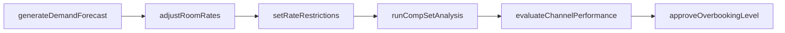
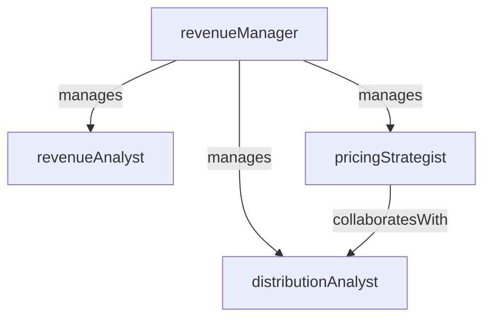

# Revenue Management

> Business-as-Code definition for the Revenue Management department. Models responsibilities, actions, events, and searches.

## Overview

Revenue Management maximizes room revenue through dynamic pricing, demand forecasting, rate strategy optimization, and distribution channel management. The department uses data-driven models to balance occupancy, average daily rate, and revenue per available room.

## Responsibilities

| Responsibility | Description |
|---------------|-------------|
| forecastDemand | Project future room demand by segment, date, and channel using historical data and market signals |
| optimizePricing | Set and adjust room rates dynamically based on demand, competition, and booking pace |
| manageRateStrategy | Define rate tiers, restrictions, length-of-stay controls, and overbooking levels |
| analyzeCompetitiveSet | Monitor competitor pricing, positioning, and market share to inform rate decisions |
| optimizeChannelMix | Balance direct versus third-party distribution to maximize net revenue |

## Roles

| Role | Description |
|------|-------------|
| revenueManager | Leads pricing strategy, demand forecasting, and revenue optimization for the property |
| revenueAnalyst | Builds forecast models, analyzes booking pace, and produces performance reports |
| pricingStrategist | Designs rate structures, restrictions, and promotional pricing for each segment |
| distributionAnalyst | Monitors channel performance, rate parity, and OTA commission costs |

## Entities

| Entity | Description |
|--------|-------------|
| DemandForecast | Projected room night demand by date, segment, and channel |
| RateStrategy | Set of pricing rules, restrictions, and controls for a room type and date range |
| CompSetReport | Competitive set analysis comparing rates, occupancy, and RevPAR index |
| RevenuePerformanceReport | Daily, weekly, or monthly summary of occupancy, ADR, and RevPAR versus budget |
| ChannelMixAnalysis | Breakdown of booking volume, revenue, and cost by distribution channel |

## Actions

| Action | Description |
|--------|-------------|
| generateDemandForecast | Build a room demand projection using pace data, historical trends, and market events |
| adjustRoomRates | Change published room rates in response to demand signals or competitive shifts |
| setRateRestrictions | Apply minimum stay, closed-to-arrival, or advance purchase restrictions for a date range |
| runCompSetAnalysis | Compare property performance against the competitive set on rates and occupancy |
| evaluateChannelPerformance | Assess revenue contribution and cost efficiency of each distribution channel |
| approveOverbookingLevel | Set the authorized overbooking ceiling for a date based on forecasted no-show rates |

## Events

| Event | Description |
|-------|-------------|
| demandForecastGenerated | A new demand projection was created for an upcoming date range |
| roomRatesAdjusted | Published room rates were changed for one or more room types and dates |
| rateRestrictionsApplied | Stay restrictions were activated or removed for a date range |
| compSetAnalysisCompleted | A competitive set performance comparison was completed and distributed |
| channelPerformanceReviewed | Distribution channel metrics were evaluated and recommendations issued |
| revParTargetMissed | Actual RevPAR fell below the budgeted target for a reporting period |
| overbookingLevelApproved | An authorized overbooking ceiling was set for a specific date |

## Searches

| Search | Description |
|--------|-------------|
| getDemandForecast | Retrieve the demand projection for a date range by segment and room type |
| getRevParPerformance | Query RevPAR, ADR, and occupancy actuals versus budget and prior year |
| findRateParityViolations | Identify dates where OTA rates undercut the best available direct rate |
| getBookingPaceVsForecast | Compare current booking pace against the demand forecast by arrival date |
| searchCompetitorRates | Retrieve competitor published rates for specific dates and room types |
| getChannelCostAnalysis | Calculate net revenue by channel after commissions and distribution fees |

## Workflow



## Actor Relationships



## Related Processes

| Process | APQC ID | Relationship |
|---------|---------|-------------|
| Deliver Products and Services | 4.4 | Revenue management optimizes the pricing and availability of the core lodging product |
| Market and Sell Products and Services | 3.5 | Pricing strategy and channel optimization directly support marketing and sales execution |
| Perform Revenue Accounting | 5.2 | Rate and revenue data feed into financial reporting and performance analysis |

## Related Departments

| Department | Relationship |
|-----------|-------------|
| Reservations | Executes rate and availability changes set by revenue management |
| Front Desk | Applies upgrade and upsell strategies guided by revenue management |
| Enterprise Sales | Aligns rate strategy with sales targets and group booking negotiations |
| Banquets and Events | Coordinates event pricing and function space revenue optimization |

## Usage

```typescript
import { db } from '@headlessly/db'

const dept = await db.departments.get('revenueManagement')
const forecast = await db.departments.search('getDemandForecast', { startDate: '2025-06-01', endDate: '2025-06-30' })
const revpar = await db.departments.search('getRevParPerformance', { period: '2025-05', property: 'main' })
```
