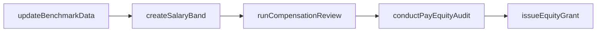
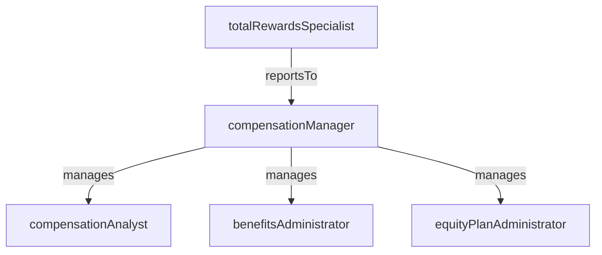

# Compensation & Benefits

> Business-as-Code definition for the Compensation & Benefits department. Models responsibilities, actions, events, and searches.

## Overview

Pay structures, equity programs, benefits administration, and total rewards

## Responsibilities

| Responsibility | Description |
|---------------|-------------|
| designCompensationStructures | Define salary bands, pay grades, and variable compensation frameworks aligned to market data |
| administerBenefitsPrograms | Manage health insurance, retirement plans, wellness programs, and other employee benefits |
| manageEquityPrograms | Administer stock option grants, RSU vesting schedules, and equity plan communications |
| conductMarketBenchmarking | Perform periodic compensation surveys and benchmarking to maintain competitive positioning |
| ensurePayEquity | Analyze compensation data to identify and remediate pay disparities across demographics |

## Roles

| Role | Description |
|------|-------------|
| compensationManager | Leads compensation strategy, manages salary structures, and oversees pay review cycles |
| benefitsAdministrator | Manages benefits enrollment, vendor relationships, and employee benefits inquiries |
| compensationAnalyst | Conducts market research, builds pay models, and analyzes compensation data |
| equityPlanAdministrator | Processes equity grants, manages vesting schedules, and handles stock plan compliance |
| totalRewardsSpecialist | Develops total rewards statements and communicates the full value of the compensation package |

## Entities

| Entity | Description |
|--------|-------------|
| SalaryBand | Defined pay range with minimum, midpoint, and maximum for a job grade or level |
| BenefitsPlan | A specific benefits offering such as medical, dental, 401(k), or wellness program |
| EquityGrant | A stock option or RSU award issued to an employee with a vesting schedule |
| CompensationReview | A periodic review cycle evaluating merit increases, promotions, and market adjustments |
| BenchmarkSurvey | Market compensation data collected from industry surveys for competitive analysis |

## Actions

| Action | Description |
|--------|-------------|
| createSalaryBand | Define a new pay range for a job grade or role family |
| runCompensationReview | Initiate the annual or mid-year compensation review cycle |
| enrollInBenefits | Process an employee's enrollment or changes to benefits plans |
| issueEquityGrant | Create and approve a new stock option or RSU grant for an employee |
| conductPayEquityAudit | Analyze compensation data across demographics to identify disparities |
| updateBenchmarkData | Import and refresh market compensation survey data |

## Events

| Event | Description |
|-------|-------------|
| salaryBandUpdated | A pay range was created or modified for a job grade |
| compensationReviewCompleted | The annual compensation review cycle was finalized with approved adjustments |
| benefitsEnrollmentProcessed | An employee's benefits enrollment or change was recorded |
| equityGrantIssued | A new stock option or RSU grant was approved and communicated to the employee |
| payEquityAuditCompleted | A pay equity analysis was finished and findings were documented |
| openEnrollmentOpened | The annual benefits open enrollment period was launched |

## Searches

| Search | Description |
|--------|-------------|
| getSalaryBandByLevel | Retrieve the pay range for a specific job grade or level |
| findBenefitsEligibility | Determine which benefits plans an employee is eligible for |
| getEquityVestingSchedule | Query the vesting timeline and status for an employee's equity grants |
| searchCompensationByDepartment | Retrieve aggregated compensation data for a specific department or team |
| findPendingReviewActions | List compensation review decisions awaiting manager or HR approval |

## Workflow



## Actor Relationships



## Related Processes

| Process | APQC ID | Relationship |
|---------|---------|-------------|
| Reward and Retain Employees | 7.5 | Core process for designing and administering compensation, benefits, and recognition |
| Manage Employee Information and Analytics | 7.9 | Provides workforce data used for compensation analysis and pay equity audits |

## Related Departments

| Department | Relationship |
|-----------|-------------|
| People Operations | Processes payroll changes resulting from compensation reviews and benefits elections |
| Talent Acquisition | Provides salary bands and benefits details for competitive offer packages |
| Accounting | Accounts for compensation expense, equity liability, and benefits costs |

## Usage

```typescript
import { db } from '@headlessly/db'

const dept = await db.departments.get('compensationBenefits')
const bands = await db.departments.search('getSalaryBandByLevel', { level: 'L5' })
const vesting = await db.departments.search('getEquityVestingSchedule', { employeeId: 'emp_7890' })
```
