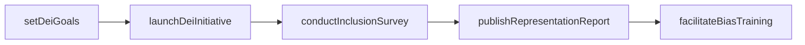
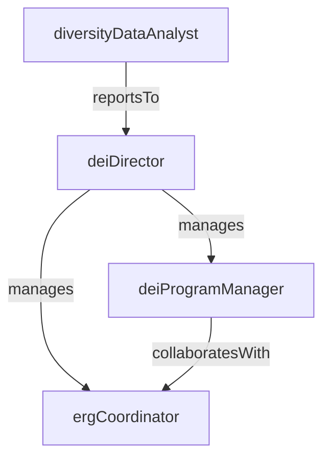

# Diversity Equity & Inclusion

> Business-as-Code definition for the Diversity Equity & Inclusion department. Models responsibilities, actions, events, and searches.

## Overview

DEI strategy, employee resource groups, and inclusive hiring practices

## Responsibilities

| Responsibility | Description |
|---------------|-------------|
| developDeiStrategy | Define the organization's diversity, equity, and inclusion goals, roadmap, and accountability metrics |
| manageEmployeeResourceGroups | Charter, fund, and support employee resource groups that foster community and belonging |
| advanceInclusiveHiring | Partner with Talent Acquisition to embed inclusive sourcing, screening, and interviewing practices |
| deliverDeiTraining | Design and facilitate training on unconscious bias, inclusive leadership, and cultural competency |
| trackRepresentationMetrics | Collect, analyze, and report on workforce diversity data across demographics and levels |

## Roles

| Role | Description |
|------|-------------|
| deiDirector | Sets the strategic direction for DEI initiatives and reports progress to executive leadership |
| deiProgramManager | Plans and executes DEI programs, events, and training across the organization |
| ergCoordinator | Supports employee resource group operations, budgets, and cross-ERG collaboration |
| diversityDataAnalyst | Analyzes workforce demographic data, measures program impact, and produces DEI dashboards |

## Entities

| Entity | Description |
|--------|-------------|
| DeiInitiative | A planned program or project aimed at advancing a specific diversity, equity, or inclusion goal |
| EmployeeResourceGroup | A voluntary, employee-led group organized around a shared identity, experience, or interest |
| RepresentationReport | A periodic report detailing workforce demographic composition across dimensions and levels |
| InclusionSurvey | A survey measuring employees' sense of belonging, psychological safety, and inclusive experience |
| DeiGoal | A measurable objective with targets and timelines for improving diversity or inclusion outcomes |

## Actions

| Action | Description |
|--------|-------------|
| launchDeiInitiative | Create and kick off a new DEI program or campaign with defined objectives and timeline |
| charterResourceGroup | Formally establish a new employee resource group with a charter, executive sponsor, and budget |
| conductInclusionSurvey | Deploy an inclusion and belonging survey to the workforce |
| publishRepresentationReport | Generate and distribute the periodic workforce diversity report |
| facilitateBiasTraining | Deliver an unconscious bias or inclusive leadership training session |
| setDeiGoals | Define measurable DEI targets for the organization or a specific department |

## Events

| Event | Description |
|-------|-------------|
| deiInitiativeLaunched | A new DEI program or campaign was activated |
| resourceGroupChartered | A new employee resource group was formally established |
| inclusionSurveyCompleted | An inclusion and belonging survey closed and results were compiled |
| representationReportPublished | The periodic workforce diversity report was released to stakeholders |
| biasTrainingDelivered | An unconscious bias or inclusive leadership training session was completed |
| deiGoalAchieved | A measurable DEI target was reached within the defined timeline |

## Searches

| Search | Description |
|--------|-------------|
| getRepresentationByLevel | Retrieve workforce demographic breakdown filtered by job level or department |
| findActiveInitiatives | List all DEI initiatives currently in progress |
| getInclusionSurveyResults | Query inclusion and belonging survey scores by department or demographic group |
| searchResourceGroups | List employee resource groups filtered by focus area or region |

## Workflow



## Actor Relationships



## Related Processes

| Process | APQC ID | Relationship |
|---------|---------|-------------|
| Recruit, Source, and Select Employees | 7.2 | DEI partners on inclusive sourcing strategies and diverse candidate slates |
| Manage Employee Relations | 7.4 | Collaborates on bias-related investigations and inclusive workplace policies |

## Related Departments

| Department | Relationship |
|-----------|-------------|
| Talent Acquisition | Partners on diverse sourcing strategies, inclusive job descriptions, and equitable screening |
| Employee Relations | Collaborates on bias-related complaints and inclusive workplace policy development |
| Learning & Development | Co-develops DEI training content and integrates inclusion into leadership programs |

## Usage

```typescript
import { db } from '@headlessly/db'

const dept = await db.departments.get('diversityEquityInclusion')
const representation = await db.departments.search('getRepresentationByLevel', { level: 'director' })
const initiatives = await db.departments.search('findActiveInitiatives', { status: 'in-progress' })
```
