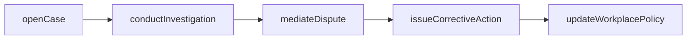
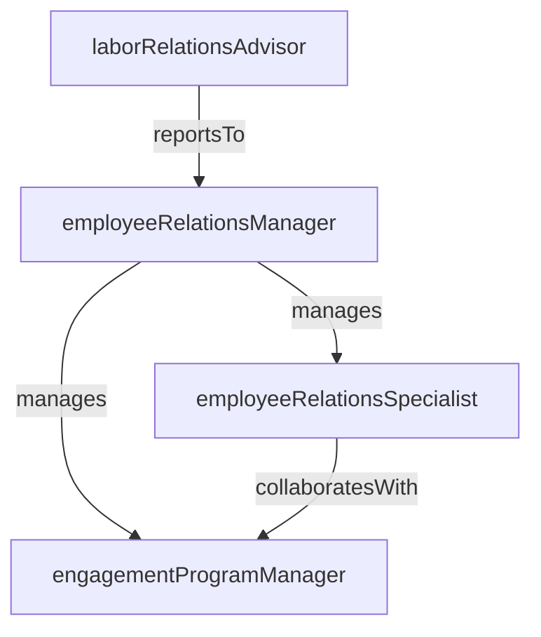

# Employee Relations

> Business-as-Code definition for the Employee Relations department. Models responsibilities, actions, events, and searches.

## Overview

Workplace policies, conflict resolution, and employee engagement

## Responsibilities

| Responsibility | Description |
|---------------|-------------|
| manageWorkplacePolicies | Develop, publish, and enforce employee handbook policies and workplace conduct standards |
| resolveEmployeeConflicts | Investigate complaints, mediate disputes, and recommend corrective or restorative actions |
| conductWorkplaceInvestigations | Lead formal investigations into allegations of misconduct, harassment, or policy violations |
| driveEmployeeEngagement | Design and execute engagement surveys, analyze results, and partner with leaders on action plans |
| adviseOnEmploymentLaw | Provide guidance to managers and HR partners on employment regulations and compliance risks |

## Roles

| Role | Description |
|------|-------------|
| employeeRelationsManager | Leads the ER function, sets policy direction, and manages complex investigations |
| employeeRelationsSpecialist | Handles casework including complaints, investigations, and corrective action recommendations |
| engagementProgramManager | Designs and runs employee engagement surveys, recognition programs, and culture initiatives |
| laborRelationsAdvisor | Manages union relationships, collective bargaining, and labor agreement interpretation |

## Entities

| Entity | Description |
|--------|-------------|
| EmployeeCase | A formal record of a complaint, investigation, or disciplinary matter involving an employee |
| WorkplacePolicy | A documented policy governing employee conduct, attendance, safety, or other workplace matters |
| EngagementSurvey | A structured survey measuring employee satisfaction, engagement, and workplace sentiment |
| CorrectiveAction | A formal disciplinary measure such as a verbal warning, written warning, or performance plan |
| GrievanceFiling | A formal complaint submitted by an employee or union representative regarding a workplace issue |

## Actions

| Action | Description |
|--------|-------------|
| openCase | Create a new employee relations case for a complaint or reported concern |
| conductInvestigation | Gather evidence, interview witnesses, and document findings for an ER case |
| issueCorrective Action | Deliver a formal disciplinary action based on investigation findings |
| launchEngagementSurvey | Deploy an employee engagement survey to a targeted population |
| mediateDispute | Facilitate a mediation session between parties involved in a workplace conflict |
| updateWorkplacePolicy | Draft, review, and publish revisions to an employee handbook policy |

## Events

| Event | Description |
|-------|-------------|
| caseOpened | A new employee relations case was created and assigned for investigation |
| investigationCompleted | An investigation concluded with documented findings and a recommended outcome |
| correctiveActionIssued | A formal disciplinary action was delivered and recorded in the employee's file |
| engagementSurveyCompleted | An employee engagement survey closed and results were compiled |
| policyUpdated | A workplace policy was revised and published to the employee handbook |
| grievanceFiled | A formal grievance was submitted by an employee or union representative |

## Searches

| Search | Description |
|--------|-------------|
| findOpenCases | Retrieve all active employee relations cases filtered by status or category |
| getEngagementScores | Query engagement survey results by department, location, or time period |
| searchPolicyViolations | List cases involving violations of a specific workplace policy |
| findCasesByManager | Retrieve employee relations cases associated with a specific manager's team |

## Workflow



## Actor Relationships



## Related Processes

| Process | APQC ID | Relationship |
|---------|---------|-------------|
| Manage Employee Relations | 7.6 | Core process for handling complaints, investigations, and workplace conflict resolution |
| Develop and Counsel Employees | 7.3 | Corrective actions and coaching intersect with employee development processes |

## Related Departments

| Department | Relationship |
|-----------|-------------|
| People Operations | Maintains employee records updated with case outcomes and corrective actions |
| Legal & Compliance | Advises on employment law, litigation risk, and regulatory compliance for ER cases |
| Diversity Equity & Inclusion | Partners on bias-related investigations and inclusive workplace policy development |

## Usage

```typescript
import { db } from '@headlessly/db'

const dept = await db.departments.get('employeeRelations')
const openCases = await db.departments.search('findOpenCases', { status: 'active' })
const scores = await db.departments.search('getEngagementScores', { department: 'engineering' })
```
