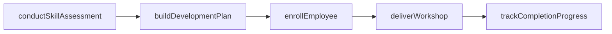
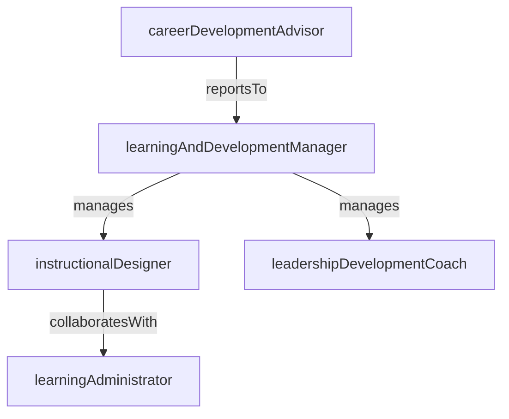

# Learning & Development

> Business-as-Code definition for the Learning & Development department. Models responsibilities, actions, events, and searches.

## Overview

Training programs, leadership development, and career pathing

## Responsibilities

| Responsibility | Description |
|---------------|-------------|
| designLearningPrograms | Create structured training curricula aligned to competency frameworks and business needs |
| developLeadershipCapability | Build and deliver leadership development programs for emerging and senior leaders |
| manageCareerPathing | Define career ladders, skill matrices, and progression criteria across roles |
| administerLearningPlatform | Operate the learning management system including content catalog, enrollment, and tracking |
| assessSkillGaps | Conduct organization-wide skill assessments to identify development priorities |

## Roles

| Role | Description |
|------|-------------|
| learningAndDevelopmentManager | Leads the L&D function, sets the learning strategy, and manages the training budget |
| instructionalDesigner | Designs course content, e-learning modules, and assessment instruments |
| leadershipDevelopmentCoach | Facilitates leadership programs, executive coaching, and 360-degree feedback |
| learningAdministrator | Manages LMS operations, enrollment processing, and completion reporting |
| careerDevelopmentAdvisor | Guides employees on career paths, skill building, and professional growth planning |

## Entities

| Entity | Description |
|--------|-------------|
| TrainingProgram | A structured set of courses and activities designed to develop a specific competency |
| LearningPath | An ordered sequence of learning activities leading to role readiness or skill mastery |
| SkillAssessment | An evaluation measuring an employee's proficiency against a defined competency framework |
| DevelopmentPlan | An individual employee's goals, learning activities, and milestones for professional growth |
| CourseCompletion | A record that an employee finished a specific training course or module |

## Actions

| Action | Description |
|--------|-------------|
| createTrainingProgram | Design and publish a new training program with courses and learning objectives |
| enrollEmployee | Register an employee into a training program or learning path |
| conductSkillAssessment | Administer a competency evaluation for an individual or team |
| buildDevelopmentPlan | Create a personalized development plan with goals and learning activities |
| deliverWorkshop | Facilitate a live or virtual instructor-led workshop session |
| trackCompletionProgress | Monitor and report on employee progress through assigned learning activities |

## Events

| Event | Description |
|-------|-------------|
| trainingProgramLaunched | A new training program was published and made available for enrollment |
| employeeEnrolled | An employee was registered into a training program or learning path |
| skillAssessmentCompleted | An employee completed a competency assessment and results were recorded |
| developmentPlanCreated | A personalized development plan was built for an employee |
| courseCompleted | An employee finished a training course and their completion was recorded |
| skillGapIdentified | A significant gap between required and current competency was detected |

## Searches

| Search | Description |
|--------|-------------|
| findAvailablePrograms | List training programs open for enrollment filtered by topic or skill area |
| getCompletionRatesByTeam | Retrieve training completion percentages aggregated by team or department |
| searchSkillGaps | Identify employees or teams with gaps in specific competency areas |
| getDevelopmentPlanStatus | Query progress on individual development plans filtered by manager or department |

## Workflow



## Actor Relationships



## Related Processes

| Process | APQC ID | Relationship |
|---------|---------|-------------|
| Develop and Counsel Employees | 7.3 | Core process for employee training, coaching, and professional development |
| Manage Employee Careers | 7.4 | Governs career pathing, succession planning, and leadership pipelines |

## Related Departments

| Department | Relationship |
|-----------|-------------|
| People Operations | Provides employee data and integrates learning records into HRIS profiles |
| Talent Acquisition | Aligns onboarding training for new hires with role-specific learning paths |
| Compensation & Benefits | Connects skill progression to compensation bands and promotion criteria |

## Usage

```typescript
import { db } from '@headlessly/db'

const dept = await db.departments.get('learningDevelopment')
const programs = await db.departments.search('findAvailablePrograms', { skill: 'leadership' })
const gaps = await db.departments.search('searchSkillGaps', { department: 'engineering' })
```
