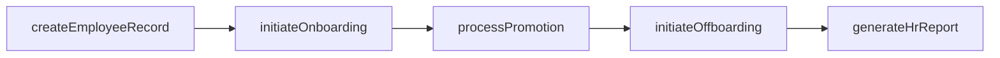
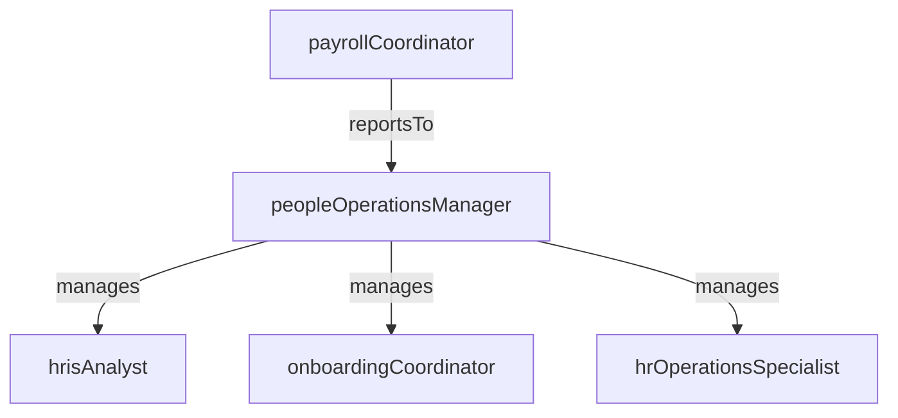

# People Operations

> Business-as-Code definition for the People Operations department. Models responsibilities, actions, events, and searches.

## Overview

HRIS management, onboarding/offboarding, and HR process automation

## Responsibilities

| Responsibility | Description |
|---------------|-------------|
| manageHrisSystem | Administer the human resource information system including employee records, org structures, and data integrity |
| executeOnboarding | Coordinate the end-to-end new hire onboarding process from pre-boarding through Day 30 orientation |
| processOffboarding | Manage employee separations including exit interviews, access revocation, and final payroll |
| automateHrWorkflows | Design and implement automated workflows for approvals, notifications, and employee self-service |
| maintainEmployeeRecords | Ensure accuracy, completeness, and compliance of all employee data and personnel files |

## Roles

| Role | Description |
|------|-------------|
| peopleOperationsManager | Leads the People Ops team, owns HR systems strategy, and manages process improvement |
| hrisAnalyst | Configures and maintains the HRIS platform, builds reports, and troubleshoots data issues |
| onboardingCoordinator | Manages the new hire onboarding workflow including equipment, accounts, and orientation scheduling |
| hrOperationsSpecialist | Processes employee lifecycle transactions such as promotions, transfers, and terminations |
| payrollCoordinator | Prepares and validates payroll inputs, resolves discrepancies, and coordinates with finance |

## Entities

| Entity | Description |
|--------|-------------|
| EmployeeRecord | The master data record for an employee including personal, job, and compensation information |
| OnboardingChecklist | A structured set of tasks and milestones to be completed during the new hire onboarding process |
| OffboardingRequest | A workflow request initiated when an employee separates, covering access, equipment, and final pay |
| OrgStructure | The hierarchical representation of reporting relationships, departments, and cost centers |
| EmployeeLifecycleEvent | A recorded change in an employee's status such as hire, promotion, transfer, or termination |

## Actions

| Action | Description |
|--------|-------------|
| createEmployeeRecord | Set up a new employee profile in the HRIS upon hire |
| initiateOnboarding | Launch the onboarding workflow with tasks for IT, facilities, and the hiring manager |
| processPromotion | Record a promotion including title change, compensation adjustment, and reporting update |
| initiateOffboarding | Start the separation workflow including exit interview, access revocation, and final pay |
| generateHrReport | Produce headcount, turnover, or workforce analytics reports from HRIS data |
| updateOrgStructure | Modify reporting relationships, department assignments, or cost center mappings |

## Events

| Event | Description |
|-------|-------------|
| employeeRecordCreated | A new employee profile was created in the HRIS |
| onboardingCompleted | All onboarding tasks for a new hire were finished and the employee is fully operational |
| promotionProcessed | An employee's promotion was recorded with updated title and compensation |
| offboardingCompleted | An employee separation was fully processed including final payroll and access removal |
| orgStructureUpdated | A change to reporting relationships or department assignments was published |
| payrollSubmitted | Payroll inputs were validated and submitted for processing |

## Searches

| Search | Description |
|--------|-------------|
| getHeadcountByDepartment | Retrieve current headcount totals aggregated by department or location |
| findPendingOnboardings | List new hires with incomplete onboarding checklists |
| searchEmployeesByStatus | Query employees filtered by employment status such as active, leave, or terminated |
| getTurnoverMetrics | Retrieve voluntary and involuntary turnover rates by period and department |
| findPendingLifecycleActions | List employee lifecycle changes awaiting approval or processing |

## Workflow



## Actor Relationships



## Related Processes

| Process | APQC ID | Relationship |
|---------|---------|-------------|
| Manage Employee On-boarding, Development, and Training | 7.3 | Core process for onboarding new hires and managing employee lifecycle transitions |
| Manage Employee Information and Analytics | 7.9 | Governs HRIS data management, workforce reporting, and employee records |

## Related Departments

| Department | Relationship |
|-----------|-------------|
| Talent Acquisition | Hands off accepted candidates for onboarding and HRIS record creation |
| Compensation & Benefits | Processes payroll changes from compensation reviews and benefits enrollments |
| Employee Relations | Maintains case records and corrective actions linked to employee profiles |

## Usage

```typescript
import { db } from '@headlessly/db'

const dept = await db.departments.get('peopleOperations')
const headcount = await db.departments.search('getHeadcountByDepartment', { department: 'engineering' })
const pending = await db.departments.search('findPendingOnboardings', { status: 'incomplete' })
```
