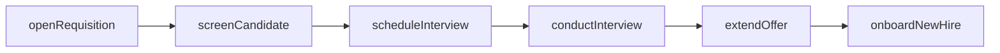
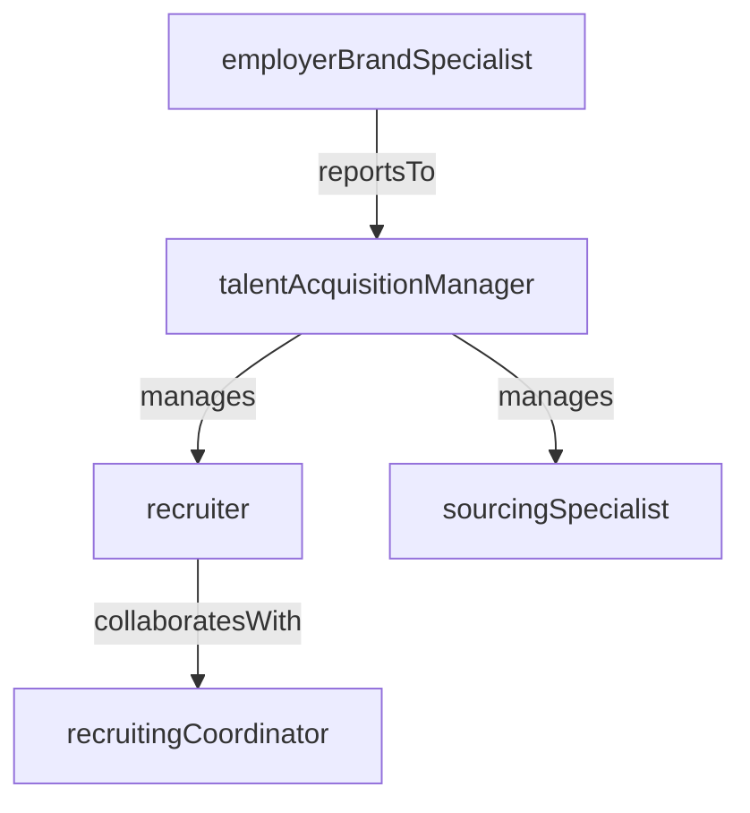

# Talent Acquisition

> Business-as-Code definition for the Talent Acquisition department. Models responsibilities, actions, events, and searches.

## Overview

Recruiting, employer branding, candidate experience, and hiring operations

## Responsibilities

| Responsibility | Description |
|---------------|-------------|
| manageFullCycleRecruiting | Own the end-to-end hiring process from requisition intake through offer acceptance |
| buildEmployerBrand | Develop and promote the company's employer value proposition across channels |
| optimizeCandidateExperience | Design a streamlined, transparent, and responsive experience for all applicants |
| manageSourcingStrategy | Identify and engage passive talent through direct outreach, events, and partnerships |
| maintainRecruitingCompliance | Ensure hiring practices comply with employment law, EEOC requirements, and internal policies |

## Roles

| Role | Description |
|------|-------------|
| talentAcquisitionManager | Leads the recruiting team, sets hiring strategy, and manages recruiter capacity |
| recruiter | Manages requisition pipelines, screens candidates, and coordinates interviews |
| sourcingSpecialist | Identifies and engages passive candidates through research and outreach campaigns |
| recruitingCoordinator | Schedules interviews, manages candidate communications, and processes offer paperwork |
| employerBrandSpecialist | Creates content and manages campaigns to strengthen the company's talent brand |

## Entities

| Entity | Description |
|--------|-------------|
| JobRequisition | Approved request to fill a position, including role requirements and compensation range |
| Candidate | An individual who has applied for or been sourced for an open position |
| InterviewSchedule | Coordinated set of interview sessions with panel members for a candidate |
| OfferLetter | Formal employment offer document including compensation, start date, and terms |
| TalentPipeline | A pool of pre-qualified candidates maintained for current or future openings |

## Actions

| Action | Description |
|--------|-------------|
| openRequisition | Create and publish a new job requisition for an approved headcount |
| screenCandidate | Review a candidate's application and qualifications against role requirements |
| scheduleInterview | Coordinate interview sessions between the candidate and the hiring panel |
| conductInterview | Facilitate a structured interview and record evaluation feedback |
| extendOffer | Generate and send a formal offer letter to the selected candidate |
| onboardNewHire | Initiate the pre-boarding workflow and hand off to People Operations for Day 1 |

## Events

| Event | Description |
|-------|-------------|
| requisitionOpened | A new job requisition was approved and published to job boards |
| candidateApplied | A candidate submitted an application for an open position |
| interviewCompleted | A candidate completed all scheduled interview rounds |
| offerExtended | A formal offer letter was sent to the selected candidate |
| offerAccepted | The candidate accepted the employment offer |
| requisitionFilled | The position was filled and the requisition was closed |

## Searches

| Search | Description |
|--------|-------------|
| findOpenRequisitions | Retrieve all active job requisitions filtered by department or level |
| searchCandidatesBySkill | Query the candidate database by skills, experience, or location |
| getPipelineMetrics | Retrieve funnel conversion rates across stages for a requisition or team |
| findOffersAwaitingResponse | List extended offers that have not yet been accepted or declined |

## Workflow



## Actor Relationships



## Related Processes

| Process | APQC ID | Relationship |
|---------|---------|-------------|
| Manage Human Capital Planning | 7.1 | Workforce plans drive requisition volumes and hiring priorities |
| Recruit, Source, and Select Employees | 7.2 | Core process governing sourcing, interviewing, and hiring |

## Related Departments

| Department | Relationship |
|-----------|-------------|
| People Operations | Receives accepted offers and executes the onboarding and HRIS setup process |
| Compensation & Benefits | Provides salary bands and benefits information for offer creation |
| Diversity Equity & Inclusion | Partners on inclusive hiring practices and diverse sourcing strategies |

## Usage

```typescript
import { db } from '@headlessly/db'

const dept = await db.departments.get('talentAcquisition')
const openReqs = await db.departments.search('findOpenRequisitions', { department: 'engineering' })
const pipeline = await db.departments.search('getPipelineMetrics', { requisitionId: 'req_4567' })
```
