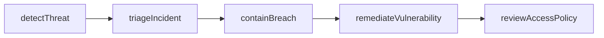
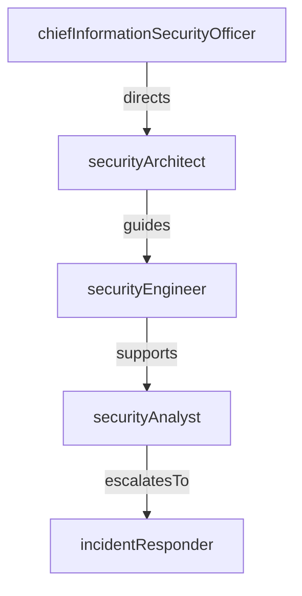

# Cybersecurity

> Business-as-Code definition for the Cybersecurity department. Models responsibilities, actions, events, and searches.

## Overview

Security operations, threat detection, incident response, and compliance

## Responsibilities

| Responsibility | Description |
|---------------|-------------|
| monitorThreats | Operate the security operations center and monitor for intrusion attempts and anomalies |
| manageIncidentResponse | Coordinate detection, containment, eradication, and recovery for security incidents |
| enforceAccessControl | Define and enforce identity, authentication, and authorization policies |
| conductVulnerabilityManagement | Scan, prioritize, and remediate vulnerabilities across infrastructure and applications |
| ensureSecurityCompliance | Maintain compliance with SOC 2, ISO 27001, GDPR, and other regulatory frameworks |

## Roles

| Role | Description |
|------|-------------|
| securityAnalyst | Monitors SIEM alerts, triages events, and investigates potential threats |
| incidentResponder | Leads containment and remediation during active security incidents |
| securityEngineer | Builds and maintains security tooling, firewalls, and detection rules |
| securityArchitect | Designs zero-trust architecture and enterprise security strategy |
| chiefInformationSecurityOfficer | Sets security policy, risk appetite, and compliance direction |

## Entities

| Entity | Description |
|--------|-------------|
| SecurityIncident | A confirmed or suspected breach, intrusion, or policy violation |
| Vulnerability | A known weakness in software, configuration, or infrastructure |
| AccessPolicy | A rule governing identity authentication and resource authorization |
| ThreatIntelFeed | External or internal feed providing indicators of compromise |
| AuditLog | Immutable record of system access and configuration changes |

## Actions

| Action | Description |
|--------|-------------|
| detectThreat | Identify suspicious activity from SIEM alerts or threat intelligence |
| triageIncident | Assess severity and scope of a detected security event |
| containBreach | Isolate affected systems to prevent lateral movement |
| remediateVulnerability | Apply patches or configuration changes to close a known vulnerability |
| conductPenetrationTest | Simulate adversarial attacks to validate defenses |
| reviewAccessPolicy | Audit and update identity and access management rules |

## Events

| Event | Description |
|-------|-------------|
| threatDetected | Suspicious activity identified by monitoring systems |
| incidentTriaged | Security event assessed and assigned a severity level |
| breachContained | Affected systems isolated and lateral movement prevented |
| vulnerabilityRemediated | Known vulnerability patched or mitigated |
| penetrationTestCompleted | Simulated attack exercise finished with findings documented |
| accessPolicyUpdated | Identity or authorization policy revised and deployed |

## Searches

| Search | Description |
|--------|-------------|
| findOpenIncidents | List active security incidents by severity and status |
| getVulnerabilitiesBySeverity | Retrieve unresolved vulnerabilities ranked by CVSS score |
| listAccessPolicyViolations | Identify users or services that violated access control policies |
| searchThreatIndicators | Query threat intelligence feeds for specific indicators of compromise |

## Workflow



## Actor Relationships



## Related Processes

| Process | APQC ID | Relationship |
|---------|---------|-------------|
| Manage Information Security and Privacy | 8.5 | Core process governing security policy, risk management, and data protection |
| Manage IT Resilience | 8.4 | Partners on business continuity and disaster recovery from security events |
| Manage IT Operations | 8.6 | Coordinates monitoring, alerting, and operational incident response |

## Related Departments

| Department | Relationship |
|-----------|-------------|
| IT Infrastructure | Collaborates on network hardening, firewall rules, and patching |
| Internal Audit | Provides evidence and controls validation for compliance audits |
| IT Service Management | Coordinates security-related change requests and incident escalations |

## Usage

```typescript
import { db } from '@headlessly/db'

const sec = await db.departments.get('cybersecurity')
const incidents = await db.departments.search('findOpenIncidents', { severity: 'critical' })
const vulns = await db.departments.search('getVulnerabilitiesBySeverity', { minCvss: 7.0 })
```
