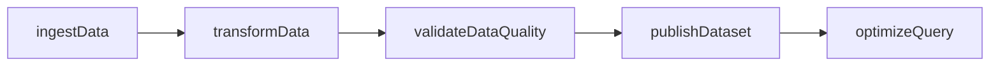
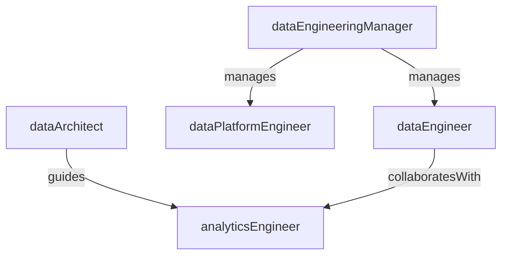

# Data Engineering

> Business-as-Code definition for the Data Engineering department. Models responsibilities, actions, events, and searches.

## Overview

Data pipelines, data warehousing, ETL, and data platform management

## Responsibilities

| Responsibility | Description |
|---------------|-------------|
| buildDataPipelines | Design, develop, and maintain ETL/ELT pipelines that move data between sources and targets |
| manageDataWarehouse | Operate and optimize the enterprise data warehouse and lakehouse architecture |
| ensureDataQuality | Implement validation rules, monitoring, and alerting for data accuracy and completeness |
| governDataPlatform | Define schemas, access controls, and cataloging standards for the data platform |
| supportAnalyticsConsumers | Provide curated datasets and performant query layers for analysts and data scientists |

## Roles

| Role | Description |
|------|-------------|
| dataEngineer | Builds and maintains data pipelines, transformations, and storage layers |
| dataPlatformEngineer | Operates the underlying infrastructure for data warehouses, lakes, and streaming systems |
| analyticsEngineer | Creates curated data models and semantic layers for business intelligence |
| dataArchitect | Designs the overall data platform strategy, schema standards, and integration patterns |
| dataEngineeringManager | Oversees team delivery, pipeline reliability, and cross-functional data initiatives |

## Entities

| Entity | Description |
|--------|-------------|
| Pipeline | An automated data flow that extracts, transforms, and loads data between systems |
| Dataset | A structured collection of data stored in the warehouse or lakehouse |
| Schema | A versioned definition of table structures, columns, and relationships |
| DataSource | An upstream system or API from which data is ingested |
| DataQualityRule | A validation check that monitors data accuracy, freshness, or completeness |

## Actions

| Action | Description |
|--------|-------------|
| ingestData | Extract data from a source system and land it in the raw storage layer |
| transformData | Apply business logic and cleaning rules to produce curated datasets |
| orchestratePipeline | Schedule and coordinate pipeline execution using a workflow orchestrator |
| validateDataQuality | Run quality checks against datasets and flag anomalies |
| publishDataset | Register a curated dataset in the data catalog and grant consumer access |
| optimizeQuery | Tune warehouse queries, partitioning, and indexing for performance |

## Events

| Event | Description |
|-------|-------------|
| dataIngested | Raw data successfully landed from a source system |
| dataTransformed | Curated dataset produced from transformation logic |
| pipelineOrchestrated | Pipeline run completed with all steps executed |
| dataQualityValidated | Quality checks passed or anomalies flagged for review |
| datasetPublished | New or updated dataset registered in the data catalog |
| queryOptimized | Warehouse query or table structure tuned for improved performance |

## Searches

| Search | Description |
|--------|-------------|
| findFailedPipelines | List pipeline runs that errored or timed out in a given period |
| getDatasetLineage | Trace the upstream sources and downstream consumers of a dataset |
| listDataQualityAlerts | Retrieve active data quality violations by severity |
| searchDataCatalog | Query the catalog for datasets by name, owner, or tag |

## Workflow



## Actor Relationships



## Related Processes

| Process | APQC ID | Relationship |
|---------|---------|-------------|
| Manage Enterprise Information | 8.5 | Governs data standards, metadata, and information lifecycle |
| Manage IT Operations | 8.6 | Coordinates pipeline monitoring, alerting, and incident response |
| Manage Enterprise Architecture | 8.1 | Aligns data platform design with enterprise architecture standards |

## Related Departments

| Department | Relationship |
|-----------|-------------|
| IT Infrastructure | Provides compute, storage, and networking for data platform workloads |
| Enterprise Applications | Supplies source system data and integration endpoints |
| Financial Planning & Analysis | Primary consumer of curated financial datasets and reporting models |

## Usage

```typescript
import { db } from '@headlessly/db'

const deng = await db.departments.get('dataEngineering')
const failures = await db.departments.search('findFailedPipelines', { period: 'last24h' })
const lineage = await db.departments.search('getDatasetLineage', { dataset: 'revenue_daily' })
```
