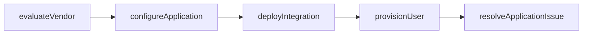
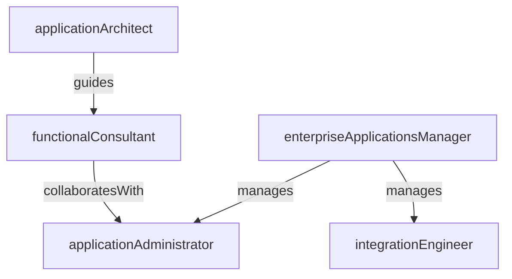

# Enterprise Applications

> Business-as-Code definition for the Enterprise Applications department. Models responsibilities, actions, events, and searches.

## Overview

ERP, CRM, and business application administration and integration

## Responsibilities

| Responsibility | Description |
|---------------|-------------|
| administerErpSystems | Configure, maintain, and upgrade enterprise resource planning platforms |
| manageCrmPlatform | Administer CRM system customization, data quality, and user provisioning |
| integrateApplications | Build and maintain integrations and data flows between business applications |
| supportBusinessUsers | Provide tier-2 application support and troubleshoot functional issues |
| governApplicationPortfolio | Evaluate, rationalize, and roadmap the enterprise application landscape |

## Roles

| Role | Description |
|------|-------------|
| applicationAdministrator | Configures and maintains enterprise applications and user permissions |
| integrationEngineer | Designs and implements data flows and APIs between business systems |
| functionalConsultant | Translates business requirements into application configuration |
| applicationArchitect | Defines application strategy, integration patterns, and technology standards |
| enterpriseApplicationsManager | Oversees team priorities, vendor relationships, and system roadmaps |

## Entities

| Entity | Description |
|--------|-------------|
| Application | A business software system such as ERP, CRM, or HRIS |
| Integration | A data flow or API connection between two or more applications |
| Configuration | A set of application settings, workflows, or customization rules |
| License | Software entitlement governing user seats or feature access |
| ChangeRequest | A request to modify application configuration or add new functionality |

## Actions

| Action | Description |
|--------|-------------|
| configureApplication | Adjust application settings, workflows, or business rules |
| deployIntegration | Activate a new data flow or API connection between systems |
| upgradeSystem | Apply version upgrades or patches to enterprise applications |
| provisionUser | Create or modify user accounts and role assignments in an application |
| resolveApplicationIssue | Diagnose and fix functional or configuration problems reported by users |
| evaluateVendor | Assess new software vendors or renewal terms for existing platforms |

## Events

| Event | Description |
|-------|-------------|
| applicationConfigured | Application settings or business rules updated and validated |
| integrationDeployed | New data flow between systems activated in production |
| systemUpgraded | Application version upgrade completed and verified |
| userProvisioned | User account created or permissions updated in an application |
| applicationIssueResolved | Reported functional or configuration defect fixed |
| vendorEvaluated | Software vendor assessment completed with recommendation |

## Searches

| Search | Description |
|--------|-------------|
| listApplicationsByCategory | Query enterprise applications grouped by functional domain |
| findIntegrationErrors | Retrieve failed or errored integration jobs across systems |
| getLicenseUtilization | Check license consumption versus entitlements for each application |
| searchChangeRequests | Find open change requests by application, priority, or requestor |

## Workflow



## Actor Relationships



## Related Processes

| Process | APQC ID | Relationship |
|---------|---------|-------------|
| Develop and Manage IT Customer Relationships | 8.1 | Defines application standards and integration patterns |
| Develop and Manage IT Business Strategy | 8.2 | Governs application rationalization and investment decisions |
| Deploy Services/Solutions | 8.6 | Coordinates application monitoring and production support |

## Related Departments

| Department | Relationship |
|-----------|-------------|
| IT Infrastructure | Provides hosting, compute, and network services for applications |
| Data Engineering | Partners on data extraction, transformation, and warehouse loading from enterprise systems |
| IT Service Management | Routes application support tickets and manages change approvals |

## Usage

```typescript
import { db } from '@headlessly/db'

const eapps = await db.departments.get('enterpriseApplications')
const errors = await db.departments.search('findIntegrationErrors', { status: 'failed' })
const licenses = await db.departments.search('getLicenseUtilization', { application: 'erp' })
```
