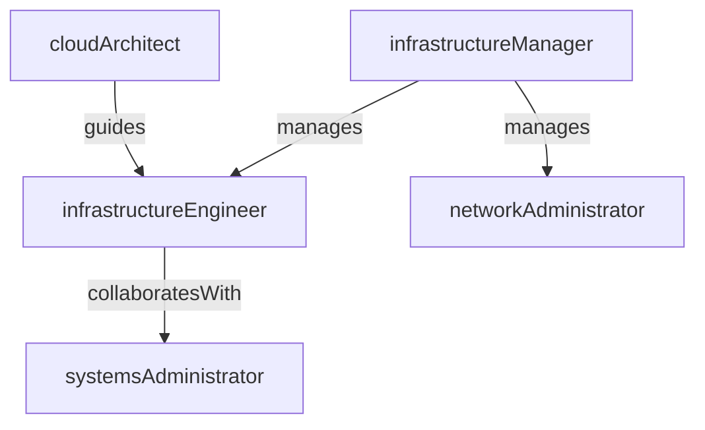

# IT Infrastructure

> Business-as-Code definition for the IT Infrastructure department. Models responsibilities, actions, events, and searches.

## Overview

Network, servers, cloud infrastructure, and endpoint management

## Responsibilities

| Responsibility | Description |
|---------------|-------------|
| manageNetworkInfrastructure | Operate and maintain LAN, WAN, VPN, and firewall configurations |
| administerCloudPlatforms | Provision, scale, and govern cloud resources across AWS, Azure, or GCP |
| maintainServerFleet | Manage physical and virtual server environments including patching and hardening |
| manageEndpointDevices | Deploy, configure, and lifecycle-manage corporate laptops, desktops, and mobile devices |
| ensureHighAvailability | Design and operate redundancy, failover, and disaster recovery mechanisms |

## Roles

| Role | Description |
|------|-------------|
| infrastructureEngineer | Builds and maintains servers, networks, and cloud environments |
| networkAdministrator | Configures and monitors network equipment, VPNs, and firewalls |
| cloudArchitect | Designs cloud topology, cost optimization, and migration strategies |
| systemsAdministrator | Manages operating systems, patching, and server configuration |
| infrastructureManager | Oversees team delivery, capacity planning, and vendor relationships |

## Entities

| Entity | Description |
|--------|-------------|
| Server | Physical or virtual compute instance hosting applications or services |
| Network | LAN, WAN, or VPN segment with associated routing and firewall rules |
| CloudResource | Provisioned cloud service such as a VM, storage bucket, or load balancer |
| Endpoint | Corporate-managed laptop, desktop, or mobile device |
| Certificate | TLS/SSL certificate used for secure communications |

## Actions

| Action | Description |
|--------|-------------|
| provisionServer | Create and configure a new physical or virtual server instance |
| configureNetwork | Set up or modify network routing, firewall rules, or VPN tunnels |
| scaleCloudResource | Adjust cloud resource capacity in response to demand changes |
| patchSystem | Apply security and operating system patches to infrastructure components |
| renewCertificate | Rotate or renew expiring TLS/SSL certificates |
| executeFailover | Initiate disaster recovery or failover to a secondary site |

## Events

| Event | Description |
|-------|-------------|
| serverProvisioned | New server instance created and added to inventory |
| networkConfigured | Network segment or firewall rule change applied successfully |
| cloudResourceScaled | Cloud resource capacity adjusted to meet demand |
| systemPatched | Security or OS patch applied to a server or endpoint |
| certificateRenewed | TLS/SSL certificate rotated before expiration |
| failoverExecuted | Traffic shifted to secondary site during an outage |

## Searches

| Search | Description |
|--------|-------------|
| findServersByStatus | List servers filtered by operational status or health state |
| getExpiringCertificates | Retrieve certificates approaching their expiration date |
| listCloudResourcesByRegion | Query cloud resources grouped by region and cost center |
| findUnpatchedSystems | Identify servers or endpoints missing critical patches |

## Workflow


## Actor Relationships



## Related Processes

| Process | APQC ID | Relationship |
|---------|---------|-------------|
| Manage IT Infrastructure | 8.3 | Core process for provisioning and maintaining technology infrastructure |
| Manage IT Resilience | 8.4 | Drives disaster recovery, failover, and business continuity planning |
| Manage IT Operations | 8.6 | Coordinates day-to-day monitoring and incident response for infrastructure |

## Related Departments

| Department | Relationship |
|-----------|-------------|
| Cybersecurity | Partners on network hardening, patching policies, and firewall management |
| IT Service Management | Provides infrastructure support for service desk tickets and change requests |
| Data Engineering | Supplies compute and storage resources for data platform workloads |

## Usage

```typescript
import { db } from '@headlessly/db'

const infra = await db.departments.get('itInfrastructure')
const unpatched = await db.departments.search('findUnpatchedSystems', { severity: 'critical' })
const expiring = await db.departments.search('getExpiringCertificates', { withinDays: 30 })
```
