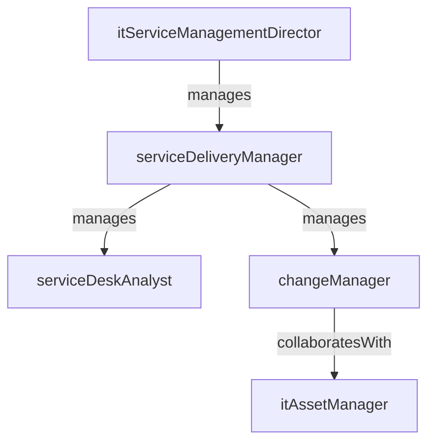

# IT Service Management

> Business-as-Code definition for the IT Service Management department. Models responsibilities, actions, events, and searches.

## Overview

Help desk, asset management, and IT service delivery

## Responsibilities

| Responsibility | Description |
|---------------|-------------|
| operateServiceDesk | Manage the help desk as the single point of contact for IT support requests |
| manageItAssets | Track the full lifecycle of hardware and software assets from procurement to disposal |
| coordinateChangeManagement | Review, approve, and schedule changes to IT systems and infrastructure |
| maintainServiceCatalog | Define, publish, and update the catalog of available IT services and SLAs |
| reportServiceMetrics | Measure and report on incident volumes, resolution times, and SLA adherence |

## Roles

| Role | Description |
|------|-------------|
| serviceDeskAnalyst | Handles front-line incident and request tickets from end users |
| itAssetManager | Maintains the configuration management database and asset inventory |
| changeManager | Facilitates the change advisory board and approves production changes |
| serviceDeliveryManager | Oversees SLA performance, vendor coordination, and continuous improvement |
| itServiceManagementDirector | Sets ITSM strategy, tool selection, and process governance |

## Entities

| Entity | Description |
|--------|-------------|
| Ticket | An incident, service request, or problem record in the ITSM system |
| Asset | A tracked hardware or software item in the configuration management database |
| ChangeRecord | A formal request to add, modify, or remove an IT component in production |
| ServiceLevelAgreement | A contract defining performance targets for an IT service |
| KnowledgeArticle | A documented solution or procedure for resolving common issues |

## Actions

| Action | Description |
|--------|-------------|
| createTicket | Log a new incident or service request from an end user |
| assignTicket | Route a ticket to the appropriate support team or individual |
| resolveIncident | Apply a fix and close an incident ticket |
| approveChange | Review and authorize a proposed change through the advisory board |
| registerAsset | Add a new hardware or software item to the asset inventory |
| publishKnowledgeArticle | Create or update a self-service knowledge base article |
| reportServiceMetrics | Measure and report on incident volumes, resolution times, and SLA adherence |

## Events

| Event | Description |
|-------|-------------|
| ticketCreated | New incident or service request logged in the ITSM system |
| ticketAssigned | Ticket routed to the responsible support team |
| incidentResolved | Incident fix applied and ticket closed |
| changeApproved | Proposed change authorized by the change advisory board |
| assetRegistered | New asset added to the configuration management database |
| slaBreached | Service level target exceeded without resolution |

## Searches

| Search | Description |
|--------|-------------|
| findOpenTickets | List unresolved incidents and requests by priority and age |
| getAssetInventory | Query the CMDB for assets by type, owner, or location |
| listPendingChanges | Retrieve change records awaiting advisory board approval |
| searchKnowledgeBase | Find knowledge articles matching a keyword or category |
| getSlaPerformance | Check SLA adherence metrics by service and time period |

## Workflow


## Actor Relationships



## Related Processes

| Process | APQC ID | Relationship |
|---------|---------|-------------|
| Create and Manage Support Services/Solutions | 8.7 | Core process for incident management, monitoring, and service delivery |
| Develop and Manage IT Business Strategy | 8.2 | Informs asset lifecycle decisions and service catalog investments |
| Develop and Manage IT Customer Relationships | 8.1 | Aligns service catalog offerings with enterprise architecture standards |

## Related Departments

| Department | Relationship |
|-----------|-------------|
| IT Infrastructure | Escalation target for infrastructure-related incidents and changes |
| Cybersecurity | Coordinates on security incidents and access management requests |
| Enterprise Applications | Partners on application-level support tickets and change requests |

## Usage

```typescript
import { db } from '@headlessly/db'

const itsm = await db.departments.get('itServiceManagement')
const tickets = await db.departments.search('findOpenTickets', { priority: 'high' })
const sla = await db.departments.search('getSlaPerformance', { period: 'monthly' })
```
