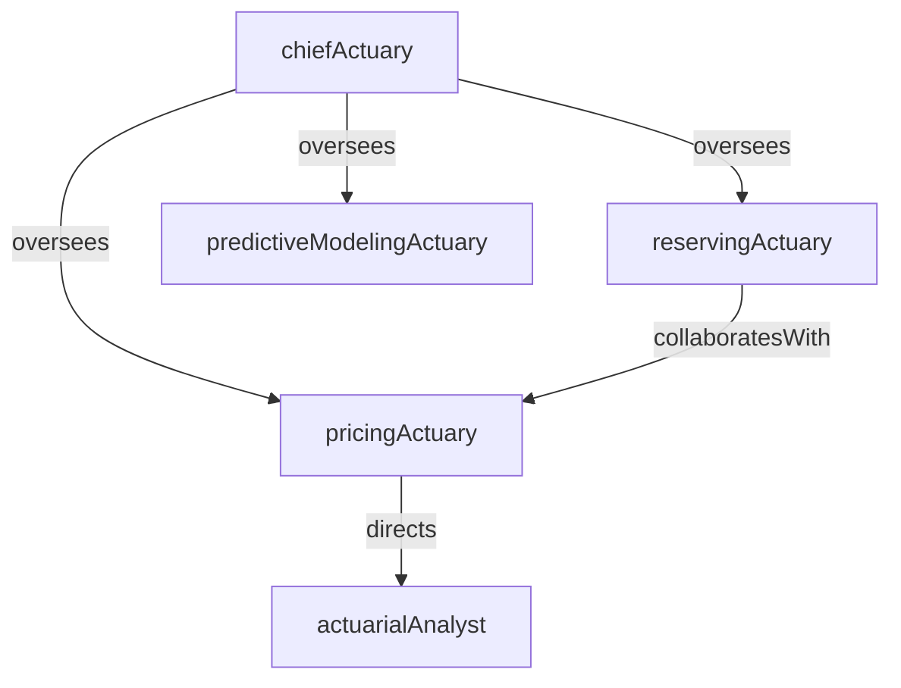

# Actuarial

> Business-as-Code definition for the Actuarial department. Models responsibilities, actions, events, and searches.

## Overview

Actuarial develops and maintains the mathematical models that underpin insurance pricing, loss reserving, and capital adequacy. The department analyzes historical loss experience, projects future claim costs, sets premium rates, and certifies reserve adequacy to ensure the insurer remains financially sound and competitively priced.

## Responsibilities

| Responsibility | Description |
|---------------|-------------|
| developPricingModels | Build rating algorithms and premium models for new and renewal insurance products |
| estimateLossReserves | Calculate incurred-but-not-reported (IBNR) and case reserve development factors |
| performExperienceAnalysis | Analyze historical loss data to identify trends, frequency changes, and severity shifts |
| certifyReserveAdequacy | Provide actuarial opinions on the adequacy of carried reserves for regulatory filings |
| supportCapitalPlanning | Model risk-based capital requirements and economic capital under various stress scenarios |

## Roles

| Role | Description |
|------|-------------|
| pricingActuary | Develops premium rates and rating factors for insurance products |
| reservingActuary | Estimates unpaid loss liabilities using actuarial projection methods |
| chiefActuary | Leads the actuarial function, signs actuarial opinions, and advises executive leadership |
| actuarialAnalyst | Supports actuaries with data preparation, model runs, and statistical analysis |
| predictiveModelingActuary | Builds machine-learning and GLM models to enhance pricing segmentation and loss prediction |

## Entities

| Entity | Description |
|--------|-------------|
| RateFilingModel | A pricing model submitted to regulators for approval of premium rates |
| LossTriangle | A tabular display of incurred or paid losses organized by accident year and development period |
| ActuarialReserveEstimate | A projection of ultimate loss costs used to set IBNR reserves on the balance sheet |
| ExperienceStudy | An analysis of historical loss data segmented by line, territory, class, or other factors |
| CapitalModel | A stochastic or deterministic model estimating capital requirements under stress scenarios |
| ActuarialOpinion | A formal statement certifying the reasonableness of carried reserves for regulatory filing |

## Actions

| Action | Description |
|--------|-------------|
| buildRatingModel | Construct premium rate tables using credibility-weighted loss experience and trend factors |
| projectUltimateLosses | Apply actuarial methods to loss triangles to estimate ultimate incurred losses by accident year |
| performTrendAnalysis | Measure loss frequency and severity trends to adjust pricing and reserving assumptions |
| prepareActuarialOpinion | Draft the formal actuarial opinion on reserve adequacy for the annual statutory filing |
| runCapitalSimulation | Execute stochastic simulations to quantify capital needs under tail-risk scenarios |
| segmentRiskClasses | Analyze loss experience to refine rating variables and improve pricing segmentation |
| validatePricingAssumptions | Back-test pricing models against actual experience to verify rate adequacy |

## Events

| Event | Description |
|-------|-------------|
| ratingModelBuilt | Premium rate model constructed and ready for internal review or regulatory filing |
| ultimateLossesProjected | Actuarial loss projections completed for all accident years and lines of business |
| trendAnalysisPerformed | Frequency and severity trend analysis completed with updated factors |
| actuarialOpinionPrepared | Formal reserve adequacy opinion drafted for regulatory submission |
| capitalSimulationCompleted | Stochastic capital model run finished with risk-based capital estimates |
| riskClassesSegmented | Rating variable analysis completed with refined segmentation recommendations |
| pricingAssumptionsValidated | Back-test of pricing models against actual experience completed |

## Searches

| Search | Description |
|--------|-------------|
| getLossTriangleByLine | Retrieve loss development triangles for a specific line of business |
| findRateFilingsByStatus | List rate filing models filtered by approval status or effective date |
| getReserveEstimateByYear | Query actuarial reserve estimates for a specific accident year |
| searchExperienceStudies | Find completed experience studies by line of business or analysis period |
| getCapitalModelResults | Retrieve capital simulation outputs for a specific scenario or confidence level |
| listPendingActuarialOpinions | Find actuarial opinions in draft status awaiting chief actuary sign-off |

## Workflow


## Actor Relationships



## Related Processes

| Process | APQC ID | Relationship |
|---------|---------|-------------|
| Perform Planning and Management Accounting | 9.1 | Actuarial loss reserve estimates feed into financial planning and budgeting |
| Manage Internal Controls | 9.8 | Actuarial models and opinions are subject to internal control and governance standards |
| Manage Enterprise Risk | 11.4 | Capital modeling and reserve adequacy are core inputs to enterprise risk management |

## Related Departments

| Department | Relationship |
|-----------|-------------|
| Claims | Provides historical loss data used for reserving and pricing analyses |
| Policy Administration | Receives approved premium rates for implementation in policy issuance systems |
| Reinsurance | Consumes actuarial loss projections to structure ceded risk programs |
| Financial Planning & Analysis | Uses actuarial reserve estimates for financial forecasting and budget planning |

## Usage

```typescript
import { db } from '@headlessly/db'

const actuarial = await db.departments.get('actuarial')
const triangles = await db.departments.search('getLossTriangleByLine', { line: 'generalLiability' })
const reserves = await db.departments.search('getReserveEstimateByYear', { accidentYear: 2025 })
```
