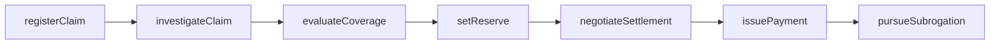
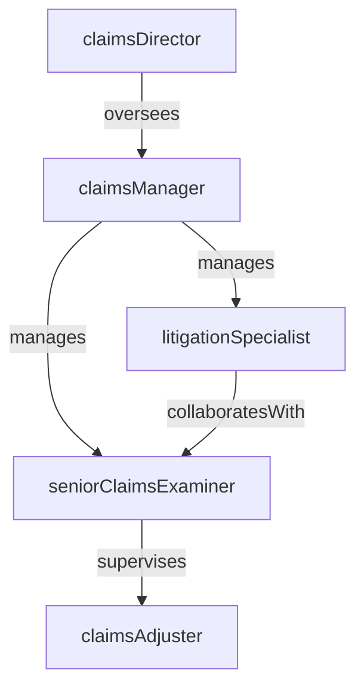

# Claims

> Business-as-Code definition for the Claims department. Models responsibilities, actions, events, and searches.

## Overview

Claims manages the end-to-end lifecycle of insurance claims from first notice of loss through investigation, adjustment, and settlement or denial. The department determines coverage applicability, establishes loss reserves, negotiates settlements, and manages litigation for disputed claims to protect the insurer's financial position while delivering fair outcomes to policyholders.

## Responsibilities

| Responsibility | Description |
|---------------|-------------|
| intakeClaims | Receive and register first notice of loss reports from policyholders, agents, and third parties |
| investigateLosses | Gather evidence, inspect damage, interview witnesses, and verify the facts of each claim |
| adjustClaims | Evaluate coverage, determine liability, estimate damages, and set case reserves |
| negotiateSettlements | Work with claimants, attorneys, and third parties to reach fair settlement amounts |
| manageLitigation | Oversee litigated claims including defense counsel coordination and discovery support |
| maintainLossReserves | Establish and periodically review individual case reserves to reflect expected claim costs |

## Roles

| Role | Description |
|------|-------------|
| claimsAdjuster | Investigates claims, evaluates coverage, estimates damages, and settles within authority limits |
| seniorClaimsExaminer | Handles complex or high-severity claims and mentors junior adjusters |
| claimsManager | Leads the claims team, manages caseloads, and monitors settlement quality |
| litigationSpecialist | Manages claims in suit, coordinates with defense counsel, and oversees discovery and mediation |
| claimsDirector | Sets claims strategy, manages department budget, and reports on loss trends to leadership |

## Entities

| Entity | Description |
|--------|-------------|
| Claim | A formal request for indemnification under an insurance policy for a covered loss event |
| LossReserve | The estimated cost to settle an individual claim including indemnity and expenses |
| ClaimPayment | A disbursement to a claimant, vendor, or attorney for a settled or partial claim |
| SubrogationRecovery | Funds recovered from a responsible third party to offset paid claim amounts |
| PolicyCoverage | The specific terms, limits, and exclusions of the insurance policy applicable to a claim |
| ClaimInvestigationFile | The collection of evidence, statements, photos, and reports supporting a claim decision |

## Actions

| Action | Description |
|--------|-------------|
| registerClaim | Create a new claim record from the first notice of loss and assign a claims handler |
| investigateClaim | Gather evidence, inspect damages, and verify the facts surrounding the loss event |
| evaluateCoverage | Review the insurance policy to determine if the loss is covered and identify applicable limits |
| setReserve | Establish or adjust the estimated cost to settle the claim based on current information |
| negotiateSettlement | Work with the claimant or their representative to agree on a settlement amount |
| issuePayment | Authorize and process a claim payment to the claimant or service provider |
| pursueSubrogation | Initiate recovery from a responsible third party to recoup paid claim amounts |

## Events

| Event | Description |
|-------|-------------|
| claimRegistered | New claim created from first notice of loss and assigned to a handler |
| claimInvestigated | Evidence gathering and damage inspection completed for the claim |
| coverageEvaluated | Policy coverage determination completed with applicable limits identified |
| reserveSet | Individual case reserve established or adjusted for the claim |
| settlementNegotiated | Settlement amount agreed upon with the claimant or their representative |
| paymentIssued | Claim payment authorized and disbursed to the payee |
| subrogationRecovered | Funds recovered from a responsible third party applied to the claim |

## Searches

| Search | Description |
|--------|-------------|
| findOpenClaims | List claims currently open and in process filtered by line of business or handler |
| getClaimsByPolicy | Retrieve all claims filed under a specific insurance policy number |
| listHighSeverityClaims | Find claims with reserves or incurred amounts exceeding a specified threshold |
| searchClaimsByDateOfLoss | Query claims by the date the loss event occurred within a given range |
| getSubrogationOpportunities | Identify paid claims with potential recovery from responsible third parties |
| findClaimsInLitigation | List claims currently in suit requiring litigation management |

## Workflow



## Actor Relationships



## Related Processes

| Process | APQC ID | Relationship |
|---------|---------|-------------|
| Process Accounts Payable | 9.6 | Governs claim payment disbursement and vendor payment processes |
| Manage Internal Controls | 9.8 | Ensures claims handling complies with regulatory requirements and internal authority limits |
| Manage Enterprise Risk | 11.4 | Loss trends and reserve adequacy feed into enterprise risk assessment |

## Related Departments

| Department | Relationship |
|-----------|-------------|
| Special Investigations Unit | Investigates claims referred for suspected fraud or misrepresentation |
| Actuarial | Uses claims data for loss reserving, pricing, and trend analysis |
| Policy Administration | Provides policy terms and coverage details used in claims adjudication |
| Reinsurance | Recovers ceded portions of large or catastrophic claims from reinsurers |

## Usage

```typescript
import { db } from '@headlessly/db'

const claims = await db.departments.get('claims')
const open = await db.departments.search('findOpenClaims', { lineOfBusiness: 'auto' })
const highSeverity = await db.departments.search('listHighSeverityClaims', { minReserve: 100000 })
```
