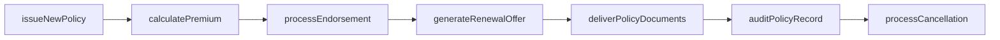
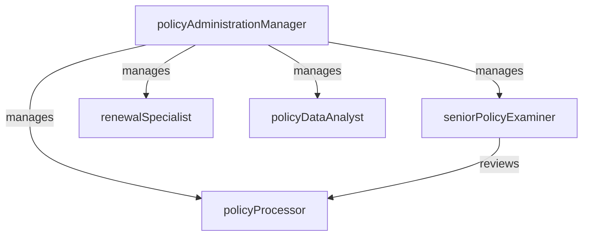

# Policy Administration

> Business-as-Code definition for the Policy Administration department. Models responsibilities, actions, events, and searches.

## Overview

Policy Administration manages the full lifecycle of insurance policies from initial issuance through endorsements, renewals, and cancellations. The department maintains policy master data, processes premium transactions, and ensures accurate policy documentation is delivered to policyholders, agents, and internal stakeholders.

## Responsibilities

| Responsibility | Description |
|---------------|-------------|
| issuePolicies | Generate and deliver new insurance policies with accurate terms, coverages, and premiums |
| processEndorsements | Apply mid-term policy changes including coverage additions, deletions, and limit adjustments |
| manageRenewals | Execute the renewal cycle including re-rating, offer generation, and policyholder notification |
| processCancellations | Handle policy cancellations and non-renewals in compliance with statutory notice requirements |
| maintainPolicyMasterData | Ensure policy records are accurate, complete, and accessible across operational systems |

## Roles

| Role | Description |
|------|-------------|
| policyProcessor | Issues new policies, processes endorsements, and generates policy documents |
| renewalSpecialist | Manages the renewal pipeline including re-rating, offer preparation, and retention outreach |
| policyAdministrationManager | Oversees policy operations, monitors processing accuracy, and manages team capacity |
| policyDataAnalyst | Maintains policy master data, investigates data quality issues, and produces operational reports |
| seniorPolicyExaminer | Reviews complex policy transactions, handles exceptions, and ensures regulatory compliance |

## Entities

| Entity | Description |
|--------|-------------|
| InsurancePolicy | A contract providing indemnification for specified risks in exchange for premium payment |
| Endorsement | A mid-term amendment modifying the terms, coverages, or conditions of an existing policy |
| RenewalOffer | A proposal to continue coverage for the next policy term with updated rates and terms |
| CancellationNotice | A formal notice terminating policy coverage in compliance with statutory requirements |
| PremiumTransaction | A financial entry recording earned, written, or returned premium for a policy |
| PolicyDocument | The printed or electronic declaration page and forms comprising the insurance contract |

## Actions

| Action | Description |
|--------|-------------|
| issueNewPolicy | Generate the policy contract, declaration page, and forms for a newly bound insurance policy |
| processEndorsement | Apply a mid-term policy change and recalculate premium based on the effective date |
| generateRenewalOffer | Rate the policy for the upcoming term and produce a renewal offer for the policyholder |
| processCancellation | Execute policy cancellation, calculate return premium, and issue the cancellation notice |
| auditPolicyRecord | Review a policy record for data accuracy, coverage consistency, and regulatory compliance |
| calculatePremium | Compute the premium amount based on rating factors, endorsements, and applicable credits |
| deliverPolicyDocuments | Send policy declarations and forms to the policyholder and producing agent |

## Events

| Event | Description |
|-------|-------------|
| newPolicyIssued | Insurance policy generated with declarations and forms delivered to the policyholder |
| endorsementProcessed | Mid-term policy change applied with premium adjustment calculated |
| renewalOfferGenerated | Renewal offer rated and prepared for delivery to the policyholder |
| cancellationProcessed | Policy canceled with return premium calculated and cancellation notice issued |
| policyRecordAudited | Policy data reviewed for accuracy and compliance with documented findings |
| premiumCalculated | Premium amount computed based on current rating factors and endorsements |
| policyDocumentsDelivered | Policy declarations and forms delivered to the policyholder and agent |

## Searches

| Search | Description |
|--------|-------------|
| findPoliciesByStatus | List insurance policies filtered by active, expired, canceled, or pending status |
| getUpcomingRenewals | Retrieve policies with renewal dates within a specified period |
| searchPoliciesByInsured | Query policies by policyholder name, address, or account number |
| listPendingEndorsements | Find endorsements awaiting processing or approval |
| getPremiumByLine | Calculate total written or earned premium for a specific line of business |
| findCancellationsPendingNotice | Identify cancellations where the statutory notice has not yet been sent |

## Workflow



## Actor Relationships



## Related Processes

| Process | APQC ID | Relationship |
|---------|---------|-------------|
| Perform Revenue Accounting | 9.2 | Premium transactions from policy issuance feed into revenue recognition |
| Manage Internal Controls | 9.8 | Policy processing must comply with regulatory filing and documentation standards |
| Invoice Customer | 9.2.2 | Policy premium billing aligns with customer invoicing processes |

## Related Departments

| Department | Relationship |
|-----------|-------------|
| Actuarial | Provides approved premium rates and rating factors used in policy issuance and renewal |
| Claims | References policy terms and coverage details when adjudicating claims |
| Reinsurance | Consumes policy-level data for ceded premium calculations and treaty reporting |
| Accounting | Receives premium transactions for revenue recognition and financial reporting |

## Usage

```typescript
import { db } from '@headlessly/db'

const polAdmin = await db.departments.get('policyAdministration')
const renewals = await db.departments.search('getUpcomingRenewals', { daysAhead: 60 })
const pending = await db.departments.search('listPendingEndorsements', { status: 'pending' })
```
