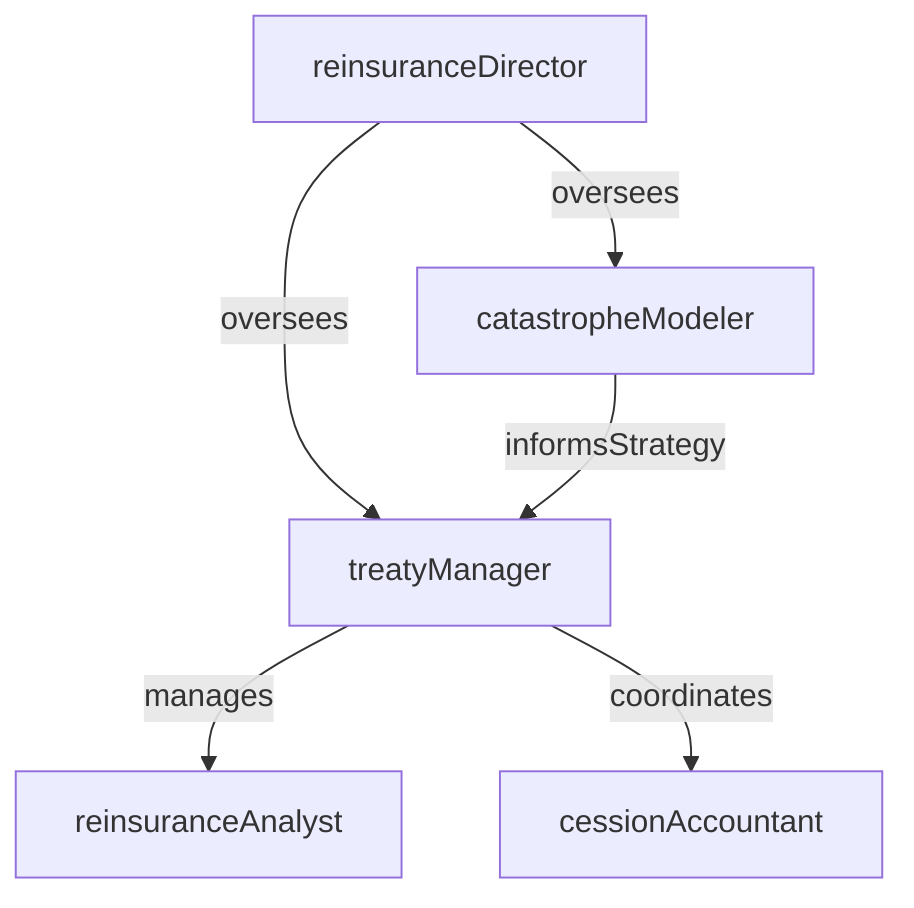

# Reinsurance

> Business-as-Code definition for the Reinsurance department. Models responsibilities, actions, events, and searches.

## Overview

Reinsurance negotiates and administers ceded risk programs that transfer portions of the insurer's underwriting exposure to reinsurers. The department structures treaty and facultative placements, manages ceded premium and loss recovery transactions, and maintains reinsurer relationships to optimize risk transfer and capital efficiency.

## Responsibilities

| Responsibility | Description |
|---------------|-------------|
| structureReinsuranceProgram | Design the optimal mix of treaty, facultative, and catastrophe reinsurance placements |
| negotiateTreatyTerms | Negotiate coverage terms, pricing, commissions, and contract language with reinsurers and brokers |
| manageCededPremiums | Calculate and remit ceded premiums to reinsurers per treaty terms and reporting schedules |
| processLossRecoveries | File claims with reinsurers and collect reinsurance recoveries for ceded losses |
| monitorReinsurerSecurity | Assess the financial strength and credit quality of reinsurance counterparties |

## Roles

| Role | Description |
|------|-------------|
| reinsuranceAnalyst | Calculates ceded premiums, prepares treaty submissions, and processes recovery billings |
| treatyManager | Negotiates treaty terms, manages reinsurer relationships, and oversees placement execution |
| reinsuranceDirector | Sets the reinsurance strategy, approves program structure, and reports to executive leadership |
| cessionAccountant | Reconciles ceded premium and loss recovery transactions between the insurer and reinsurers |
| catastropheModeler | Runs catastrophe models to quantify natural disaster exposure and inform reinsurance purchasing |

## Entities

| Entity | Description |
|--------|-------------|
| ReinsuranceTreaty | A contract defining the terms under which risk is ceded from the insurer to the reinsurer |
| FacultativePlacement | A reinsurance arrangement negotiated for a single policy or specific risk |
| CededPremium | The portion of premium paid to reinsurers in exchange for assuming ceded risk |
| ReinsuranceRecovery | Funds received from reinsurers for their share of ceded losses |
| TreatyBordereau | A detailed schedule of individual policies or claims reported to the reinsurer under a treaty |
| CatastropheModel | A probabilistic model estimating potential losses from natural or man-made catastrophic events |

## Actions

| Action | Description |
|--------|-------------|
| designProgramStructure | Determine the layers, retention levels, and limits for the reinsurance program |
| negotiatePlacement | Work with reinsurers and brokers to secure terms, pricing, and capacity for treaty renewals |
| calculateCededPremium | Compute the ceded premium owed to reinsurers based on subject premium and treaty terms |
| submitLossRecovery | File ceded loss notices and supporting documentation with reinsurers to collect recoveries |
| prepareBordereau | Compile policy or claims-level detail for periodic reporting to reinsurers |
| assessReinsurerCreditworthiness | Evaluate the financial strength ratings and collateral of reinsurance counterparties |
| runCatastropheModel | Execute probabilistic catastrophe simulations to quantify exposure and inform purchasing |

## Events

| Event | Description |
|-------|-------------|
| programStructureDesigned | Reinsurance program layers and retention levels finalized for the upcoming term |
| placementNegotiated | Treaty terms, pricing, and capacity secured from reinsurers for the upcoming term |
| cededPremiumCalculated | Ceded premium computed and ready for remittance to reinsurers |
| lossRecoverySubmitted | Ceded loss notice and supporting documentation filed with the reinsurer |
| bordereauPrepared | Policy or claims-level schedule compiled and delivered to the reinsurer |
| reinsurerCreditworthinessAssessed | Financial strength and collateral review completed for a reinsurance counterparty |
| catastropheModelCompleted | Catastrophe simulation run finished with updated exposure estimates |

## Searches

| Search | Description |
|--------|-------------|
| findTreatiesByLine | List active reinsurance treaties filtered by line of business |
| getRecoverablesByReinsurer | Retrieve outstanding reinsurance recoveries owed by a specific reinsurer |
| listExpiringTreaties | Find treaties with expiration dates within a specified period for renewal planning |
| searchFacultativePlacements | Query facultative reinsurance placements by policy number or risk description |
| getCededPremiumByTreaty | Calculate total ceded premium for a specific treaty and reporting period |
| getReinsurerRatings | Retrieve financial strength ratings for active reinsurance counterparties |

## Workflow


## Actor Relationships



## Related Processes

| Process | APQC ID | Relationship |
|---------|---------|-------------|
| Perform Planning and Management Accounting | 9.1 | Ceded premium and recovery projections feed into financial planning |
| Manage Internal Controls | 9.8 | Reinsurance transactions and counterparty exposure are subject to internal controls |
| Manage Enterprise Risk | 11.4 | Reinsurance program structure is a core component of enterprise risk transfer strategy |

## Related Departments

| Department | Relationship |
|-----------|-------------|
| Actuarial | Provides loss projections and catastrophe exposure estimates used to design the reinsurance program |
| Claims | Identifies and reports large or catastrophic losses eligible for reinsurance recovery |
| Policy Administration | Supplies policy-level data for bordereau reporting and ceded premium calculations |
| Accounting | Records ceded premium, reinsurance recoveries, and receivables on the financial statements |

## Usage

```typescript
import { db } from '@headlessly/db'

const reins = await db.departments.get('reinsurance')
const expiring = await db.departments.search('listExpiringTreaties', { daysToExpiry: 90 })
const recoverables = await db.departments.search('getRecoverablesByReinsurer', { reinsurer: 'SwissRe' })
```
