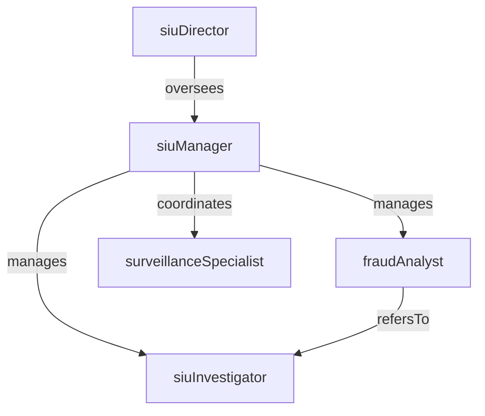

# Special Investigations Unit

> Business-as-Code definition for the Special Investigations Unit department. Models responsibilities, actions, events, and searches.

## Overview

The Special Investigations Unit (SIU) detects, investigates, and resolves suspected insurance fraud across all lines of business. The department analyzes claims referrals, conducts field investigations, coordinates with law enforcement, and refers confirmed fraud cases for prosecution or civil recovery to protect the insurer from fraudulent losses.

## Responsibilities

| Responsibility | Description |
|---------------|-------------|
| detectFraudIndicators | Operate predictive models and red-flag screening rules to identify potentially fraudulent claims |
| investigateSuspectedFraud | Conduct in-depth investigations including surveillance, recorded statements, and document analysis |
| coordinateWithLawEnforcement | Partner with police, district attorneys, and state fraud bureaus on criminal referrals |
| manageVendorInvestigations | Direct and oversee external investigation firms conducting surveillance and background checks |
| reportFraudMetrics | Track fraud detection rates, referral volumes, recovery amounts, and investigation outcomes |

## Roles

| Role | Description |
|------|-------------|
| siuInvestigator | Conducts field investigations, interviews claimants, and gathers evidence of fraud |
| siuManager | Leads the SIU team, prioritizes case assignments, and manages investigation quality |
| fraudAnalyst | Analyzes data patterns, runs predictive models, and screens claims for fraud indicators |
| siuDirector | Sets the anti-fraud strategy, manages regulatory reporting, and represents the insurer in industry coalitions |
| surveillanceSpecialist | Conducts physical and digital surveillance to document claimant activities |

## Entities

| Entity | Description |
|--------|-------------|
| FraudReferral | A claim flagged by adjusters, analytics, or tip lines for suspected fraudulent activity |
| InvestigationCase | A formal SIU case opened to investigate a fraud referral with documented evidence and findings |
| SurveillanceReport | A report documenting observations from physical or digital surveillance of a subject |
| RecordedStatement | A transcribed or recorded interview with a claimant, witness, or insured under investigation |
| FraudIndicatorScore | A numeric score from predictive models indicating the likelihood of fraud on a claim |
| CriminalReferral | A formal referral to law enforcement or a state insurance fraud bureau for prosecution |

## Actions

| Action | Description |
|--------|-------------|
| screenForFraudIndicators | Run claims through predictive models and red-flag rules to identify potential fraud |
| openInvestigation | Create a formal SIU case for a referred claim and assign an investigator |
| conductSurveillance | Perform physical or digital surveillance to document a subject's activities and claims validity |
| obtainRecordedStatement | Interview the claimant or witnesses under oath and record their testimony |
| analyzeEvidence | Review medical records, financial documents, photos, and surveillance to build the case |
| referForProsecution | Submit case findings and evidence to law enforcement or the state fraud bureau |
| closeInvestigation | Document final findings, recommendations, and outcomes and close the SIU case |

## Events

| Event | Description |
|-------|-------------|
| fraudIndicatorsScreened | Claim processed through predictive models and red-flag rules with a fraud score assigned |
| investigationOpened | Formal SIU case created and investigator assigned for a fraud referral |
| surveillanceConducted | Physical or digital surveillance completed with observations documented |
| recordedStatementObtained | Claimant or witness interview conducted and recorded testimony captured |
| evidenceAnalyzed | Case evidence reviewed with findings and conclusions documented |
| prosecutionReferred | Case materials submitted to law enforcement or the state fraud bureau |
| investigationClosed | SIU case finalized with documented findings, recovery amounts, and disposition |

## Searches

| Search | Description |
|--------|-------------|
| findOpenInvestigations | List SIU cases currently in active investigation status |
| getReferralsBySource | Retrieve fraud referrals grouped by originating source such as claims, analytics, or tip line |
| listCasesByInvestigator | Query SIU cases assigned to a specific investigator |
| searchByFraudType | Find investigation cases by fraud scheme category such as staged accident, arson, or exaggeration |
| getProsecutionReferrals | Retrieve cases referred to law enforcement filtered by status or jurisdiction |
| getFraudSavings | Calculate total savings from denied or reduced claims resulting from SIU investigations |

## Workflow


## Actor Relationships



## Related Processes

| Process | APQC ID | Relationship |
|---------|---------|-------------|
| Manage Internal Controls | 9.8 | Fraud investigations support the internal controls framework for claims integrity |
| Manage Enterprise Risk | 11.4 | Fraud risk is a key operational risk managed within the enterprise risk framework |
| Manage and Process Collections | 9.2.4 | Recovery of fraudulent claim payments aligns with collections processes |

## Related Departments

| Department | Relationship |
|-----------|-------------|
| Claims | Refers suspected fraud cases and provides claim file documentation for SIU investigations |
| BSA/AML Compliance | Coordinates on overlapping financial crime concerns such as premium fraud and money laundering |
| Corporate Legal | Advises on prosecution referrals, civil recovery actions, and regulatory reporting obligations |
| Policy Administration | Provides policy and underwriting data used to verify coverage and detect application fraud |

## Usage

```typescript
import { db } from '@headlessly/db'

const siu = await db.departments.get('specialInvestigationsUnit')
const open = await db.departments.search('findOpenInvestigations', { status: 'active' })
const savings = await db.departments.search('getFraudSavings', { period: '2025' })
```
