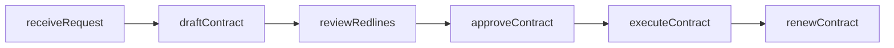
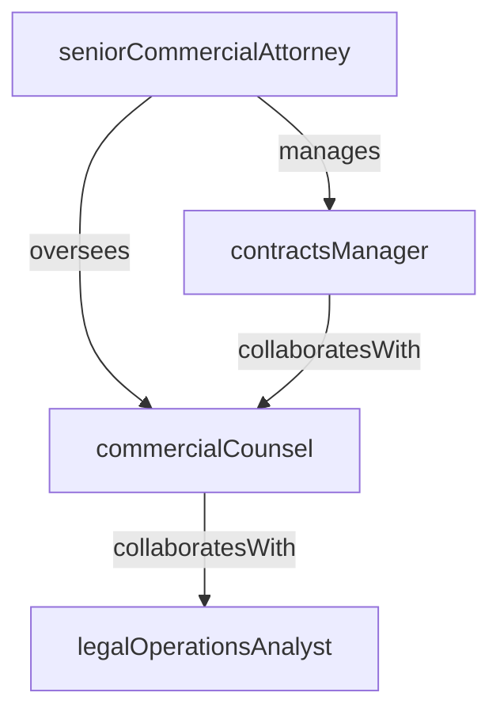

# Commercial Legal

> Business-as-Code definition for the Commercial Legal department. Models responsibilities, actions, events, and searches.

## Overview

Contract review, negotiation, and commercial agreements

## Responsibilities

| Responsibility | Description |
|---------------|-------------|
| reviewContracts | Analyze commercial agreements for legal risk, compliance, and business alignment |
| negotiateTerms | Lead or support negotiations on pricing, liability, indemnification, and SLA terms |
| maintainTemplates | Develop and update standard contract templates, playbooks, and clause libraries |
| adviseBusinessTeams | Provide day-to-day legal guidance to sales, partnerships, and procurement teams |
| manageCLM | Oversee the contract lifecycle management process from request through execution and renewal |

## Roles

| Role | Description |
|------|-------------|
| commercialCounsel | Reviews, drafts, and negotiates commercial agreements with customers and partners |
| contractsManager | Manages the end-to-end contract lifecycle, template library, and approval workflows |
| legalOperationsAnalyst | Supports CLM tooling, reporting, and process optimization for the legal team |
| seniorCommercialAttorney | Handles high-value or complex deals and escalated negotiation issues |

## Entities

| Entity | Description |
|--------|-------------|
| Contract | A legally binding commercial agreement with a customer, partner, or vendor |
| Amendment | A formal modification to an existing contract's terms or scope |
| ClauseLibrary | A repository of pre-approved legal clauses organized by category and risk level |
| ContractRequest | A business team's request for legal review or drafting of a new agreement |
| NDA | A non-disclosure agreement governing confidential information exchange |

## Actions

| Action | Description |
|--------|-------------|
| draftContract | Create a new agreement using approved templates and clause libraries |
| reviewRedlines | Analyze counterparty redlines and provide recommended positions |
| approveContract | Sign off on final contract terms and authorize execution |
| amendContract | Draft and process a modification to an existing agreement |
| escalateIssue | Route a negotiation impasse or non-standard term to senior counsel |
| renewContract | Initiate the renewal process for an expiring agreement |

## Events

| Event | Description |
|-------|-------------|
| contractDrafted | A new agreement was created and sent for internal review |
| contractExecuted | A fully signed agreement was recorded and countersigned |
| contractAmended | An existing agreement was formally modified |
| contractExpired | An agreement reached its end date without renewal |
| redlinesReceived | A counterparty returned marked-up contract terms for review |
| escalationResolved | A non-standard term or negotiation impasse was resolved by senior counsel |

## Searches

| Search | Description |
|--------|-------------|
| findContractsByStatus | List contracts filtered by draft, in-review, executed, or expired status |
| searchContractsByCounterparty | Look up all agreements with a specific customer or vendor |
| getExpiringContracts | Retrieve contracts approaching their renewal or expiration date |
| listPendingReviews | Find contract requests awaiting legal review or approval |

## Workflow



## Actor Relationships



## Related Processes

| Process | APQC ID | Relationship |
|---------|---------|-------------|
| Manage Legal and Ethical Compliance | 11.1 | Governs contract standards and legal risk management |
| Manage Contract Lifecycle | 11.2 | Core process for commercial agreement management |

## Related Departments

| Department | Relationship |
|-----------|-------------|
| Corporate Legal | Escalates governance and entity-level issues |
| Enterprise Sales | Partners on customer contract negotiation and deal structuring |
| Procurement & Asset Management | Collaborates on vendor and supplier agreements |

## Usage

```typescript
import { db } from '@headlessly/db'

const dept = await db.departments.get('commercialLegal')
const pending = await db.departments.search('listPendingReviews', { status: 'awaiting-review' })
const expiring = await db.departments.search('getExpiringContracts', { withinDays: 90 })
```
