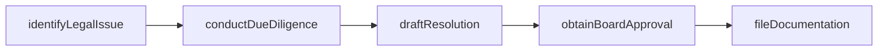
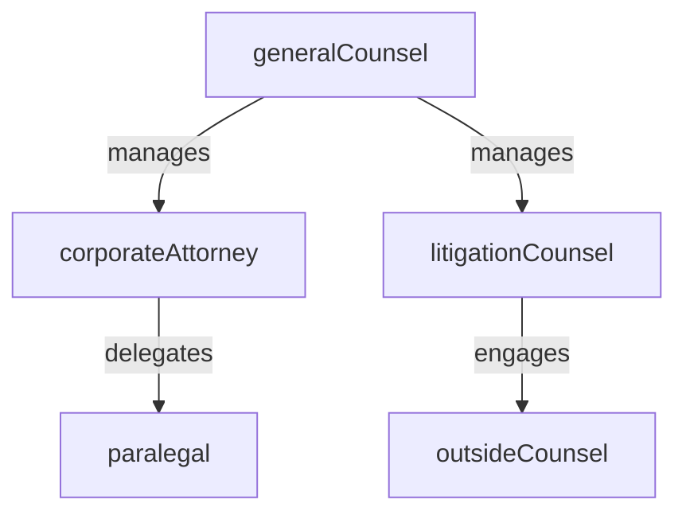

# Corporate Legal

> Business-as-Code definition for the Corporate Legal department. Models responsibilities, actions, events, and searches.

## Overview

Corporate governance, M&A legal support, and entity management

## Responsibilities

| Responsibility | Description |
|---------------|-------------|
| adviseOnGovernance | Provide legal counsel on board matters, corporate bylaws, and governance policies |
| manageCorporateEntities | Maintain subsidiary registrations, filings, and entity records across jurisdictions |
| supportMergers | Deliver legal due diligence, transaction structuring, and closing documentation for M&A deals |
| overseeLitigation | Manage external counsel and coordinate the defense of lawsuits and regulatory actions |
| draftBoardResolutions | Prepare resolutions, consents, and minutes for board and committee meetings |

## Roles

| Role | Description |
|------|-------------|
| generalCounsel | Leads the legal department and serves as chief legal advisor to the executive team |
| corporateAttorney | Handles governance matters, entity management, and board documentation |
| litigationCounsel | Manages active lawsuits, disputes, and engagement with outside litigation firms |
| paralegal | Supports attorneys with research, filings, document management, and entity maintenance |

## Entities

| Entity | Description |
|--------|-------------|
| LegalEntity | A subsidiary or corporate entity registered in a specific jurisdiction |
| BoardResolution | A formal decision adopted by the board of directors or a committee |
| LitigationMatter | An active lawsuit, arbitration, or regulatory proceeding |
| CorporateFiling | A statutory filing such as an annual report, certificate of good standing, or amendment |

## Actions

| Action | Description |
|--------|-------------|
| draftResolution | Prepare a board or committee resolution for approval |
| fileAnnualReport | Submit required statutory filings to maintain entity good standing |
| engageOutsideCounsel | Retain an external law firm for specialized legal matters |
| conductDueDiligence | Perform legal review of a target company or transaction |
| updateEntityRecords | Amend registered agent, officer, or address information for a legal entity |
| assessLitigationRisk | Evaluate the exposure and probable outcome of a pending legal matter |

## Events

| Event | Description |
|-------|-------------|
| resolutionAdopted | A board resolution was approved and signed by directors |
| entityIncorporated | A new subsidiary or legal entity was registered |
| litigationFiled | A new lawsuit or arbitration proceeding was commenced |
| litigationSettled | A pending legal matter was resolved through settlement |
| dueDiligenceCompleted | Legal review of a transaction target was finalized |
| annualFilingSubmitted | A required statutory filing was submitted to the relevant authority |

## Searches

| Search | Description |
|--------|-------------|
| findActiveLitigation | List all open lawsuits and disputes by status, jurisdiction, or counsel |
| listCorporateEntities | Retrieve all registered legal entities by jurisdiction or parent company |
| getUpcomingFilings | Find statutory filings due within a specified date range |
| searchBoardResolutions | Look up resolutions by date, topic, or committee |

## Workflow



## Actor Relationships



## Related Processes

| Process | APQC ID | Relationship |
|---------|---------|-------------|
| Manage Legal and Ethical Compliance | 11.1 | Core process for corporate governance and legal compliance |
| Manage External Relations | 12.1 | Coordinates with government relations on regulatory filings |

## Related Departments

| Department | Relationship |
|-----------|-------------|
| Commercial Legal | Collaborates on contract disputes and commercial litigation |
| Risk Management | Partners on litigation risk assessment and insurance coverage |
| Corporate Development | Provides legal support for M&A transactions and integrations |

## Usage

```typescript
import { db } from '@headlessly/db'

const dept = await db.departments.get('corporateLegal')
const litigation = await db.departments.search('findActiveLitigation', { status: 'open' })
const entities = await db.departments.search('listCorporateEntities', { jurisdiction: 'delaware' })
```
