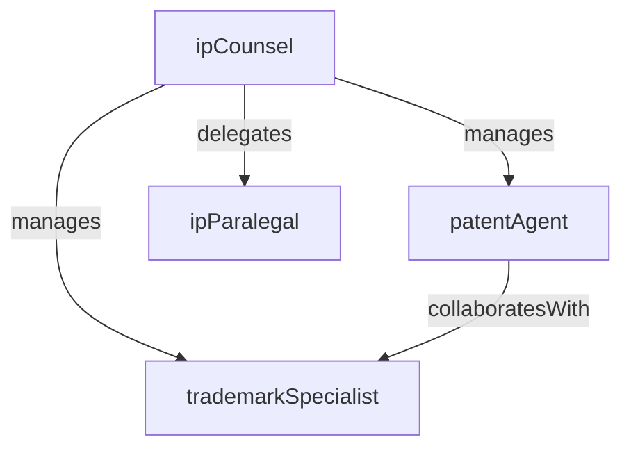

# Intellectual Property

> Business-as-Code definition for the Intellectual Property department. Models responsibilities, actions, events, and searches.

## Overview

Patent strategy, trademark management, and IP portfolio protection

## Responsibilities

| Responsibility | Description |
|---------------|-------------|
| managePatentPortfolio | File, prosecute, and maintain patents across all jurisdictions |
| protectTrademarks | Register, monitor, and enforce trademark rights for corporate brands and products |
| governIPStrategy | Develop the organization's IP strategy aligned with business and product roadmaps |
| enforceCopyrights | Manage copyright registrations and address unauthorized use of protected works |
| conductIPDueDiligence | Assess IP assets and risks in connection with M&A transactions and licensing deals |

## Roles

| Role | Description |
|------|-------------|
| ipCounsel | Manages patent prosecution, trademark filings, and IP enforcement actions |
| patentAgent | Drafts patent applications and coordinates with outside patent counsel and examiners |
| trademarkSpecialist | Handles trademark searches, registrations, renewals, and opposition proceedings |
| ipParalegal | Supports docketing, deadline management, and maintenance fee payments for the IP portfolio |

## Entities

| Entity | Description |
|--------|-------------|
| Patent | A granted or pending patent application protecting an invention |
| Trademark | A registered or pending mark protecting a brand name, logo, or slogan |
| IPLicense | An agreement granting or receiving rights to use intellectual property |
| InventionDisclosure | A formal submission from an inventor describing a potentially patentable innovation |
| IPDocket | A centralized tracking system for IP filing deadlines, renewals, and prosecution milestones |

## Actions

| Action | Description |
|--------|-------------|
| filePatent | Submit a new patent application to a patent office |
| registerTrademark | File a trademark application in one or more jurisdictions |
| reviewInventionDisclosure | Evaluate an inventor's submission for patentability and strategic value |
| renewRegistration | Pay maintenance fees or renew a patent or trademark registration |
| issueInfringementNotice | Send a cease-and-desist or takedown notice for IP infringement |
| negotiateLicense | Draft and negotiate terms for an inbound or outbound IP license |

## Events

| Event | Description |
|-------|-------------|
| patentFiled | A new patent application was submitted to the patent office |
| patentGranted | A patent application was approved and the patent was issued |
| trademarkRegistered | A trademark application was accepted and the mark was registered |
| infringementDetected | Unauthorized use of a patent, trademark, or copyright was identified |
| licenseExecuted | An IP licensing agreement was finalized and signed |
| inventionDisclosed | An inventor submitted a new invention disclosure for evaluation |

## Searches

| Search | Description |
|--------|-------------|
| findPatentsByStatus | List patents filtered by pending, granted, expired, or abandoned status |
| searchTrademarks | Look up trademarks by mark name, class, jurisdiction, or registration status |
| listPendingDisclosures | Retrieve invention disclosures awaiting patentability review |
| getUpcomingRenewals | Find patents and trademarks with maintenance fees or renewals due within a date range |
| findIPLicenses | Search licensing agreements by licensor, licensee, or technology area |

## Workflow


## Actor Relationships



## Related Processes

| Process | APQC ID | Relationship |
|---------|---------|-------------|
| Manage Legal and Ethical Issues | 12.4 | Governs IP enforcement and legal risk management |
| Manage Remediation Efforts | 11.3 | Core process for patent and trademark lifecycle management |

## Related Departments

| Department | Relationship |
|-----------|-------------|
| Corporate Legal | Coordinates on IP litigation and M&A due diligence |
| Engineering | Partners on invention disclosures and prior art reviews |
| Product Management | Aligns IP filings with product roadmap and competitive strategy |

## Usage

```typescript
import { db } from '@headlessly/db'

const dept = await db.departments.get('intellectualProperty')
const patents = await db.departments.search('findPatentsByStatus', { status: 'granted' })
const renewals = await db.departments.search('getUpcomingRenewals', { withinDays: 60 })
```
