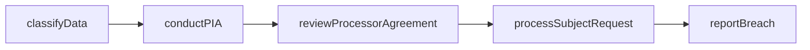
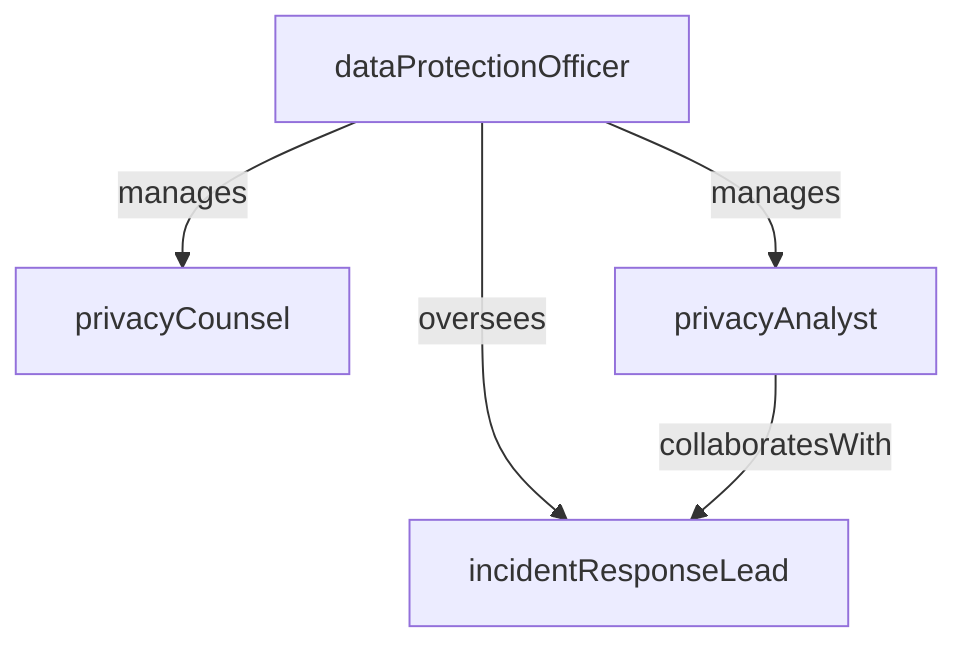

# Privacy & Data Protection

> Business-as-Code definition for the Privacy & Data Protection department. Models responsibilities, actions, events, and searches.

## Overview

Data privacy programs, GDPR/CCPA compliance, and privacy impact assessments

## Responsibilities

| Responsibility | Description |
|---------------|-------------|
| managePrivacyProgram | Operate the enterprise privacy program including policies, training, and awareness campaigns |
| conductPrivacyAssessments | Perform privacy impact assessments and data protection impact assessments for new products and processes |
| handleDataSubjectRequests | Process access, deletion, correction, and portability requests from data subjects |
| maintainDataInventory | Map and catalog personal data processing activities, data flows, and third-party sharing |
| respondToBreaches | Lead the privacy incident response process including notification to regulators and affected individuals |

## Roles

| Role | Description |
|------|-------------|
| dataProtectionOfficer | Serves as the designated DPO and primary contact for regulators and data subjects |
| privacyCounsel | Provides legal guidance on privacy regulations and reviews data processing agreements |
| privacyAnalyst | Conducts assessments, maintains data inventories, and supports compliance monitoring |
| incidentResponseLead | Coordinates breach investigation, containment, and regulatory notification |

## Entities

| Entity | Description |
|--------|-------------|
| PrivacyImpactAssessment | An evaluation of privacy risks associated with a new product, feature, or data processing activity |
| DataSubjectRequest | A formal request from an individual to exercise their privacy rights |
| DataProcessingRecord | A documented record of a personal data processing activity as required by GDPR Article 30 |
| PrivacyIncident | A security event or breach involving the unauthorized access or disclosure of personal data |
| DataProcessingAgreement | A contract governing how a third-party processor handles personal data on the organization's behalf |

## Actions

| Action | Description |
|--------|-------------|
| conductPIA | Perform a privacy impact assessment for a proposed data processing activity |
| processSubjectRequest | Fulfill a data subject access, deletion, or portability request within regulatory timelines |
| classifyData | Categorize data assets by sensitivity level and applicable privacy regulations |
| reportBreach | Notify regulators and affected individuals of a personal data breach |
| reviewProcessorAgreement | Evaluate and negotiate data processing agreements with third-party vendors |
| updateDataInventory | Add or modify entries in the personal data processing register |

## Events

| Event | Description |
|-------|-------------|
| piaCompleted | A privacy impact assessment was finalized with findings and recommendations |
| subjectRequestFulfilled | A data subject request was completed within the required timeframe |
| breachDetected | A personal data breach was identified and escalated for investigation |
| breachNotified | Regulators and affected individuals were notified of a confirmed data breach |
| processorAgreementExecuted | A data processing agreement was signed with a third-party vendor |
| dataInventoryUpdated | The personal data processing register was revised with new or changed entries |

## Searches

| Search | Description |
|--------|-------------|
| findOpenSubjectRequests | List data subject requests awaiting fulfillment by type and deadline |
| searchDataInventory | Look up data processing activities by data category, purpose, or third-party processor |
| listPendingAssessments | Retrieve privacy impact assessments that are in progress or awaiting review |
| getBreachHistory | Find past privacy incidents filtered by severity, date range, or regulation |
| findProcessorAgreements | Search data processing agreements by vendor, jurisdiction, or renewal date |

## Workflow



## Actor Relationships



## Related Processes

| Process | APQC ID | Relationship |
|---------|---------|-------------|
| Manage Compliance | 11.2 | Governs privacy program policies and regulatory obligations |
| Manage Remediation Efforts | 11.3 | Core process for data protection controls and breach response |

## Related Departments

| Department | Relationship |
|-----------|-------------|
| Regulatory Compliance | Aligns on privacy regulation monitoring and compliance audits |
| Cybersecurity | Partners on data breach detection, containment, and forensic investigation |
| Engineering | Collaborates on privacy-by-design implementation in products and systems |

## Usage

```typescript
import { db } from '@headlessly/db'

const dept = await db.departments.get('privacyDataProtection')
const requests = await db.departments.search('findOpenSubjectRequests', { type: 'deletion' })
const inventory = await db.departments.search('searchDataInventory', { category: 'personal-identifiable' })
```
