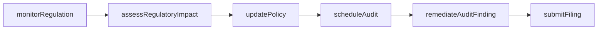
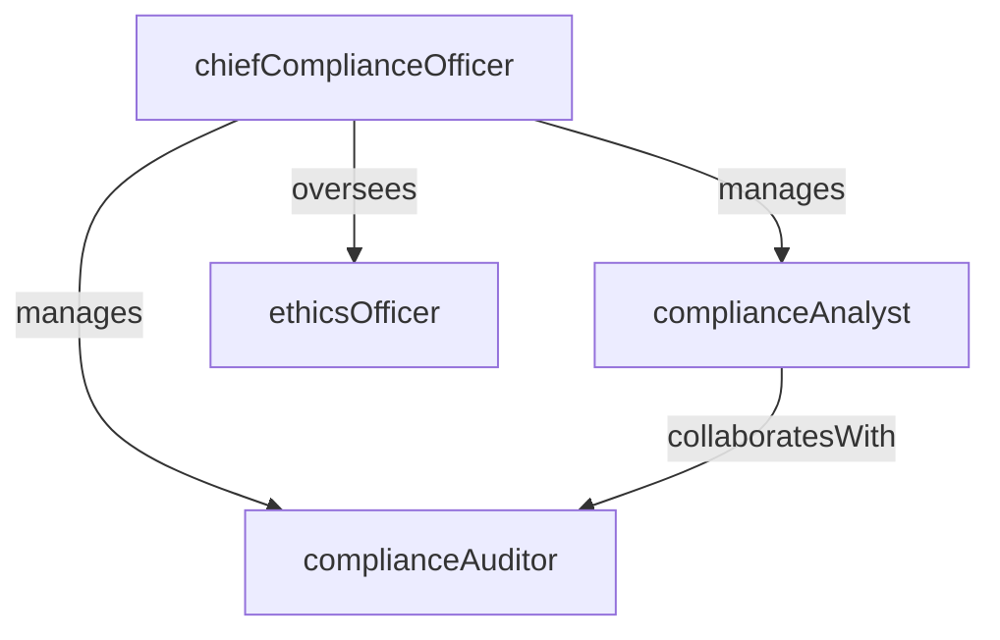

# Regulatory Compliance

> Business-as-Code definition for the Regulatory Compliance department. Models responsibilities, actions, events, and searches.

## Overview

Regulatory monitoring, policy development, and compliance programs

## Responsibilities

| Responsibility | Description |
|---------------|-------------|
| monitorRegulations | Track new and changing laws, rules, and regulatory guidance across all applicable jurisdictions |
| developCompliancePolicies | Author and maintain internal policies and procedures that meet regulatory requirements |
| conductComplianceAudits | Plan and execute periodic audits to verify adherence to regulations and internal policies |
| manageTrainingPrograms | Design and deliver compliance training for employees on topics such as anti-bribery, sanctions, and ethics |
| reportToRegulators | Prepare and submit required filings, disclosures, and reports to regulatory bodies |

## Roles

| Role | Description |
|------|-------------|
| chiefComplianceOfficer | Leads the compliance program and reports to the board on regulatory matters |
| complianceAnalyst | Monitors regulatory changes, performs gap analyses, and drafts policy updates |
| complianceAuditor | Conducts internal compliance audits and documents findings and remediation plans |
| ethicsOfficer | Manages the ethics hotline, investigates reports, and oversees the code of conduct |

## Entities

| Entity | Description |
|--------|-------------|
| Regulation | A law, rule, or regulatory requirement applicable to the organization |
| CompliancePolicy | An internal policy document that translates regulatory requirements into organizational standards |
| AuditFinding | A documented gap or deficiency identified during a compliance audit |
| ComplianceTraining | A training course or certification required for employees in specific roles or jurisdictions |
| RegulatoryFiling | A report or disclosure submitted to a regulatory authority on a defined schedule |

## Actions

| Action | Description |
|--------|-------------|
| assessRegulatoryImpact | Evaluate how a new regulation affects the organization's operations and policies |
| updatePolicy | Revise an internal compliance policy to address regulatory changes |
| scheduleAudit | Plan a compliance audit with scope, timeline, and assigned auditors |
| investigateComplaint | Review and investigate an ethics hotline report or compliance concern |
| submitFiling | Prepare and transmit a required regulatory report or disclosure |
| remediateAuditFinding | Implement corrective actions to address a compliance gap |

## Events

| Event | Description |
|-------|-------------|
| regulationIdentified | A new or amended regulation was flagged as applicable to the organization |
| policyUpdated | A compliance policy was revised and published |
| auditCompleted | A scheduled compliance audit was finalized with findings documented |
| findingRemediated | A corrective action was implemented and verified for an audit finding |
| filingSubmitted | A regulatory report or disclosure was submitted to the relevant authority |
| complianceBreachDetected | A potential violation of regulations or internal policies was identified |

## Searches

| Search | Description |
|--------|-------------|
| findOpenFindings | List unresolved audit findings by severity, department, or regulation |
| listUpcomingFilings | Retrieve regulatory filings due within a specified date range |
| searchPolicies | Look up compliance policies by topic, regulation, or last-updated date |
| getTrainingCompletion | Check employee completion rates for required compliance training courses |
| findRegulationsByJurisdiction | List applicable regulations filtered by jurisdiction or regulatory body |

## Workflow



## Actor Relationships



## Related Processes

| Process | APQC ID | Relationship |
|---------|---------|-------------|
| Manage Legal and Ethical Compliance | 11.1 | Core process for regulatory monitoring and compliance program management |
| Manage Internal Controls | 11.2 | Governs the control environment that supports compliance objectives |

## Related Departments

| Department | Relationship |
|-----------|-------------|
| Corporate Legal | Coordinates on regulatory interpretation and enforcement actions |
| Privacy & Data Protection | Aligns on data privacy regulations such as GDPR and CCPA |
| Risk Management | Partners on compliance risk assessments and control testing |

## Usage

```typescript
import { db } from '@headlessly/db'

const dept = await db.departments.get('regulatoryCompliance')
const findings = await db.departments.search('findOpenFindings', { severity: 'high' })
const filings = await db.departments.search('listUpcomingFilings', { withinDays: 30 })
```
