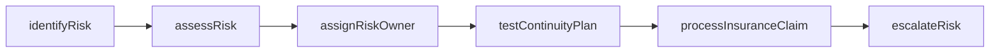
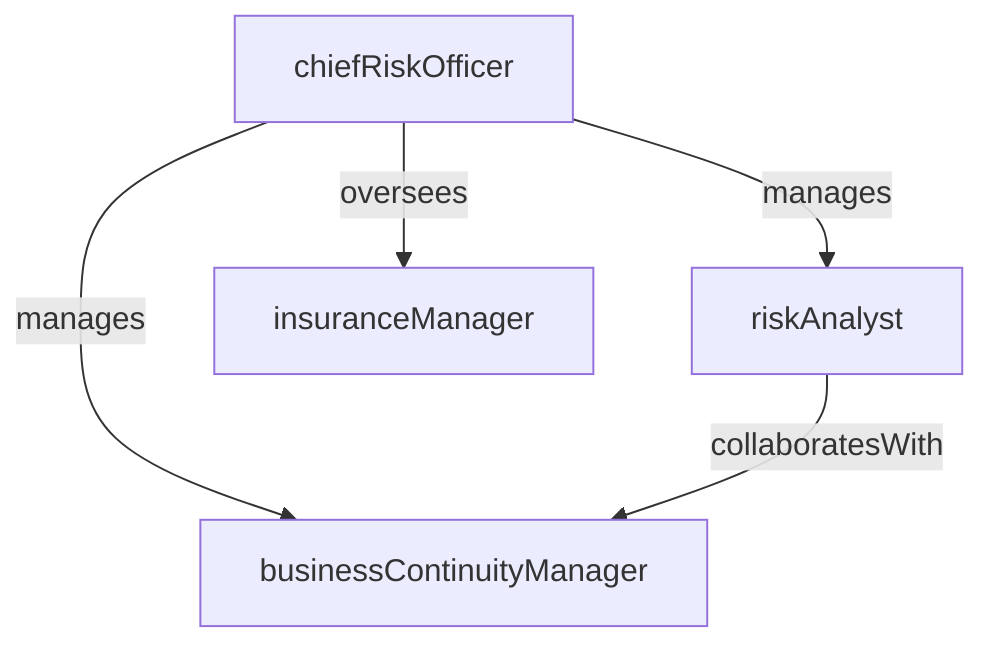

# Risk Management

> Business-as-Code definition for the Risk Management department. Models responsibilities, actions, events, and searches.

## Overview

Enterprise risk assessment, mitigation planning, and business continuity

## Responsibilities

| Responsibility | Description |
|---------------|-------------|
| assessEnterpriseRisks | Identify, evaluate, and prioritize strategic, operational, financial, and compliance risks |
| developMitigationPlans | Design and implement controls and action plans to reduce risk exposure to acceptable levels |
| maintainRiskRegister | Operate a centralized risk register that tracks all identified risks, owners, and mitigation status |
| manageBusinessContinuity | Develop, test, and maintain business continuity and disaster recovery plans |
| administerInsurance | Procure and manage corporate insurance programs covering property, liability, and cyber risks |

## Roles

| Role | Description |
|------|-------------|
| chiefRiskOfficer | Leads the enterprise risk management program and reports to the board on risk posture |
| riskAnalyst | Performs risk assessments, quantifies exposures, and monitors key risk indicators |
| businessContinuityManager | Develops and tests BCP/DR plans and coordinates crisis response exercises |
| insuranceManager | Manages insurance broker relationships, policy renewals, and claims processing |

## Entities

| Entity | Description |
|--------|-------------|
| Risk | An identified threat or uncertainty that could impact business objectives |
| RiskRegister | A centralized inventory of all assessed risks with likelihood, impact, owner, and mitigation status |
| MitigationPlan | A documented set of controls and actions designed to reduce a specific risk |
| BusinessContinuityPlan | A plan outlining procedures to maintain operations during and after a disruptive event |
| InsurancePolicy | A coverage policy protecting the organization against specified loss categories |

## Actions

| Action | Description |
|--------|-------------|
| identifyRisk | Document a new risk with its category, likelihood, and potential impact |
| assessRisk | Quantify a risk's probability and business impact using scoring methodologies |
| assignRiskOwner | Designate a responsible party accountable for managing and mitigating a specific risk |
| testContinuityPlan | Execute a tabletop exercise or simulation to validate a business continuity plan |
| processInsuranceClaim | File and manage an insurance claim for a covered loss event |
| escalateRisk | Raise a risk that exceeds tolerance thresholds to senior leadership for action |

## Events

| Event | Description |
|-------|-------------|
| riskIdentified | A new risk was documented and added to the risk register |
| riskMitigated | A mitigation plan was implemented and the risk was reduced to acceptable levels |
| riskEscalated | A risk exceeded its tolerance threshold and was escalated to senior leadership |
| continuityPlanTested | A business continuity exercise was completed with findings documented |
| insuranceClaimFiled | An insurance claim was submitted for a covered loss event |
| riskAssessmentCompleted | A periodic enterprise risk assessment cycle was finalized |

## Searches

| Search | Description |
|--------|-------------|
| findHighRisks | List risks rated above a specified likelihood or impact threshold |
| getRisksByOwner | Retrieve all risks assigned to a specific department or individual |
| listOpenMitigationPlans | Find mitigation plans that are in progress or overdue |
| searchInsurancePolicies | Look up insurance policies by coverage type, carrier, or renewal date |
| getContinuityPlanStatus | Check the testing status and readiness of business continuity plans |

## Workflow



## Actor Relationships



## Related Processes

| Process | APQC ID | Relationship |
|---------|---------|-------------|
| Manage Legal and Ethical Compliance | 11.1 | Provides the legal and governance framework for risk management |
| Manage Internal Controls | 11.2 | Governs the control environment that implements risk mitigation measures |

## Related Departments

| Department | Relationship |
|-----------|-------------|
| Regulatory Compliance | Coordinates on compliance risks and control testing |
| Corporate Legal | Partners on litigation risk assessment and insurance claims |
| Cybersecurity | Aligns on cybersecurity risk identification and mitigation |

## Usage

```typescript
import { db } from '@headlessly/db'

const dept = await db.departments.get('riskManagement')
const highRisks = await db.departments.search('findHighRisks', { impactThreshold: 'critical' })
const mitigations = await db.departments.search('listOpenMitigationPlans', { status: 'in-progress' })
```
