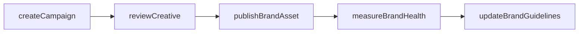
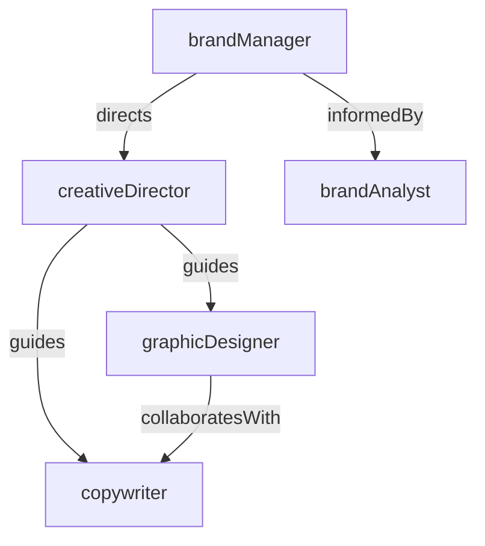

# Brand Marketing

> Business-as-Code definition for the Brand Marketing department. Models responsibilities, actions, events, and searches.

## Overview

Brand strategy, creative campaigns, and brand identity management

## Responsibilities

| Responsibility | Description |
|---------------|-------------|
| manageBrandIdentity | Define and maintain visual identity, voice, and brand guidelines across all touchpoints |
| developCreativeCampaigns | Conceptualize and execute integrated marketing campaigns that reinforce brand positioning |
| conductBrandResearch | Measure brand awareness, perception, and equity through surveys and market research |
| ensureBrandConsistency | Enforce brand standards across teams, partners, and external agencies |

## Roles

| Role | Description |
|------|-------------|
| brandManager | Owns brand strategy, positioning, and guideline enforcement |
| creativeDirector | Leads visual and conceptual direction for campaigns and brand assets |
| graphicDesigner | Produces visual assets including logos, templates, and campaign creative |
| copywriter | Crafts brand messaging, taglines, and campaign copy |
| brandAnalyst | Tracks brand health metrics, competitive positioning, and market perception |

## Entities

| Entity | Description |
|--------|-------------|
| BrandGuideline | Document defining visual identity, tone of voice, and usage rules |
| Campaign | Coordinated marketing initiative with defined objectives and creative assets |
| BrandAsset | Logo, template, image, or other creative element in the brand library |
| BrandSurvey | Research instrument measuring brand awareness, recall, and sentiment |

## Actions

| Action | Description |
|--------|-------------|
| createCampaign | Design and launch a new brand marketing campaign |
| updateBrandGuidelines | Revise brand standards to reflect evolved positioning |
| publishBrandAsset | Release a new creative asset to the brand library |
| measureBrandHealth | Run brand tracking surveys and compile perception metrics |
| reviewCreative | Evaluate campaign creative for brand alignment and quality |
| approveBrandUsage | Authorize third-party or partner use of brand elements |

## Events

| Event | Description |
|-------|-------------|
| campaignLaunched | A new brand campaign went live across target channels |
| brandGuidelinesUpdated | Brand standards document was revised and published |
| brandAssetPublished | A new asset was added to the brand library |
| brandHealthMeasured | Brand tracking survey results were compiled and reported |
| creativeApproved | Campaign creative passed brand review and was cleared for production |

## Searches

| Search | Description |
|--------|-------------|
| findActiveCampaigns | List brand campaigns currently in market with performance data |
| searchBrandAssets | Query the brand asset library by type, format, or campaign |
| getBrandHealthScores | Retrieve latest brand awareness and perception metrics |
| findPendingReviews | List creative submissions awaiting brand compliance review |

## Workflow



## Actor Relationships



## Related Processes

| Process | APQC ID | Relationship |
|---------|---------|-------------|
| Develop Marketing Strategy | 3.2 | Defines brand positioning within overall marketing strategy |
| Develop and Manage Brands | 3.2.3 | Core process governing brand identity and equity management |
| Design and Execute Brand and Product Marketing Programs | 3.3.3 | Executes brand campaigns through advertising channels |

## Related Departments

| Department | Relationship |
|-----------|-------------|
| Content Marketing | Produces brand-aligned content and editorial assets |
| Product Marketing | Aligns product messaging with overarching brand positioning |
| Public Relations | Amplifies brand narrative through earned media and thought leadership |

## Usage

```typescript
import { db } from '@headlessly/db'

const brand = await db.departments.get('brandMarketing')
const campaigns = await db.departments.search('findActiveCampaigns', { status: 'live' })
const assets = await db.departments.search('searchBrandAssets', { format: 'svg' })
```
