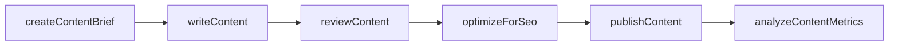
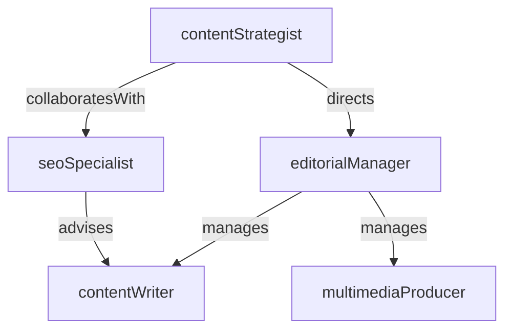

# Content Marketing

> Business-as-Code definition for the Content Marketing department. Models responsibilities, actions, events, and searches.

## Overview

Content strategy, creation, SEO, and editorial operations

## Responsibilities

| Responsibility | Description |
|---------------|-------------|
| developContentStrategy | Define content pillars, audience segments, and editorial calendar aligned to business goals |
| produceEditorialContent | Create blog posts, whitepapers, case studies, and multimedia content |
| optimizeSearchVisibility | Improve organic search rankings through keyword research, on-page SEO, and link building |
| manageEditorialCalendar | Coordinate content production timelines, approvals, and publishing schedules |
| measureContentPerformance | Track engagement, traffic, conversions, and ROI of published content |

## Roles

| Role | Description |
|------|-------------|
| contentStrategist | Defines content roadmap, audience targeting, and distribution strategy |
| contentWriter | Researches and writes long-form and short-form marketing content |
| seoSpecialist | Conducts keyword research, technical audits, and search optimization |
| editorialManager | Manages the editorial calendar, contributor workflows, and quality standards |
| multimediaProducer | Creates video, podcast, and visual content assets |

## Entities

| Entity | Description |
|--------|-------------|
| ContentPiece | An article, whitepaper, video, or other published content asset |
| EditorialCalendar | Scheduled plan of upcoming content topics, authors, and publish dates |
| KeywordTarget | Search term or phrase being targeted for organic ranking |
| ContentBrief | Specification document outlining scope, audience, and objectives for a content piece |

## Actions

| Action | Description |
|--------|-------------|
| createContentBrief | Draft a specification for a new content piece with target keywords and audience |
| writeContent | Author a content piece following the approved brief |
| reviewContent | Edit and approve content for accuracy, quality, and brand voice |
| publishContent | Release finalized content to the website or distribution channels |
| optimizeForSeo | Apply keyword targeting, meta data, and structured markup to content |
| analyzeContentMetrics | Evaluate traffic, engagement, and conversion data for published content |

## Events

| Event | Description |
|-------|-------------|
| contentBriefApproved | A content brief was reviewed and approved for production |
| contentPublished | A content piece was published to the target channel |
| keywordRankingChanged | A tracked keyword moved up or down in search engine results |
| editorialCalendarUpdated | The content schedule was revised with new or rescheduled items |
| contentPerformanceReviewed | Periodic content analytics report was generated and shared |

## Searches

| Search | Description |
|--------|-------------|
| findPublishedContent | Query content library by topic, author, date, or content type |
| getKeywordRankings | Retrieve current search rankings for tracked keyword targets |
| listUpcomingContent | View scheduled content pieces on the editorial calendar |
| findTopPerformingContent | Rank content by traffic, engagement, or conversion metrics |

## Workflow



## Actor Relationships



## Related Processes

| Process | APQC ID | Relationship |
|---------|---------|-------------|
| Develop Marketing Strategy | 3.1.1 | Content strategy derives from overall marketing plan and positioning |
| Develop and Manage Content | 3.3.4 | Core process for content creation, curation, and lifecycle management |

## Related Departments

| Department | Relationship |
|-----------|-------------|
| Brand Marketing | Ensures all content adheres to brand voice and visual identity |
| Demand Generation | Provides gated content assets for lead capture campaigns |
| Product Marketing | Collaborates on product-focused content, case studies, and launch materials |

## Usage

```typescript
import { db } from '@headlessly/db'

const content = await db.departments.get('contentMarketing')
const topContent = await db.departments.search('findTopPerformingContent', { metric: 'conversions', limit: 10 })
const calendar = await db.departments.search('listUpcomingContent', { month: '2026-03' })
```
