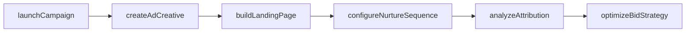
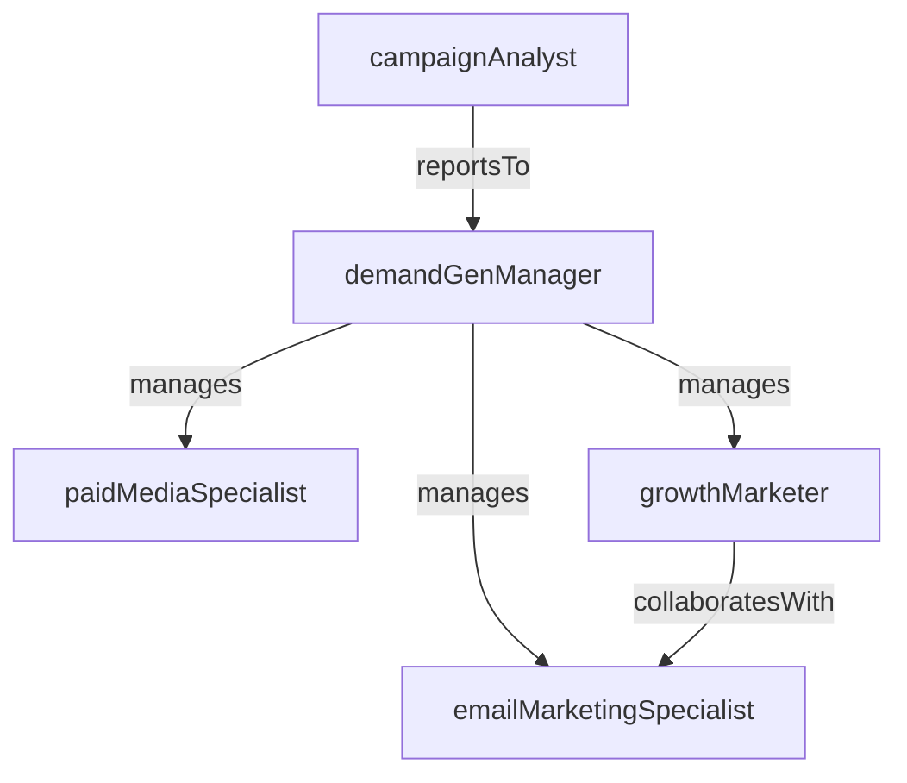

# Demand Generation

> Business-as-Code definition for the Demand Generation department. Models responsibilities, actions, events, and searches.

## Overview

Lead generation, paid media, growth marketing, and conversion optimization

## Responsibilities

| Responsibility | Description |
|---------------|-------------|
| generateQualifiedLeads | Drive marketing-qualified leads through inbound and outbound campaigns |
| managePaidMedia | Plan, execute, and optimize paid advertising across search, social, and display channels |
| optimizeConversionFunnels | Improve landing page performance, form completion rates, and funnel throughput |
| runNurtureCampaigns | Design and execute email drip sequences to advance leads through the buying journey |
| reportCampaignRoi | Measure and attribute revenue pipeline to demand generation programs |

## Roles

| Role | Description |
|------|-------------|
| demandGenManager | Owns lead targets, campaign strategy, and pipeline contribution goals |
| paidMediaSpecialist | Manages ad platforms, bidding strategies, and media budgets |
| growthMarketer | Runs experiments on landing pages, CTAs, and funnel flows to improve conversion |
| emailMarketingSpecialist | Builds and optimizes automated email nurture sequences |
| campaignAnalyst | Tracks campaign performance, attribution models, and cost-per-lead metrics |

## Entities

| Entity | Description |
|--------|-------------|
| Campaign | A coordinated demand generation program with budget, channels, and lead targets |
| Lead | A prospect who has engaged with marketing content and entered the funnel |
| LandingPage | A purpose-built web page designed to capture leads or drive conversions |
| AdCreative | Visual or text advertisement used across paid media channels |
| NurtureSequence | An automated multi-step email workflow for lead engagement |

## Actions

| Action | Description |
|--------|-------------|
| launchCampaign | Activate a new demand generation campaign across target channels |
| createAdCreative | Produce ad copy and visual assets for paid media placement |
| buildLandingPage | Design and publish a conversion-optimized landing page |
| configureNurtureSequence | Set up automated email drip workflows with triggers and segmentation |
| analyzeAttribution | Map pipeline revenue back to originating campaigns and touchpoints |
| optimizeBidStrategy | Adjust paid media bids and budgets based on performance data |

## Events

| Event | Description |
|-------|-------------|
| campaignLaunched | A demand generation campaign was activated and started serving |
| leadCaptured | A new prospect submitted a form or engaged with a conversion point |
| mqlThresholdReached | A lead accumulated enough engagement to qualify as marketing-qualified |
| campaignBudgetExhausted | A campaign reached its allocated spend limit |
| conversionRateChanged | A landing page or funnel step showed a significant shift in conversion rate |
| attributionReportGenerated | A campaign attribution analysis was completed and distributed |

## Searches

| Search | Description |
|--------|-------------|
| findActiveCampaigns | List campaigns currently running with budget and lead metrics |
| getLeadsBySource | Query leads segmented by acquisition channel or campaign |
| getCampaignRoi | Retrieve cost, pipeline, and revenue attribution for a campaign |
| findUnderperformingAds | Identify ad creatives below target click-through or conversion rates |
| listMqls | Query marketing-qualified leads by date range and score threshold |

## Workflow



## Actor Relationships



## Related Processes

| Process | APQC ID | Relationship |
|---------|---------|-------------|
| Develop Marketing Strategy | 3.1.1 | Campaign planning derives from marketing strategy and segmentation |
| Develop and Manage Advertising | 3.3.2 | Manages paid media execution and advertising spend optimization |
| Manage Customer Communications | 3.3.5 | Email nurture and campaign communications to prospects |

## Related Departments

| Department | Relationship |
|-----------|-------------|
| Content Marketing | Supplies gated content and blog assets used in lead capture |
| Inside Sales | Receives marketing-qualified leads for follow-up and qualification |
| Marketing Operations | Provides automation tooling, lead scoring, and attribution infrastructure |

## Usage

```typescript
import { db } from '@headlessly/db'

const demandGen = await db.departments.get('demandGeneration')
const mqls = await db.departments.search('listMqls', { minScore: 80, dateRange: '2026-Q1' })
const roi = await db.departments.search('getCampaignRoi', { campaignId: 'spring-launch-2026' })
```
