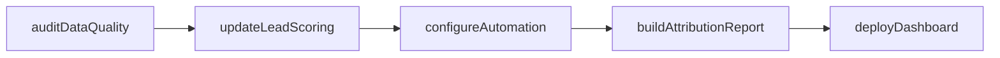
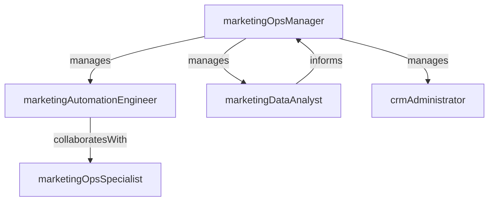

# Marketing Operations

> Business-as-Code definition for the Marketing Operations department. Models responsibilities, actions, events, and searches.

## Overview

Marketing analytics, automation, attribution, and tech stack management

## Responsibilities

| Responsibility | Description |
|---------------|-------------|
| manageMarketingTechStack | Evaluate, implement, and maintain marketing automation platforms and integrations |
| operateLeadManagement | Define lead scoring models, routing rules, and lifecycle stage definitions |
| deliverMarketingAnalytics | Build dashboards, attribution models, and performance reports for marketing leadership |
| maintainDataQuality | Enforce data hygiene, deduplication, and enrichment across marketing databases |
| governCampaignProcesses | Standardize campaign request workflows, naming conventions, and approval processes |

## Roles

| Role | Description |
|------|-------------|
| marketingOpsManager | Owns marketing technology strategy, process governance, and analytics delivery |
| marketingAutomationEngineer | Configures automation workflows, lead scoring, and system integrations |
| marketingDataAnalyst | Builds reports, attribution models, and performance dashboards |
| crmAdministrator | Manages CRM configuration, data integrity, and user access for marketing |
| marketingOpsSpecialist | Handles day-to-day campaign operations, list management, and QA |

## Entities

| Entity | Description |
|--------|-------------|
| AutomationWorkflow | A configured sequence of triggers, conditions, and actions in the marketing platform |
| LeadScoringModel | Rule set that assigns engagement and demographic scores to leads |
| AttributionModel | Framework mapping revenue and pipeline credit to marketing touchpoints |
| MarketingDashboard | Analytics view showing campaign performance, funnel metrics, and ROI |

## Actions

| Action | Description |
|--------|-------------|
| configureAutomation | Build or modify marketing automation workflows and trigger logic |
| updateLeadScoring | Revise lead scoring rules based on conversion data and sales feedback |
| buildAttributionReport | Generate multi-touch attribution analysis for campaign performance |
| auditDataQuality | Run deduplication, enrichment, and validation checks on marketing data |
| integrateMarketingTool | Connect a new platform or data source to the marketing tech stack |
| deployDashboard | Publish a new or updated analytics dashboard for stakeholders |

## Events

| Event | Description |
|-------|-------------|
| automationWorkflowDeployed | A new or updated automation workflow was activated in production |
| leadScoringModelUpdated | Lead scoring rules were revised and published to the automation platform |
| attributionReportPublished | A campaign attribution analysis was completed and shared with stakeholders |
| dataQualityAuditCompleted | A marketing database audit was finished with findings and remediation actions |
| marketingToolIntegrated | A new tool or data source was connected to the marketing tech stack |
| dashboardDeployed | A new analytics dashboard was published and made available to users |

## Searches

| Search | Description |
|--------|-------------|
| findAutomationWorkflows | List active automation workflows with trigger types and volumes |
| getAttributionData | Query multi-touch attribution data by campaign, channel, or time period |
| listDataQualityIssues | Retrieve records flagged for deduplication, enrichment, or validation |
| getLeadScoringDistribution | View lead score distribution across the marketing database |
| findIntegrationStatus | Check health and sync status of connected marketing tools |

## Workflow



## Actor Relationships



## Related Processes

| Process | APQC ID | Relationship |
|---------|---------|-------------|
| Develop Marketing Strategy | 3.1.1 | Provides data infrastructure and analytics to inform strategy development |
| Measure and Evaluate Marketing Programs | 3.5 | Operates attribution models and dashboards that measure program effectiveness |
| Manage Customer Data | 3.3.6 | Maintains data quality and integration across marketing systems |

## Related Departments

| Department | Relationship |
|-----------|-------------|
| Demand Generation | Provides automation infrastructure and lead scoring for campaign execution |
| Revenue Operations | Collaborates on cross-functional data alignment and funnel attribution |
| Sales Operations | Coordinates lead routing, CRM sync, and handoff processes |

## Usage

```typescript
import { db } from '@headlessly/db'

const mops = await db.departments.get('marketingOperations')
const workflows = await db.departments.search('findAutomationWorkflows', { status: 'active' })
const attribution = await db.departments.search('getAttributionData', { quarter: '2026-Q1' })
```
