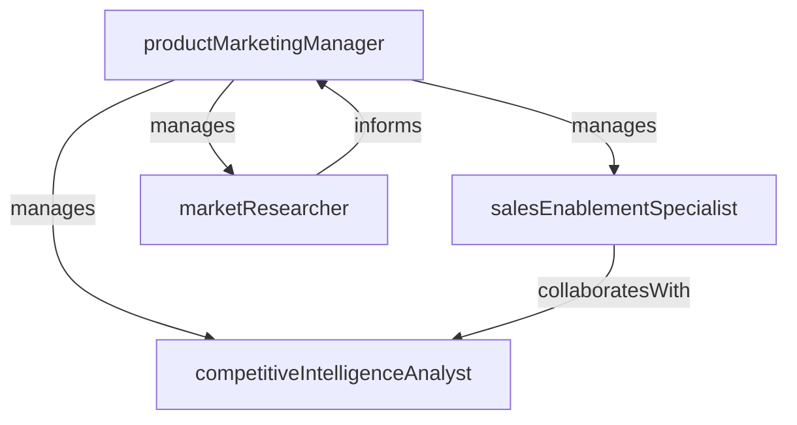

# Product Marketing

> Business-as-Code definition for the Product Marketing department. Models responsibilities, actions, events, and searches.

## Overview

Positioning, messaging, competitive intelligence, and go-to-market

## Responsibilities

| Responsibility | Description |
|---------------|-------------|
| definePositioning | Craft product positioning and value propositions for target buyer personas |
| conductCompetitiveIntelligence | Research competitor offerings, pricing, and messaging to inform strategy |
| manageGoToMarketLaunches | Plan and execute coordinated product launches across sales, marketing, and customer success |
| enableSalesTeams | Create battlecards, pitch decks, and objection-handling guides for sales enablement |
| gatherMarketInsights | Synthesize customer feedback, win/loss data, and market trends into actionable insights |

## Roles

| Role | Description |
|------|-------------|
| productMarketingManager | Owns positioning, launch strategy, and cross-functional GTM coordination |
| competitiveIntelligenceAnalyst | Monitors competitors and produces battlecards and market landscape reports |
| salesEnablementSpecialist | Develops training materials, talk tracks, and deal support resources for sales |
| marketResearcher | Conducts buyer persona research, customer interviews, and win/loss analysis |

## Entities

| Entity | Description |
|--------|-------------|
| LaunchPlan | Coordinated go-to-market plan with timeline, messaging, and channel activation |
| Battlecard | Competitive comparison document used by sales for deal positioning |
| BuyerPersona | Detailed profile of an ideal customer segment including pain points and motivations |
| MessagingFramework | Structured document defining value propositions, proof points, and positioning hierarchy |
| WinLossAnalysis | Post-deal evaluation capturing why opportunities were won or lost |

## Actions

| Action | Description |
|--------|-------------|
| createLaunchPlan | Build a go-to-market plan for a new product or feature release |
| developMessaging | Define value propositions, positioning statements, and proof points |
| updateBattlecard | Refresh competitive intelligence and sales positioning guidance |
| conductWinLossAnalysis | Interview customers and analyze deal data to identify win/loss patterns |
| deliverSalesTraining | Run enablement sessions to equip sales with new messaging and tools |
| publishMarketInsight | Distribute a research brief on market trends or competitive shifts |

## Events

| Event | Description |
|-------|-------------|
| launchPlanApproved | A go-to-market launch plan was finalized and approved by stakeholders |
| productLaunched | A product or feature was officially released to market |
| battlecardUpdated | A competitive battlecard was refreshed with new intelligence |
| winLossReportCompleted | A win/loss analysis was completed and findings shared with leadership |
| messagingFrameworkPublished | Updated positioning and messaging was distributed to go-to-market teams |

## Searches

| Search | Description |
|--------|-------------|
| findActiveLaunches | List upcoming and in-progress product launches with status |
| getBattlecards | Retrieve competitive battlecards by competitor or product category |
| getWinLossInsights | Query win/loss data by segment, competitor, or deal size |
| findBuyerPersonas | List buyer personas with pain points and messaging alignment |

## Workflow


## Actor Relationships



## Related Processes

| Process | APQC ID | Relationship |
|---------|---------|-------------|
| Develop Marketing Strategy | 3.1.1 | Positioning and segmentation feed into overall marketing strategy |
| Define Offering and Value Proposition | 3.1.2 | Core process for crafting product positioning and value propositions |
| Manage Product Lifecycle | 3.2 | Coordinates launch timing with product development milestones |

## Related Departments

| Department | Relationship |
|-----------|-------------|
| Brand Marketing | Aligns product messaging with overarching brand positioning and voice |
| Enterprise Sales | Provides deal support, competitive positioning, and enablement materials |
| Content Marketing | Collaborates on product narratives, case studies, and thought leadership |

## Usage

```typescript
import { db } from '@headlessly/db'

const pmkt = await db.departments.get('productMarketing')
const launches = await db.departments.search('findActiveLaunches', { status: 'in-progress' })
const battlecards = await db.departments.search('getBattlecards', { competitor: 'acme-corp' })
```
