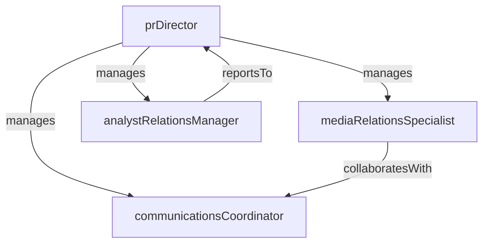

# Public Relations

> Business-as-Code definition for the Public Relations department. Models responsibilities, actions, events, and searches.

## Overview

Media relations, analyst relations, crisis communications, and thought leadership

## Responsibilities

| Responsibility | Description |
|---------------|-------------|
| manageMediaRelations | Build and maintain relationships with journalists, editors, and media outlets |
| coordinateCrisisCommunications | Develop response plans and manage messaging during reputational incidents |
| cultivateAnalystRelations | Brief industry analysts, manage report contributions, and track analyst coverage |
| developThoughtLeadership | Position executives and subject-matter experts as industry thought leaders |

## Roles

| Role | Description |
|------|-------------|
| prDirector | Leads public relations strategy, media planning, and crisis preparedness |
| mediaRelationsSpecialist | Pitches stories, manages press inquiries, and coordinates interviews |
| analystRelationsManager | Manages industry analyst engagements, briefings, and evaluation cycles |
| communicationsCoordinator | Drafts press releases, talking points, and internal communications |

## Entities

| Entity | Description |
|--------|-------------|
| PressRelease | Official company announcement distributed to media outlets |
| MediaContact | A journalist, editor, or influencer in the media relations database |
| AnalystBriefing | A scheduled engagement with an industry analyst firm |
| CrisisResponsePlan | Documented protocol for managing communications during incidents |
| MediaCoverage | A published article, broadcast segment, or online mention about the company |

## Actions

| Action | Description |
|--------|-------------|
| issuePressRelease | Draft, approve, and distribute an official press release |
| pitchStory | Present a narrative angle to targeted journalists or media outlets |
| conductAnalystBriefing | Deliver a product or strategy briefing to an industry analyst |
| activateCrisisResponse | Initiate the crisis communications protocol and coordinate messaging |
| monitorMediaCoverage | Track press mentions, sentiment, and share of voice |
| prepareExecutiveTalkingPoints | Develop key messages for executive interviews or public appearances |

## Events

| Event | Description |
|-------|-------------|
| pressReleaseIssued | A press release was approved and distributed to media |
| mediaCoverageReceived | A new press mention or article was published about the company |
| analystBriefingCompleted | An industry analyst briefing was delivered and follow-up documented |
| crisisResponseActivated | The crisis communications protocol was triggered for an incident |
| crisisResolved | A reputational incident was resolved and post-mortem completed |

## Searches

| Search | Description |
|--------|-------------|
| findMediaCoverage | Query recent press mentions by outlet, sentiment, or topic |
| listUpcomingBriefings | View scheduled analyst briefings and media engagements |
| getMediaContacts | Search the media contact database by beat, outlet, or region |
| findPressReleases | Retrieve press releases by date, topic, or distribution status |

## Workflow


## Actor Relationships



## Related Processes

| Process | APQC ID | Relationship |
|---------|---------|-------------|
| Develop Marketing Strategy | 3.1.1 | PR strategy aligns with overall marketing positioning and messaging |
| Manage Public Relations | 3.3.3 | Core process governing media relations, analyst engagement, and crisis communications |

## Related Departments

| Department | Relationship |
|-----------|-------------|
| Brand Marketing | Coordinates brand messaging consistency across earned media channels |
| Content Marketing | Collaborates on thought leadership content and executive bylines |
| Product Marketing | Provides product news and positioning for press releases and analyst briefings |

## Usage

```typescript
import { db } from '@headlessly/db'

const pr = await db.departments.get('publicRelations')
const coverage = await db.departments.search('findMediaCoverage', { sentiment: 'positive', limit: 20 })
const briefings = await db.departments.search('listUpcomingBriefings', { month: '2026-03' })
```
