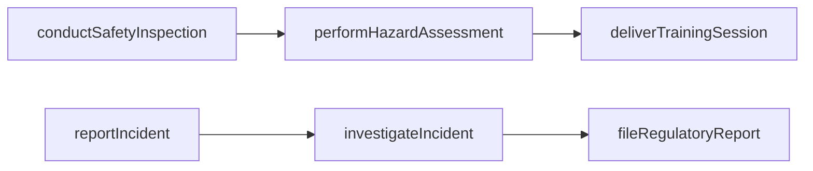
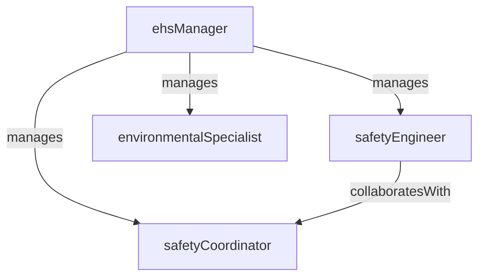

# Environmental Health & Safety

> Business-as-Code definition for the Environmental Health & Safety department. Models responsibilities, actions, events, and searches.

## Overview

Environmental Health & Safety protects employees, communities, and the environment by managing workplace safety programs, environmental compliance, hazard identification, and regulatory reporting. The department administers OSHA, EPA, and local regulatory programs while driving a culture of zero-incident operations.

## Responsibilities

| Responsibility | Description |
|---------------|-------------|
| conductSafetyInspections | Perform regular workplace inspections to identify hazards and verify corrective actions |
| manageIncidentInvestigations | Investigate workplace injuries, near-misses, and environmental releases to determine root cause |
| administerRegulatoryCompliance | Maintain compliance with OSHA, EPA, and state/local environmental and safety regulations |
| deliverSafetyTraining | Develop and deliver required safety training including lockout/tagout, confined space, and hazcom |
| manageEnvironmentalPermits | Track permit requirements, monitor emissions and discharges, and file regulatory reports |

## Roles

| Role | Description |
|------|-------------|
| ehsManager | Leads the EHS function, sets safety targets, and manages regulatory audit readiness |
| safetyEngineer | Designs safety controls, conducts hazard analyses, and develops safety procedures |
| environmentalSpecialist | Monitors emissions, waste streams, and environmental permits for regulatory compliance |
| safetyCoordinator | Facilitates daily safety meetings, tracks corrective actions, and maintains training records |

## Entities

| Entity | Description |
|--------|-------------|
| IncidentReport | Documentation of a workplace injury, illness, near-miss, or environmental release |
| SafetyInspectionRecord | Findings from a scheduled or unscheduled workplace safety inspection |
| EnvironmentalPermit | Regulatory permit for air emissions, wastewater discharge, or hazardous waste management |
| TrainingRecord | Employee completion record for a required safety or environmental training course |
| HazardAssessment | Evaluation of a job task or area identifying hazards, risk ratings, and control measures |
| SafetyDataSheet | Chemical safety data sheet maintained for hazardous substances in the facility |

## Actions

| Action | Description |
|--------|-------------|
| conductSafetyInspection | Perform a scheduled inspection of a work area and document findings |
| reportIncident | Log a workplace injury, near-miss, or environmental release event |
| investigateIncident | Conduct a root cause investigation for a reported safety or environmental incident |
| deliverTrainingSession | Execute a safety training session and record employee attendance and completion |
| performHazardAssessment | Evaluate a job task or area for hazards and assign risk ratings |
| fileRegulatoryReport | Prepare and submit required environmental or safety reports to regulatory agencies |

## Events

| Event | Description |
|-------|-------------|
| safetyInspectionCompleted | A workplace safety inspection was conducted and findings were documented |
| incidentReported | A workplace injury, near-miss, or environmental release was formally reported |
| investigationClosed | A root cause investigation was completed with corrective actions identified |
| trainingCompleted | An employee completed a required safety or environmental training course |
| hazardIdentified | A hazard assessment flagged a significant risk requiring control measures |
| regulatoryReportFiled | A required safety or environmental report was submitted to the regulatory agency |

## Searches

| Search | Description |
|--------|-------------|
| findOpenIncidents | Retrieve unresolved safety incidents and their investigation status |
| getTrainingCompliance | Query employee training completion rates for required safety courses |
| findOverdueInspections | List scheduled safety inspections that are past their due date |
| getIncidentTrends | Retrieve incident frequency and severity trends over a specified period |
| searchPermitStatus | Look up environmental permit status, expiration dates, and renewal deadlines |

## Workflow



## Actor Relationships



## Related Processes

| Process | APQC ID | Relationship |
|---------|---------|-------------|
| Produce/Assemble/Test Product | 4.3 | Ensures manufacturing operations meet workplace safety and environmental requirements |
| Manage Environmental Health and Safety (EHS) | 13.7 | Directly owns the enterprise EHS management programs |

## Related Departments

| Department | Relationship |
|-----------|-------------|
| Industrial Engineering | Partners on ergonomic assessments and workstation safety design |
| Maintenance Engineering | Coordinates on lockout/tagout procedures and equipment safety controls |
| Production Control | Integrates safety requirements into production planning and shift operations |
| Quality Control | Collaborates on safety-critical product characteristics and containment actions |

## Usage

```typescript
import { db } from '@headlessly/db'

const dept = await db.departments.get('environmentalHealthSafety')
const incidents = await db.departments.search('findOpenIncidents', { plant: 'plant-01' })
const compliance = await db.departments.search('getTrainingCompliance', { course: 'lockout-tagout' })
```
