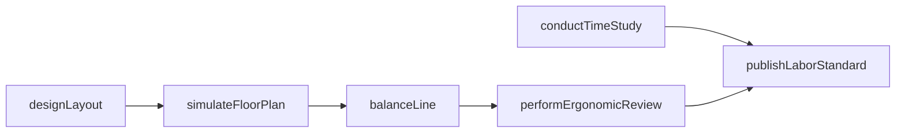
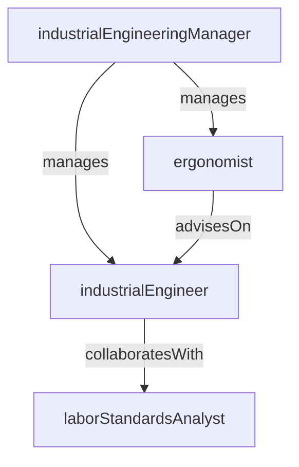

# Industrial Engineering

> Business-as-Code definition for the Industrial Engineering department. Models responsibilities, actions, events, and searches.

## Overview

Industrial Engineering applies work measurement, facility layout design, ergonomic analysis, and production efficiency studies to optimize the use of people, machines, and space. The department establishes labor standards, balances production lines, and designs plant floor configurations that maximize throughput and minimize waste.

## Responsibilities

| Responsibility | Description |
|---------------|-------------|
| conductTimeStudies | Perform time-and-motion studies to establish standard times for manufacturing operations |
| designFacilityLayouts | Plan and optimize plant floor layouts, material flow paths, and work cell configurations |
| balanceProductionLines | Distribute work content across stations to equalize cycle times and eliminate bottlenecks |
| performErgonomicAssessments | Evaluate workstation design for injury risk and recommend ergonomic improvements |
| developLaborStandards | Establish and maintain labor standard hours used in costing and capacity planning |

## Roles

| Role | Description |
|------|-------------|
| industrialEngineeringManager | Leads the IE team and prioritizes studies, layout projects, and standards development |
| industrialEngineer | Conducts time studies, line balancing, and facility layout design |
| ergonomist | Evaluates workplace ergonomics and designs interventions to reduce injury risk |
| laborStandardsAnalyst | Maintains standard time databases and validates actual-vs-standard labor performance |

## Entities

| Entity | Description |
|--------|-------------|
| TimeStudy | Documented observation of task durations, allowances, and resulting standard time |
| FacilityLayout | CAD drawing of the plant floor showing machine placement, aisles, and material flow |
| LineBalanceModel | Analysis of work content distribution across workstations for a production line |
| ErgonomicAssessment | Evaluation of a workstation including risk scores, strain analysis, and recommendations |
| LaborStandard | Established standard hours per unit for a manufacturing operation |

## Actions

| Action | Description |
|--------|-------------|
| conductTimeStudy | Observe and record task durations to establish or update a labor standard |
| designLayout | Create or revise a plant floor layout to optimize material flow and space utilization |
| balanceLine | Redistribute work elements across stations to equalize cycle times on a production line |
| performErgonomicReview | Assess a workstation for musculoskeletal risk factors and recommend improvements |
| publishLaborStandard | Release an approved standard time for use in routing, costing, and scheduling |
| simulateFloorPlan | Run a discrete-event simulation to validate a proposed facility layout change |

## Events

| Event | Description |
|-------|-------------|
| timeStudyCompleted | A time-and-motion study was finished and a standard time was established |
| layoutApproved | A new or revised plant floor layout was reviewed and approved for implementation |
| lineBalanced | Work content was successfully redistributed and the balanced line was validated |
| ergonomicRiskIdentified | An ergonomic assessment flagged a high-risk workstation requiring intervention |
| laborStandardPublished | A new or updated labor standard was released into the routing system |
| simulationCompleted | A discrete-event simulation of a proposed layout was finished with documented results |

## Searches

| Search | Description |
|--------|-------------|
| findTimeStudies | Retrieve time studies by product, operation, or work center |
| getStandardVsActual | Compare actual labor hours against established standards for a production line |
| searchLayoutProjects | List facility layout projects by status, area, or target completion date |
| findErgonomicRisks | Query workstations flagged with elevated ergonomic risk scores |
| getLineBalanceEfficiency | Retrieve line balance efficiency percentages for active production lines |

## Workflow



## Actor Relationships



## Related Processes

| Process | APQC ID | Relationship |
|---------|---------|-------------|
| Produce/Manufacture/Deliver Product | 4.3 | Provides labor standards and line balance data that drive production efficiency |
| Plan for and Align Supply Chain Resources | 4.2 | Supplies capacity models and standard times used in resource planning |

## Related Departments

| Department | Relationship |
|-----------|-------------|
| Process Engineering | Partners on process optimization, cycle time reduction, and work cell design |
| Production Scheduling | Consumes labor standards for capacity calculation and schedule feasibility |
| Environmental Health & Safety | Collaborates on ergonomic assessments and workstation safety improvements |
| Production Control | Provides standard times used in work order planning and efficiency reporting |

## Usage

```typescript
import { db } from '@headlessly/db'

const dept = await db.departments.get('industrialEngineering')
const studies = await db.departments.search('findTimeStudies', { workCenter: 'CNC-mill-01' })
const efficiency = await db.departments.search('getLineBalanceEfficiency', { line: 'assembly-02' })
```
