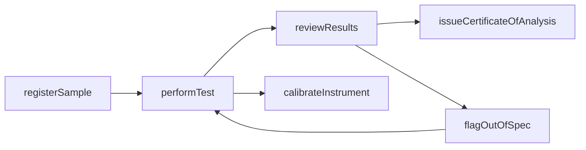
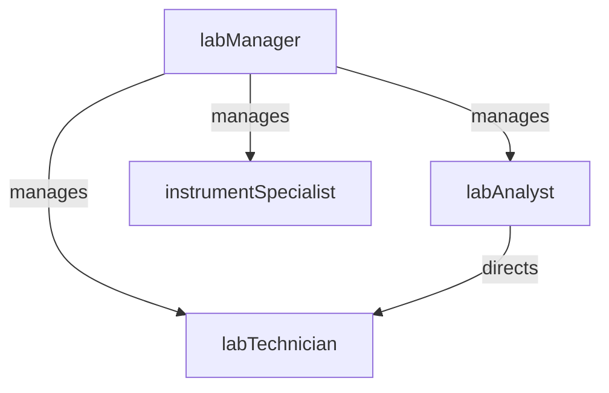

# Laboratory Testing

> Business-as-Code definition for the Laboratory Testing department. Models responsibilities, actions, events, and searches.

## Overview

Laboratory Testing performs chemical, physical, microbiological, and environmental analyses on raw materials, in-process samples, and finished products. The department maintains accredited test methods, calibrated instrumentation, and chain-of-custody procedures to provide reliable analytical data that supports quality release decisions.

## Responsibilities

| Responsibility | Description |
|---------------|-------------|
| executeSampleAnalyses | Perform chemical, physical, and microbiological tests on submitted samples using validated methods |
| maintainLabAccreditation | Uphold ISO 17025 or equivalent accreditation through method validation and proficiency testing |
| calibrateLabInstruments | Schedule and execute calibration of analytical instruments such as HPLC, GC, and spectrophotometers |
| manageSampleChainOfCustody | Track sample receipt, storage, testing, and disposal with full traceability |
| reportAnalyticalResults | Issue certificates of analysis and test reports to quality and production stakeholders |

## Roles

| Role | Description |
|------|-------------|
| labManager | Oversees laboratory operations, accreditation, staffing, and capital equipment budgets |
| labAnalyst | Performs routine and specialized analytical testing on submitted samples |
| labTechnician | Prepares samples, maintains reagent inventories, and operates routine test equipment |
| instrumentSpecialist | Manages analytical instrument maintenance, calibration, and method development |

## Entities

| Entity | Description |
|--------|-------------|
| SampleRecord | Registration of a submitted sample including source, type, chain-of-custody, and test requirements |
| TestMethod | Validated analytical procedure specifying equipment, reagents, steps, and acceptance criteria |
| AnalyticalResult | Measured value, units, specification limits, and pass/fail disposition for a test |
| CertificateOfAnalysis | Formal document reporting all analytical results for a material lot or batch |
| InstrumentRecord | Maintenance, calibration, and qualification history for a piece of analytical equipment |

## Actions

| Action | Description |
|--------|-------------|
| registerSample | Log a new sample into the LIMS with test requirements and chain-of-custody details |
| performTest | Execute an analytical test on a sample and record raw data and results |
| reviewResults | Verify analytical results for accuracy and approve or reject the data |
| issueCertificateOfAnalysis | Generate and release a certificate of analysis for a tested material lot |
| calibrateInstrument | Perform scheduled calibration on an analytical instrument and document results |
| flagOutOfSpec | Escalate an out-of-specification result for investigation and disposition |

## Events

| Event | Description |
|-------|-------------|
| sampleRegistered | A new sample was logged into the LIMS and queued for testing |
| testCompleted | An analytical test was executed and results were recorded |
| resultsApproved | Analytical results were reviewed and approved by authorized personnel |
| certificateIssued | A certificate of analysis was generated and released for a material lot |
| instrumentCalibrated | An analytical instrument completed calibration and was returned to service |
| outOfSpecFlagged | A test result exceeded specification limits and was escalated for investigation |

## Searches

| Search | Description |
|--------|-------------|
| findPendingSamples | Retrieve samples registered but not yet tested |
| getResultsByLot | Query all analytical results for a specific material lot or batch |
| findOutOfSpecResults | List test results that failed to meet specification acceptance criteria |
| getCalibrationSchedule | Retrieve upcoming instrument calibration due dates |
| searchTestMethods | Look up validated test methods by analyte, matrix, or method number |

## Workflow



## Actor Relationships



## Related Processes

| Process | APQC ID | Relationship |
|---------|---------|-------------|
| Produce/Manufacture/Deliver Product | 4.3 | Provides analytical testing that gates material release and production quality decisions |
| Manage Product and Service Quality | 4.5 | Supports quality assurance through validated test methods and certificates of analysis |

## Related Departments

| Department | Relationship |
|-----------|-------------|
| Quality Control | Receives analytical results used in incoming, in-process, and final quality disposition |
| Materials Management | Tests incoming raw materials before releasing to available inventory |
| Process Engineering | Provides analytical support for process validation and parameter optimization studies |
| Environmental Health & Safety | Performs environmental testing on emissions, waste streams, and workplace air samples |

## Usage

```typescript
import { db } from '@headlessly/db'

const dept = await db.departments.get('laboratoryTesting')
const pending = await db.departments.search('findPendingSamples', { priority: 'rush' })
const oos = await db.departments.search('findOutOfSpecResults', { lot: 'LOT-2025-0342' })
```
