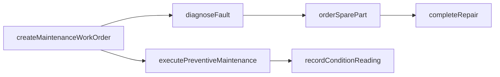
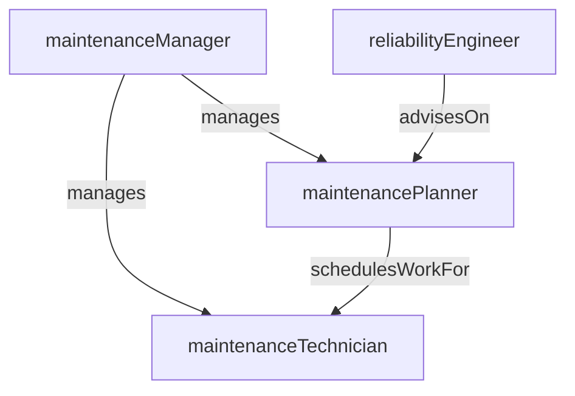

# Maintenance Engineering

> Business-as-Code definition for the Maintenance Engineering department. Models responsibilities, actions, events, and searches.

## Overview

Maintenance Engineering plans and executes preventive, predictive, and corrective maintenance programs to maximize equipment uptime and reliability. The department manages work orders, spare parts, and maintenance schedules across all plant assets to minimize unplanned downtime and extend equipment life.

## Responsibilities

| Responsibility | Description |
|---------------|-------------|
| planPreventiveMaintenance | Develop and schedule recurring maintenance tasks based on manufacturer recommendations and operating data |
| executeCorrectiveRepairs | Diagnose and repair equipment breakdowns to restore production capability |
| implementPredictiveMaintenance | Deploy condition-monitoring techniques such as vibration analysis and thermography to detect failures early |
| manageSparePartsInventory | Maintain critical spare parts stock levels and reorder points for plant equipment |
| trackEquipmentReliability | Analyze MTBF, MTTR, and OEE metrics to drive reliability improvement initiatives |

## Roles

| Role | Description |
|------|-------------|
| maintenanceManager | Leads the maintenance function, owns the PM schedule, and manages maintenance budgets |
| maintenancePlanner | Schedules work orders, coordinates parts and labor, and sequences maintenance activities |
| maintenanceTechnician | Performs hands-on preventive, predictive, and corrective maintenance on plant equipment |
| reliabilityEngineer | Analyzes failure data, conducts root cause analysis, and designs reliability improvement programs |

## Entities

| Entity | Description |
|--------|-------------|
| MaintenanceWorkOrder | A scheduled or unplanned task to inspect, repair, or service a piece of equipment |
| PreventiveMaintenanceSchedule | Recurring calendar of time-based or usage-based maintenance tasks for each asset |
| EquipmentAsset | A registered plant machine or system with specifications, location, and maintenance history |
| SparePartRecord | Inventory record for a maintenance spare part including stock level, reorder point, and lead time |
| FailureAnalysisReport | Root cause analysis documenting failure mode, contributing factors, and corrective actions |

## Actions

| Action | Description |
|--------|-------------|
| createMaintenanceWorkOrder | Generate a new work order for scheduled or unscheduled maintenance |
| executePreventiveMaintenance | Perform a scheduled PM task and record completion details |
| diagnoseFault | Investigate an equipment malfunction to identify root cause and required repair |
| orderSparePart | Submit a purchase requisition for a needed spare part |
| completeRepair | Finish a corrective repair and return the equipment to operational status |
| recordConditionReading | Log a predictive maintenance reading such as vibration, temperature, or oil analysis |

## Events

| Event | Description |
|-------|-------------|
| workOrderCreated | A new maintenance work order was generated for a plant asset |
| preventiveMaintenanceCompleted | A scheduled PM task was executed and signed off |
| equipmentFaultDiagnosed | Root cause of an equipment malfunction was identified |
| sparePartOrdered | A purchase requisition was submitted for a needed spare part |
| repairCompleted | A corrective repair was finished and the equipment returned to service |
| conditionReadingRecorded | A predictive maintenance sensor reading was captured and logged |

## Searches

| Search | Description |
|--------|-------------|
| findOpenWorkOrders | Retrieve maintenance work orders in progress or awaiting scheduling |
| getOverduePmTasks | List preventive maintenance tasks past their scheduled due date |
| getEquipmentDowntimeHistory | Query downtime events for a specific asset over a time period |
| findCriticalSparesBelowMin | List spare parts whose stock has fallen below the minimum reorder level |
| getReliabilityMetrics | Retrieve MTBF, MTTR, and OEE data for a machine or production line |

## Workflow



## Actor Relationships



## Related Processes

| Process | APQC ID | Relationship |
|---------|---------|-------------|
| Manage Enterprise Asset Lifecycle | 10.2 | Maintains plant equipment assets through their full operational lifecycle |
| Produce/Manufacture/Deliver Product | 4.3 | Ensures equipment availability to support production schedules |

## Related Departments

| Department | Relationship |
|-----------|-------------|
| Production Control | Coordinates maintenance windows with production scheduling to minimize disruption |
| Tooling and Die | Collaborates on tooling-related equipment repairs and die maintenance |
| Process Engineering | Provides equipment operating parameters and process requirements for maintenance planning |
| Materials Management | Sources and stocks spare parts and maintenance consumables |

## Usage

```typescript
import { db } from '@headlessly/db'

const dept = await db.departments.get('maintenanceEngineering')
const openWo = await db.departments.search('findOpenWorkOrders', { priority: 'high' })
const overdue = await db.departments.search('getOverduePmTasks', { plant: 'plant-01' })
```
