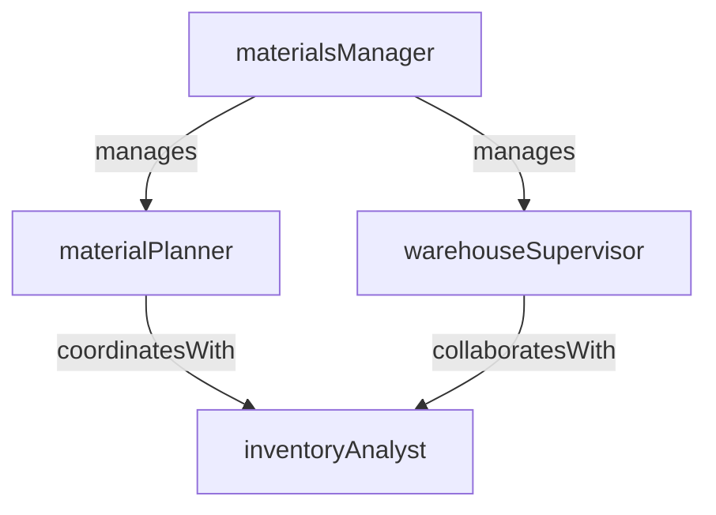

# Materials Management

> Business-as-Code definition for the Materials Management department. Models responsibilities, actions, events, and searches.

## Overview

Materials Management controls the flow of raw materials, components, and consumables from procurement through warehouse storage to point-of-use delivery on the production floor. The department runs material requirements planning, maintains inventory accuracy, and ensures that the right materials are available at the right time to support production schedules.

## Responsibilities

| Responsibility | Description |
|---------------|-------------|
| runMaterialRequirementsPlanning | Execute MRP to generate purchase requisitions and planned orders from demand and inventory data |
| manageWarehouseInventory | Maintain accurate stock levels through cycle counting, put-away, and location management |
| coordinatePointOfUseDelivery | Stage and deliver materials to production lines in the quantities and timing required |
| controlInventoryAccuracy | Perform cycle counts, reconcile variances, and maintain inventory record accuracy above target |
| manageMaterialMasterData | Maintain material master records including lead times, lot sizes, and safety stock levels |

## Roles

| Role | Description |
|------|-------------|
| materialsManager | Oversees materials planning, warehouse operations, and inventory performance metrics |
| materialPlanner | Runs MRP, manages planned orders, and coordinates supply with procurement and suppliers |
| warehouseSupervisor | Manages warehouse staff, storage layout, and daily put-away and picking operations |
| inventoryAnalyst | Performs cycle counts, investigates discrepancies, and reports on inventory accuracy KPIs |

## Entities

| Entity | Description |
|--------|-------------|
| MaterialRequirement | MRP-generated demand for a raw material or component tied to a production order |
| InventoryRecord | Current stock level, location, lot number, and status for a material in the warehouse |
| PurchaseRequisition | Request to procurement to purchase a material in a specified quantity by a required date |
| CycleCountRecord | Documentation of a physical inventory count, variance, and adjustment for a storage location |
| MaterialMaster | Master data record for a material including UOM, lead time, safety stock, and lot sizing rules |

## Actions

| Action | Description |
|--------|-------------|
| runMrp | Execute material requirements planning to generate planned orders and purchase requisitions |
| receiveMaterial | Log receipt of inbound material, verify quantity, and place into warehouse storage |
| issueMaterialToProduction | Pick and deliver materials from the warehouse to a production line or work center |
| performCycleCount | Count physical inventory at a storage location and record results |
| adjustInventory | Post an inventory adjustment to reconcile a discrepancy found during cycle count |
| updateMaterialMaster | Modify material master data such as lead time, safety stock, or reorder point |

## Events

| Event | Description |
|-------|-------------|
| mrpCompleted | An MRP run was executed and new planned orders or requisitions were generated |
| materialReceived | Inbound material was received, inspected, and placed into warehouse storage |
| materialIssuedToProduction | Materials were picked and delivered to the production floor for consumption |
| cycleCountCompleted | A physical inventory count was performed and results were recorded |
| inventoryAdjusted | An inventory variance was reconciled with an adjustment posting |
| stockBelowSafetyLevel | A material's on-hand quantity fell below its configured safety stock threshold |

## Searches

| Search | Description |
|--------|-------------|
| findMaterialShortages | List materials with insufficient stock to cover upcoming production demand |
| getInventoryByLocation | Query current stock levels and lot details for a specific warehouse location |
| getInventoryAccuracy | Retrieve cycle count accuracy rates by warehouse zone or material category |
| findPendingReceipts | List inbound material shipments expected but not yet received |
| getMrpExceptions | Retrieve MRP exception messages such as reschedule-in, reschedule-out, or cancel recommendations |

## Workflow


## Actor Relationships



## Related Processes

| Process | APQC ID | Relationship |
|---------|---------|-------------|
| Plan for and Align Supply Chain Resources | 4.2 | Runs MRP to translate demand plans into material requirements and purchase signals |
| Produce/Manufacture/Deliver Product | 4.3 | Stages and delivers materials to support production order execution |

## Related Departments

| Department | Relationship |
|-----------|-------------|
| Production Control | Receives material requirements driven by work order releases and schedule changes |
| Receiving and Shipping | Hands off inbound material from the dock to warehouse put-away |
| Quality Control | Coordinates incoming material inspection before releasing to available stock |
| Production Scheduling | Provides schedule visibility used to time material staging and delivery |

## Usage

```typescript
import { db } from '@headlessly/db'

const dept = await db.departments.get('materialsManagement')
const shortages = await db.departments.search('findMaterialShortages', { plant: 'plant-01' })
const accuracy = await db.departments.search('getInventoryAccuracy', { zone: 'warehouse-A' })
```
