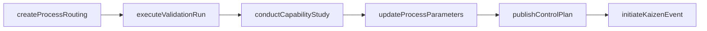
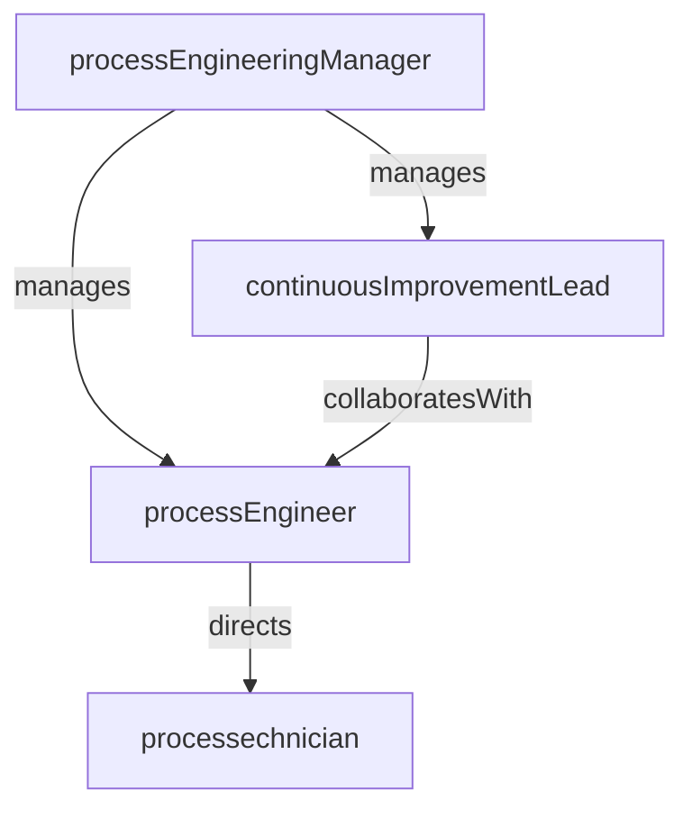

# Process Engineering

> Business-as-Code definition for the Process Engineering department. Models responsibilities, actions, events, and searches.

## Overview

Process Engineering designs, optimizes, and scales manufacturing processes to achieve target quality, throughput, and cost. The department owns process documentation, parameter specifications, and continuous improvement initiatives across all production lines.

## Responsibilities

| Responsibility | Description |
|---------------|-------------|
| designManufacturingProcesses | Develop new process flows, routings, and work instructions for product introductions |
| optimizeProcessParameters | Tune machine settings, cycle times, and operating conditions to improve yield and throughput |
| conductProcessValidation | Execute IQ/OQ/PQ validation protocols to qualify new or changed processes |
| driveContInuousImprovement | Lead Lean, Six Sigma, and kaizen initiatives to reduce waste and variation |
| maintainProcessDocumentation | Author and update standard operating procedures, control plans, and process FMEAs |

## Roles

| Role | Description |
|------|-------------|
| processEngineeringManager | Leads the process engineering team and prioritizes improvement projects across the plant |
| processEngineer | Designs, validates, and optimizes manufacturing processes and parameters |
| continuousImprovementLead | Facilitates kaizen events, value stream mapping, and Lean/Six Sigma projects |
| processtechnician | Supports trial runs, collects process data, and assists with parameter adjustments on the floor |

## Entities

| Entity | Description |
|--------|-------------|
| ProcessRouting | Sequence of operations, work centers, and standard times required to manufacture a product |
| ControlPlan | Document defining critical process parameters, measurement methods, and reaction plans |
| ProcessFmea | Failure mode and effects analysis identifying potential process risks and mitigations |
| ValidationProtocol | IQ/OQ/PQ protocol specifying test conditions, acceptance criteria, and required documentation |
| ImprovementProject | A scoped initiative to reduce waste, variation, or cycle time in a manufacturing process |

## Actions

| Action | Description |
|--------|-------------|
| createProcessRouting | Define the operation sequence, work centers, and standard times for a new product |
| updateProcessParameters | Modify machine settings or operating conditions based on optimization data |
| executeValidationRun | Perform a qualification trial to validate a new or changed process |
| conductCapabilityStudy | Run a statistical capability analysis on a critical process characteristic |
| initiateKaizenEvent | Launch a focused improvement event targeting a specific waste or bottleneck |
| publishControlPlan | Release an approved control plan for use on the production floor |

## Events

| Event | Description |
|-------|-------------|
| processRoutingCreated | A new manufacturing routing was designed and entered the system |
| parametersOptimized | Process parameters were tuned and the improvement was confirmed with data |
| validationCompleted | An IQ/OQ/PQ validation protocol was executed and passed all acceptance criteria |
| capabilityStudyCompleted | A process capability study was finished and Cpk results were recorded |
| kaizenEventClosed | A kaizen improvement event was completed with documented results and sustainment plan |
| controlPlanPublished | An updated control plan was approved and released to the production floor |

## Searches

| Search | Description |
|--------|-------------|
| findProcessRoutings | Retrieve routings for a product or product family |
| getCapabilityResults | Query Cpk/Ppk results for critical characteristics across production lines |
| findOpenImprovementProjects | List active Lean/Six Sigma projects and their current phase |
| searchControlPlans | Look up control plans by product, process, or critical parameter |
| getValidationStatus | Retrieve the validation state of a new or changed process |

## Workflow



## Actor Relationships



## Related Processes

| Process | APQC ID | Relationship |
|---------|---------|-------------|
| Produce/Manufacture/Deliver Product | 4.3 | Designs and optimizes the manufacturing processes used in production |
| Manage Product and Service Quality | 4.5 | Maintains control plans and process FMEAs that define quality controls |

## Related Departments

| Department | Relationship |
|-----------|-------------|
| Production Control | Provides routing and standard time data used in work order planning |
| Quality Control | Collaborates on SPC programs, capability studies, and control plan authoring |
| Industrial Engineering | Partners on time studies, line balancing, and facility layout optimization |
| Tooling and Die | Specifies tooling requirements driven by process design decisions |

## Usage

```typescript
import { db } from '@headlessly/db'

const dept = await db.departments.get('processEngineering')
const routings = await db.departments.search('findProcessRoutings', { product: 'widget-A' })
const kaizens = await db.departments.search('findOpenImprovementProjects', { status: 'in-progress' })
```
